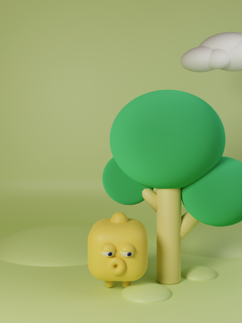
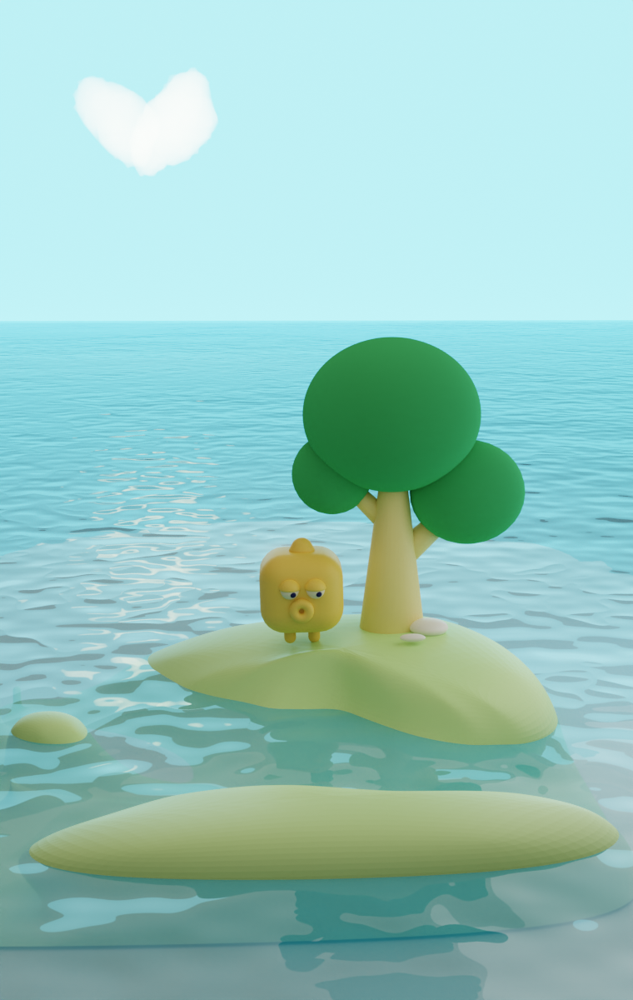
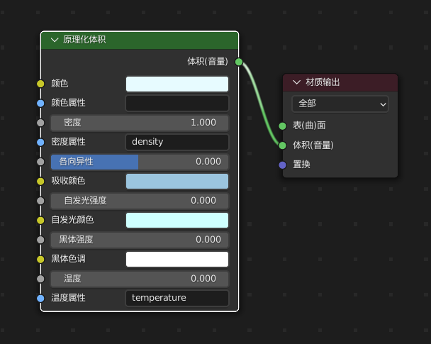
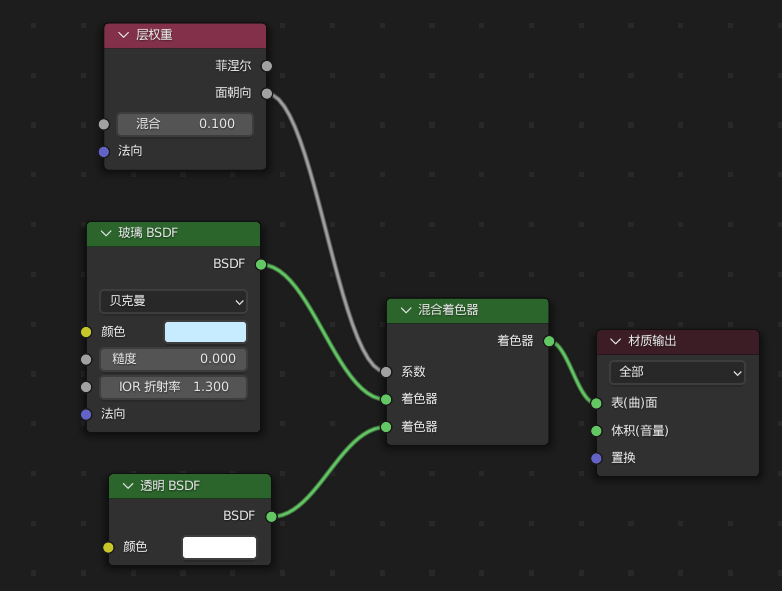

# blender学习记录

涉及内容比较多，都是记录为主，会偏向写总结和点评。

## yellowCube

偏向案例学习，由于学习中会不断的有新的想法 ，可能就会加一点新东西上去。

| result                                                  | tutorials                                                    | summary                                                      |                                                              |
| ------------------------------------------------------- | ------------------------------------------------------------ | ------------------------------------------------------------ | ------------------------------------------------------------ |
|  | [萌三兄弟](https://www.bilibili.com/video/BV1Bt4y1E7qn?p=5)  | 不是很满意云朵，树也缺乏曲线，树干身体也不是很自然      |                                                              |
|  | [云的做法](https://twitter.com/KoalaOK_/status/1656237448006086656?s=20) [切割工具使用](https://www.bilibili.com/video/BV1vF411c7Gj) [水面做法1](https://www.bilibili.com/video/BV1zh411t7F7) [水面做法2](https://www.bilibili.com/video/BV1PW4y1B7xd) [水面透明度](https://www.bilibili.com/video/BV14L411o7Qt) [Node Wrangler节点插件](https://www.bilibili.com/video/BV1FT41157Sa) | 云虽然照猫画虎做出来了，但是教程比较高阶，所以要考虑降级到能掌握得程度。 树木还是需要重绘一下，试试看建模搞。 水面可以丰富一下水底，以及做成动态的。 水底可以安排一些水草。 岛形不太好看，也没有low pony的感觉。 |  |
|                             | [烟云](https://www.bilibili.com/video/BV1Av4y1j7uB) [体积云)](https://www.youtube.com/watch?v=pYa5q0a7INM) [卡通云](https://www.bilibili.com/video/BV1pS4y1s72J) [批量清空材质库](https://www.bilibili.com/video/BV1oY4y1a7yt) [树冠的做法](https://www.bilibili.com/video/BV1u3411J74a/) [水体参考](https://www.bilibili.com/video/BV1Mg411E7Z6) | 水体质感不太对，还不如上面一个呢，还得搞搞 对烟云充满了迷茫 贴图UV啥的得学一下 水下焦散啥的效果应该不错，考虑。 | 烟云材质 水体材质 |
|                                                         |                                                              |                                                              |                                                              |

## blockBuild

历时还挺久的，断断絮絮做了好几天呢，尽量导出PNG是比较好的选择。可控导出范围，也不怕崩了。

| result                            | tutorial                                                     | summary                                                      |
| --------------------------------- | ------------------------------------------------------------ | ------------------------------------------------------------ |
|  | [积木组合](https://www.bilibili.com/video/BV1Bt4y1E7qn?p=8) [渐变色1](https://www.bilibili.com/video/BV1tU4y1U7sc/) [渐变色2](https://www.bilibili.com/video/BV1Se411A7pv/)  | 渲染导出视频还是比较有意思的 这个动态item引发的问题是：怎样镜头挪来挪去的拍摄？ |

## coinBase

