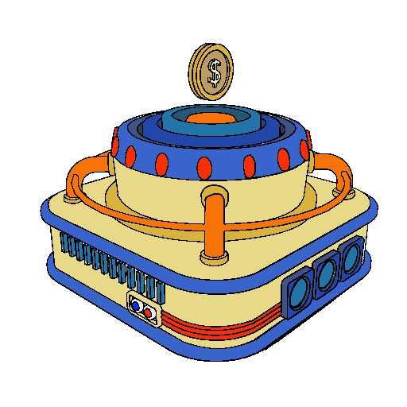
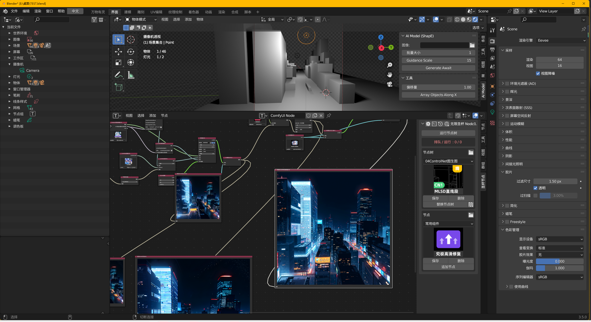

# 背景

主要是测试一下compyUI × Blender 的一些效果

可以从上图看到，这个风格是非常现代，元素也是比较抽象的

> 版本：无限圣杯 Node1.1.1
>
> 渲染：cycle，512x512

主要考虑的是从blender渲染白模图，图生图来形成景深/线稿，附加不同的风格。每次step的改动都会附加上改动项，别的设置都是节点树默认的，不再赘述。

- 可以切实看到AI绘图的各类过程细节，代码也这么好学就好了
- 也会会对【原创/抄袭】的问题有更深的体会和了解

|                  | step 1                                                       | step 2                                                       |
| ---------------- | ------------------------------------------------------------ | ------------------------------------------------------------ |
| 过程             |  |                                                              |
| 输出             |  |  |
| 关键词           | American propaganda poster, chiaroscuro, close-up, high quality |                                                              |
| 节点树           | 04，MIDAS-D深度 T2i                                          |                                                              |
| controlNet加载器 | 深度-t2iadapter_depth-fp16.safetensors                       | 线-t2iadapter_canny-fp16.safetensors                         |
| ckpt             | dreamshaper_4BakdVae.safetensors                             |                                                              |
| vae加载器        | vae-ft-mse-840000-ema-pruned.safetensors                     |                                                              |
| **点评**         | 还挺人模狗样的，复古风格明显没有画过这个东西                 | 错乱了，说明配套的节点树是比较重要的，尽管都是图生图，但是过程手法不同就会导致后续需要配套。 |
|                  |                                                              |                                                              |
| ————————————     | 这里开始只记录变化的条目                                     | ————————————————                                             |
|                  |                                                              |                                                              |
|                  | **step 3**                                                   | **step 4**                                                   |
| 过程             |  |                             |
| 输出             |  |                        |
| 节点树           | 04，线-CANNY细线_T2                                          | 04，法向-BAE-Normal+Normal_V1.1                              |
| 补充             | 整个节点数的替换会导致节点中模块的变化，等于一键模板。       | 因此只会替换掉ckpt，vae，关键词这类内容以便和之前的一样。 没有在原图上追加节点块是因为，看不过来，一不小心就搞错了。 |
| **小结**         | 很神奇的是，100%的人眼其实能知道怎么提取这个过程线稿，但是AI做不到，→输出也因此乱来，可以看到填充试图去平涂，但是没做到。 | 目前来看，step1的输出是比较符合想象的：明显的美式线条，配色，但是细节又对不上，可以理解成景深去掉了细节。 |
|                  | **step 5**                                                   | **step 6**                                                   |
| 输出             |                          |                          |
| 节点树           | 02，基础+自定VAE                                             |                                                              |
| 关键词           |                                                              | Axial view, cuboid, ring surround, pipe, gold coin, composite convex edge, American propaganda poster, chiaroscuro, close-up, high quality |
| **小结**         | amazed，这个模式输入图像就是白模图，输出就开始毫无关系了。   | 很明显，没有contrl net的图生图，可以说是缝合怪，哈哈哈哈。 因为在有明确的输入图像的时候，并不能完成指定的风格迁移，只会从关键词中选取，做最简单的重心贴上去。 |
|                  |                                                              |                                                              |

## 结论一

如果没有合理的contrlnet 控制, 几乎不能说是创作,因为就是会从万千的已有的他人画作中,pia的一下给你揉一个.

- 如果不是, 是无法解释为什么会出人头, 我是给了指定的图像的，怎么读都是读不出来人头的。因为如果step5 不出现人头,其实你说是极简风格也行,正是"人头"给了说明这是"美式复古"的机会
- 材质整个变味了，gold coin，如果真的明白  American propaganda poster，我认为即便是这么一个外方内ring的块，质感风格上也应该是 能做到的。比如这张[案例1]([The Correlation Between The Gold Standard And Stupendous Growth Is Clear (forbes.com)](https://www.forbes.com/sites/nathanlewis/2013/04/11/the-correlation-between-the-gold-standard-and-stupendous-growth-is-clear/)) ，[案例2](https://th.bing.com/th/id/OIP.akwPXqla3UALiPnAxILLAQHaHa?w=195&h=195&c=7&r=0&o=5&dpr=1.5&pid=1.7)

***

|          | **step3-1**                                                  | **step3-2**                                                  |
| -------- | ------------------------------------------------------------ | ------------------------------------------------------------ |
| 输入     |                               |  |
| 过程     |                        |                             |
| 输出     |                     |                     |
| 节点树   | 04，线-CANNY细线_T2                                          |                                                              |
| 补充     | 在step3的基础上，考虑贴入更好的线稿,看看能出啥，大小还是512来讨论 | 变化就是把过程线稿替换成自己手工处理的（还得靠抠图软件），采样比较尊重本篇开头的那章图，因为似乎是用了这样的办法来叠到。 |
| **小结** | 可以看到，线稿还是起了很大的作用，线稿表达不清楚的话，AI一叶障目的施工中，是无法知道什么时候该停下来作为停工点的。 | 原图其实提供了怎么处理光影和块面细节的思路，然后线稿很干净（省略了一些，毕竟补得好苦。 |
|          |                                                              |                                                              |

其实step3-2 大的构图不改变的前提下，做出一些决策：

- 保留老大哥剪影并精修，
- 方块底座设计成擂台
- 金币改成地球/方舟/ 钱/ 皇位/ ..... 
- 鼓体改成一座小山
- 安排很多小人在争先恐后的爬山

那么这么一顿魔改，似乎还有点意思。【尽管想法是我的，但是AI连这么明确的内容都无法搞定，我很难想象，这么具体且具有设计含义的内容能生成好，在成本并不是很高的前提下】

需要注意的是，在step3-2 以前，我并不会有以上关于决策的想法。正是step3-2的**配色**，**氛围**，**美国国旗**，**老大哥剪影**，**结构**，让我产生了这样的想法。

## 结论二

AI绘画对越抽象的页面结构越无法处理，输入图是非常简单，非常好做的，无论是用2D还是3D做，但是具备“设计感”。Ai是无法理解的，而这类画面，个人也是无法用准确的语言来描述的，换句话说，如果我能描述得AI看得懂90%，那么SD可能是我参与了开发的。

- AI提取线稿得思路，就是提高对比度，去掉颜色，过曝之类的去取线条，因此有些线条它是取不到的，因为白模嘛。
- 即便给到清晰的线条，但是原图也会被跑色块，因此其实并不会完全采用线条来重新计算结构。
- 感觉SD和chatGPT相反，chatGPT我要求越精确，描述越具体，给我的反馈越好。而SD我的要求越具体越糟糕，反而如果你给出的东西很大概，就给你填满了细节，且不说这个细节符不符合需求哈。

## 附录

虽然我这个填色也没啥美式复古，光影变化。但是表达是准确的，言之有物的。

右边出图是非常好看哈，但是如果较真对设计的还原，也可以看到：应该没有那么多车，就一辆是合理的。以及左边的建筑不太符合目标，AI会干活，但不会太听你的安排。

| 自己填色                  | 来源：[只剩一瓶辣椒酱](https://space.bilibili.com/35723238) |
| ------------------------- | ----------------------------------------------------------- |
|  |                                    |

本次测试总的来说还是比较随意也简单，并没有说针对技术上深挖，而是作为工具考察能否确切的当好一个干活助手，你选了什么样的ckpt，对结果应该是影响蛮大的。以下基于step3-2的设定：

|                    | **step3-3**                                                  | **step3-4**                                                  |
| ------------------ | ------------------------------------------------------------ | ------------------------------------------------------------ |
| 输出               |                       |  |
| controlNet加载器   | comicBabes_v1.safetensors                                    | revAnimated_v122.safetensors                                 |
| **吐槽**           | 笑死我了                                                     | 鼻环纹身，这么老美                                           |
|                    | **step3-5**                                                  | **step3-6**                                                  |
| 输出               |                       |  |
| controlNet加载器   | fantasyWorld_v1.safetensors                                  | allInOnePixelModel__1.ckpt                                   |
| **吐槽**           | 黑皮诱惑                                                     | 这个又没有人了，说明啥？                                     |
|                    |                                                              |                                                              |
|                    | **step3-7**                                                  | **step3-8**                                                  |
| 输出               |                       |                       |
| controlNet加载器   | brainime_v10.safetensors                                     | GuoFeng3.2_f16.safetensors                                   |
| CLIP文本编码（反） | 清空了                                                       |                                                              |
| **吐槽**           | 没清空也走了一遍差不多，看来人出现并不是负面的作用           | 其实观察一下很多固定处理还挺有趣的                           |
|                    | **step3-9**                                                  | **step3-10**                                                 |
| 输出               |                       |  |
| controlNet加载器   | IconMODEV10_v10.safetensors                                  |                                                              |
| CLIP文本编码（正） | American propaganda poster, chiaroscuro, close-up, high quality | chiaroscuro, close-up, high quality                          |
| **吐槽**           | 这个模型作者说专门拿来做那种游戏icon的，感觉看到了游戏道具。 | 取消美式复古，立马改成素描。                                 |
|                    | **step3-11**                                                 | **step3-12**                                                 |
| 输出               |  |  |
| controlNet加载器   | nigi3d_v20.safetensors                                       | neurocontrastdream_v10.safetensors                           |
| CLIP文本编码（正） | chiaroscuro, close-up, high quality                          |                                                              |
| **吐槽**           | 没想到表现这么糟，因为这个模型基本都是3D人物，没想到3D殆尽，作为一个原图是3D渲染图的导入来说 | 最后一个了，乏了。                                           |

## 总结

- C站这么多大模型都默认不公布训练来源，已经可以说明来源或多或少属于拿了再说。
- SD并不能理解画面和你切实的想法，它理解的是需求，你说要个二次元蓝头发美少女，它就给你pia一个waifu。
- 什么是创作的本质？ 
  - 3D建模了白膜不算创作，因为100% 跟的教程[金币基站](https://www.bilibili.com/video/BV1Bt4y1E7qn)
  - 想办法把糟糕的线稿完善是创作，因为什么是完善由我说了算。
  - 自己填色是创作，尽管脑子里想的是美式复古风格，但做到赛璐璐平涂（procreate超快），虽然不甚满意，但是基本没有回头去改配色。
  - 写这篇文章是创作，至于这么多的**输出** 是不是创作，我比较难认可。

