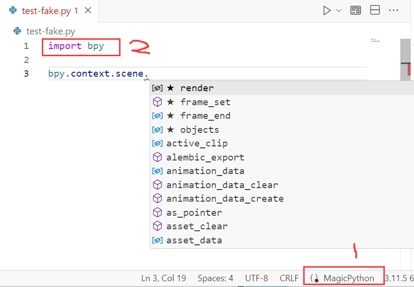

# 背景

买课《BL-插件开发》大半年了，没啥精力学习。有空了就安排上，既可以实践python基础，也可以多一种角度理解blender，长远来看，更好的支撑技术路径。

1. 打算从涉及面向对象的部分开始看，毕竟我对对象不能说一无所知，可以说毫不了解。
2. 记录过程中遇到的问题和解决问题的思路和办法，积极应对。（with chatGPT & teacher)

# 采用的配置

python啥的我早配置过了，就跳过，重点关联和这堂课比较密切相关的。

## 环境

- python 3.11
- windows 10
- blender 4.1.0.alpha

## vscode( 插件↓↓↓)

  1. Code Runner---便捷代码运行 

  2. Python Extension Pack 

  3. Python

  4. MagicPython---语法高亮 

  5. TODO Highlight---TODO 注释高亮

     
## blender 代码补全
[fake-bpy-module](https://github.com/nutti/fake-bpy-module) ---Fake Blender Python API module collection for the code completion.

> pip后即可，

1. 需要先设置MagicPython，直接点击就行。vscode界面右下方。
2. 导入bpy 模块

# 额外的发现

fake-bpy-module 采用了跟随blender版本的发布来更新不同的版本

1. 随着版本的增加，会有一些API的改变。
2. fake-bpy-module 实现的是：代码补全提示，而非引入这个package/module

不引入也是对的，bpy是一个非标准python包，而且基本是作用在blender这款软件内，作为插件/python控制台在用。

**搁vs里写了还不是得贴到blender里去测**

