# 背景

网课地址：[UBCx: How to Code: Simple Data](https://www.edx.org/learn/coding/university-of-british-columbia-how-to-code-simple-data)， 不要钱的。

- 周期大概是7week，自主进度。
- 我会采用和大纲相匹配的方式，梳理，总结，包含课程练习。

# 1a: Beginning Student Language

这一部分内容也不少，但从标题来看比较简单入门。

## Expressions

课程鼓励通过自己动手来学习，并且撂狠话：如果只听课和看答案，几乎一定会失败。（这个几乎就很内涵）

课程要求安装软件：the latest version of [Dr Racket](http://racket-lang.org/download/).

Q：你知道 DrRacket 这个软件吗？

> chatGPT:
>
> DrRacket 是一个广泛用于教学和研究的编程环境，特别适用于 Racket 编程语言。Racket 是一种多范式编程语言，源自 Lisp 家族，具有强大的宏系统和模块系统，适合各种编程任务。
>
> DrRacket 的特点包括：
>
> 1. **集成开发环境 (IDE)**：提供了编写、运行和调试 Racket 程序的综合环境。
> 2. **交互式界面**：允许用户在交互式窗口中输入和执行代码，方便测试和学习。
> 3. **错误报告**：详细的错误报告和诊断工具，帮助用户快速找到和修复问题。
> 4. **教学功能**：内置了许多教学工具，适用于计算机科学入门课程，如程序设计基础 (How to Design Programs, HtDP) 课程。
> 5. **多语言支持**：不仅支持 Racket，还支持多种其他编程语言，使其成为多语言开发的有力工具。
>
> DrRacket 广泛用于教育领域，因为它能帮助学生逐步理解编程概念和技巧，同时提供一个易于使用的界面，促进动手实践和实验。

Q： 使用 DrRacket 进行一般的数学性运算，请给出例子和示范。（省略了最基础的`+-*/` ）

>  chatGPT:
>
> ```
> ; 多项加法
> (+ 1 2 3 4)
> ; 结果是 10
> ; 嵌套运算：
> (+ (* 2 3) (/ 10 2))
> ; 结果是 11
> ;负数运算：
> (- -5 3)
> ; 结果是 -8
> 混合运算：
> (/ (+ 4 -12 6.2) 3)
> ; 结果是 -0.6
> ; 求幂
> (expt 2 3)
> ; 结果是 8
> ; 平方根：
> (sqrt 16)
> ; 结果是 4
> ; 对数
> (log 10)
> ; 结果是自然对数 ln(10)
> ; 三角函数：
> (sin (/ pi 2))
> ```
>
> `;` 等于一般编程语言中的注释。

**总结**

这堂课最重要的是引入了：operator ， value， expression ，这三个概念。

在`(* 5 6)`中，5和6是value, `*` 是operator，`( )` 这个整体则是expression. 

几乎所有的编程语言，最基本的单元都由这三个结构组成。

## 作业

>  When we want to compute the average of 4, 6.2 and -12, all three of the following expressions evaluate to the correct result. Which expression do you think is the best, and why?

A. (/ (+ 4 6.2 -12) 3) 

B. (/ (+ -8 6.2) 3)

C. -0.6

D. Doesn't matter, all are equally good.

**My Answer:**  A

**My explanation**: "The second answer is partly using the human brain to calculate 4 plus -12, and the third answer is to calculate entirely with the human brain. Programming means letting the computer do it as much as possible."

 ## Evaluation

```
;从上到下，一步一步的运算过程
(+ 2 (* 3 4) (- (+ 1 2) 3))
(+ 2 12 (- (+ 1 2) 3))
(+ 2 12 (- 3 3))
(+ 2 12 0)
14
```

 `(+ 2 (* 3 4) (- (+ 1 2) 3))`  ,ok,这么一大坨 **primitive** 被call 

直观上就两点：从左到右，从内到外。

计算机是这么理解的：

step 1：我想运行` (+ 2 __  __)`  发现第二个本来想要value，没直接给，给了 `(* 3 4)` 这么个primitive，于是进去看看，发现能call ，因为`(* 3 4)` ,是 (operator value value) ，能干。 于是我就干了这一件事。

step2：` (+ 2 12  __)`  然后这个也不符合全value，第三位也是个primitive`(- (+ 1 2) 3)`,我进去一看，里面还有个primitive`(+ 1 2)`，于是也只干了一件事，得到`(+ 2 12 (- 3 3))`

step3: 同理，得到`(+ 2 12 0)`

step4 :  总算能进行call了 ，(operator value value value) call out 14  

Q：课程采用了BSL language，为什么不用Racket？

> chatGPT:
>
> 当使用BSL语言和Racket语言时，以下是一个简单的例子来展示它们之间的区别：
>
> ### 1. 使用BSL语言的例子：
>
> 假设我们要编写一个程序来计算两个数的平方和。在BSL语言中，代码可能如下所示：
>
> ```
> (define (square-sum a b)
>   (+ (* a a) (* b b)))
> 
> (square-sum 3 4)
> ```
>
> 在这个例子中：
>
> - `define`用于定义一个函数`square-sum`，该函数接受两个参数`a`和`b`，并返回它们的平方和。
> - `(* a a)`计算`a`的平方，`(* b b)`计算`b`的平方。
> - `(+ (* a a) (* b b))`将两个平方数相加。
> - `square-sum 3 4`调用定义的函数，并输出结果。
>
> 这种简单的语法和功能限制有助于初学者理解函数定义和基本算术运算。
>
> ### 2. 使用Racket语言的例子：
>
> 现在看看同样的例子，但是使用Racket语言：
>
> ```
> (define (square-sum a b)
>   (+ (square a) (square b)))
> 
> (define (square x)
>   (* x x))
> 
> (square-sum 3 4)
> ```
>
> 在Racket中：
>
> - `square`函数被定义为计算一个数的平方。
> - `square-sum`函数使用了`square`函数来计算`a`和`b`的平方和。
> - `square-sum 3 4`同样调用函数并输出结果。
>
> 相比BSL，Racket的语法更接近传统的Lisp风格，更加灵活和表达力强。函数可以更复杂，语言本身支持更多的编程范式和高级功能，如闭包、宏等。
>
> ### 区别总结：
>
> - **语法和功能限制**：BSL有明显的语法和功能限制，使其更易于初学者理解和使用。
> - **表达能力和灵活性**：Racket提供了更广泛的语法和功能，适合开发复杂的程序和进行更深入的编程探索。
>
> 这些例子展示了在教学和实际编程中使用BSL和Racket时的主要区别，选择哪种取决于学习者的背景和学习目标。

**总结**： **the first evaluation rule, the primitive call rule.**

## strings and images

### strings

要点：calls to string and image primitives work just like calls to number primitives。（规则和之前的一样）

```
"Ada"
;"Ada"
(string-append "Ada" "Love" "coding")
;"AdaLovecoding"
(string-append "Ada " "Love " "coding.")
;"Ada Love coding."
(string-append "Ada" " " "Love" " " "coding")
;"Ada Love coding"
;(string-append 1 "11")
;string-append: expects a string, given 1
;(+ "123" "123")
;+: expects a number, given "123"
;(string-add "1" "11")
;string-add: this function is not defined

(substring "halo world" 0 3)
;"hal"
(substring "halo world" 3 6)
;"o w"

```

**总结**： 主要强调了index下标的问题，从0开始，以及左开右闭。


### images

要点：很像小海龟..... 或者 svg.

1. 我注意到他称呼 above/beside/overlay 为**primitive** ，

```
(require 2htdp/image)
(circle 10 "solid" "gray")
(circle 20 "solid" "gray")
(circle 30 "solid" "gray")
(rectangle 30 60 "outline" "skyblue")
(text "hello" 24 "orange")
(overlay (circle 10 "solid" "red")
(circle 20 "solid" "yellow")
(circle 30 "solid" "blue"))
```

我：解释上面代码的第一句

>chatGPT:
>
>在Racket或BSL中，当你看到类似 `(require 2htdp/image)` 这样的语句时，它是在引入或导入一个模块或库。让我们逐步解释这句话：
>
>1. **`(require 2htdp/image)`**：
>   - `require` 是一个特殊的语法，用于加载或引入其他模块或库，使得其中定义的函数、变量和数据类型可以在当前代码中使用。
>   - `2htdp/image` 是一个特定的模块名称。在Racket的教学环境（如BSL或DrRacket中），这个模块提供了处理图像和绘制图形的功能。
>2. **功能**：
>   - 引入 `2htdp/image` 模块后，你可以使用该模块提供的函数和数据类型来创建和操作图像。例如，你可以绘制各种形状（如圆形、矩形）、编辑图像，以及在图像上进行文本标注等操作。
>3. **示例**：
>   - 在你的示例中， `(circle 10 "solid" "gray")` 是在使用引入的 `2htdp/image` 模块中的函数 `circle` 来绘制一个半径为 `10` 的实心灰色圆。

我：如果我想绘制一个十字架，如何做？

> chatGPT:
>
> ```
> (require 2htdp/image)
> 
> (define (cross-star size)
>   (overlay (rectangle size 10 "solid" "black")
>            (rectangle 10 size "solid" "black")))
> 
> ; 绘制一个大小为 100 的十字架
> (cross-star 100)
> ```

我：可以指定一个圆出现在一个固定的坐标吗？

> chatGPT:
>
> ```
> (require 2htdp/image)
> (place-image (circle 50 "solid" "red") 100 100 (rectangle 200 200 "solid" "white"))
> ```

## 作业

制作一副有星星有月亮的夜空图，由于白嫖的课，属于自编题目了。

最终效果：

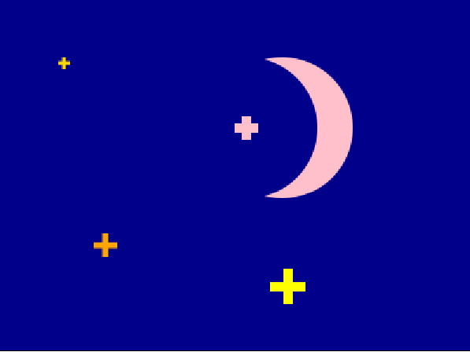

``` 
(require 2htdp/image)

; create a blank sketch, 400*300 
(define canvas (empty-scene 400 300 "darkblue"))
; a cross star made by 2 rectangle.
(define (cross-star size1 size2 color)
  (overlay (rectangle size1 size2 "solid" color)
           (rectangle size2 size1 "solid" color)))
; make moon
; a full moon made by circle 
(define full-moon (circle 60 "solid" "pink"))
; a circle with background-color to overlay the full moon，get a 
(define cover-circle (circle 60 "solid" "darkblue"))

;put all stars and the moon to the canvas
(define pirnt-canvas
  (overlay/xy (cross-star 20 5 "orange" ) -80 -200
  (overlay/xy (cross-star 10 3 "gold" ) -50 -50
  (overlay/xy (cross-star 30 8 "yellow" ) -230 -230
  (overlay/xy (cross-star 20 8 "pink" ) -200 -100
  (overlay/xy cover-circle -150 -40
   (overlay/xy full-moon -180 -50
              canvas)))))))

pirnt-canvas
```


### 过程

主要借助了chatGPT，通过提问发现大概的路径。

我：想要在一张画布上同时放4个不同位置不同尺寸的圆如何做？

> chatGPT:
>
> ```
> (require 2htdp/image)
> 
> ; 创建一个空白画布,宽度为400,高度为400
> (define canvas (empty-scene 400 400))
> 
> ; 创建四个不同尺寸和颜色的圆
> (define circle1 (circle 30 "solid" "red"))
> (define circle2 (circle 50 "solid" "blue"))
> (define circle3 (circle 40 "solid" "green"))
> (define circle4 (circle 20 "solid" "yellow"))
> 
> ; 将圆放置在不同的位置
> (define canvas-with-circles
>   (place-image circle1 50 50
>   (place-image circle2 70 100 
>   (place-image circle3 250 250
>   (place-image circle4 350 350
>                canvas)))))
> 
> ; 显示画布
> canvas-with-circles
> 
> ```
>
> 这个是能做的。

我：能使用overlay先将这些圆定义为一个define吗？

> chatGPT:
>
> ```
> (require 2htdp/image)
> 
> ; 创建四个不同尺寸和颜色的圆
> (define circle1 (circle 30 "solid" "red"))
> (define circle2 (circle 50 "solid" "blue"))
> (define circle3 (circle 40 "solid" "green"))
> (define circle4 (circle 20 "solid" "yellow"))
> 
> ; 使用overlay将四个圆叠加在一起
> (define all-circles
>   (overlay/xy circle1 -150 -150
>   (overlay/xy circle2 -50 -50
>   (overlay/xy circle3 50 50
>               circle4))))
> 
> ; 将所有圆放置在画布的中心
> (define canvas (place-image all-circles 200 200 (empty-scene 400 400)))
> 
> ; 显示画布
> canvas
> 
> ```
>
> 这个也行的。

## Constant Definitions

> 1. We're going to look at how to write constant definitions to give names 我们将研究如何编写常量定义来命名
> 2. and that those two properties-- readability and changeabiliy-- 这两个属性——可读性和可变性——
> 3. are two of the most important properties a program can have. 是程序可以具有的两个最重要的属性。
> 4. But for now we're just going to focus on the mechanism of constant definitions 但现在我们只关注常量定义的机制
> 5. so that you can learn how to write a constant definition to give names 这样你就可以学习如何编写一个常量定义来命名
> 6. to a value that you use in other parts of the program. 设置为在程序的其他部分中使用的值。

用到了一个地址 [how to design programs](https://htdp.org/2023-8-14/Book/part_prologue.html) ，白嫖意味着，得自己检索`Constant`这个关键字做更多的课外阅读....

```
(require 2htdp/image)
; . means paste a image like in word/ppt
(define XD .)
(define RXD (rotate -10 XD))
(define LXD (rotate 10 XD))
```

## Function Definitions

感觉这个课很喜欢用图像来做定义的演示，很多别的课程更习惯用数学题来说明函数。这里还是用2htdp库。

```
(require 2htdp/image)

(define (bulb c)
  (circle 40 "outline" c))
(above (bulb "red")
       (bulb "gold")
       (bulb "blue"))


(bulb (string-append "bl" "ack"))
(bulb "black")
(circle 20 "solid" "red")
```

**总结**： function是语言的核心，比较起来evaluation，funciton的parameter也可以支持operator，比如`(bulb (string-append "bl" "ack"))` ,除了这个多了一个function body的运行。

这部分俺也没嫖到作业，但是估计和一般的编程语言大同小异。

## Booleans and if Expressions

### booleans

这个视频的内容用到了上面课程大部分的内容，感觉课程设计蛮好的，符合step by step 一点点累加的教育原理。

```
(define WIDTH 100)
(define HEIGHT 100)
(> WIDTH HEIGHT)
;#false
(>= WIDTH HEIGHT)
;#true

(= 1 2)
;#false
(= 1 1)
;#true
(> 3 9)
;#false

(string=? "foo" "foo")
;#true
(string=? "foo" "bar") 
;#false
(string=? "foo" "Foo");大小写敏感
;#false
(string=? (string=? "foo" "foo") (string=? "foo" "foo"))
;string=?: expects a string, given #true
```

```
(require 2htdp/image)

(define I1 (rectangle 10 20 "solid" "red"))
(define I2 (rectangle 20 10 "solid" "blue"))
(image-width I1)
(image-width I2)
(< (image-width I1) (image-width I2))
```

### if expression

和Boolean关系还挺紧密，Boolean 在编程语言中，给我的感觉很像status

```
(if <expression1>
	<expression2>
	<expression3>
)
;1 question, (must produce boolean)
;2 true answer
;3 false answer
```

```
(require 2htdp/image)

(define I1 (rectangle 10 20 "solid" "red"))
(define I2 (rectangle 20 10 "solid" "blue"))

(if (< (image-width I2) (image-height I2))
    "tall"
    "wide"
    )
; wide
```

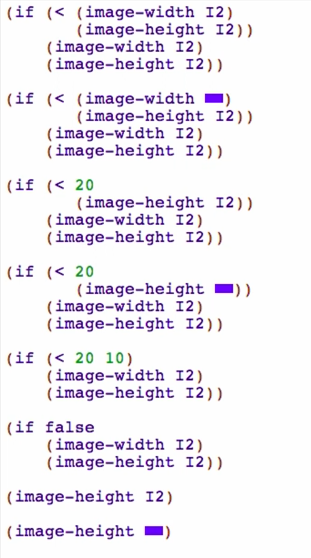

> 1. So the key thing is, the rule for if is, first you evaluate question, 所以关键是，如果的规则是，首先你评估问题，
> 2. and then, depending on the result of the question, 然后，根据问题的结果，
> 3. you replace the entire if with either the true answer or the false answer, 你用真答案或假答案替换整个if，
> 4. and then you just keep evaluating. 然后你就继续评估。

```
<and <expr1> <expr2>...)
; all <expr> must produce BOOLEAN
; if an <expr> produces false imeediately produce false, this's called short circuiting.
; if all <expr> produce true then produce true
```

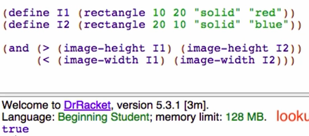

**总结**： 虽然if和booleans啥的，python,C++,JS啥的，里面都有，但是这个课程讲好细致啊....感觉又给你掰开了让你仔细观察共性。角度完全不同了......

## Using the Stepper

介绍了步进器的使用，等于上一节课一点点展现流程的方式，软件自带的一个功能模块给你解决了。

鼓励在函数没有如预期工作的时候使用这个功能分析。

## Discovering Primitives

介绍了两种方法帮你找到或者探索更多的语言提供的primitives，

1. 瞎猜，比如已经通过一些教程知道了长方形怎么画，那么可能替换下primitives，rectangle → triangle ，说不定就可以？
2. 第二种方法，可以在现在已知的primitives上，去鼠标滑中右键，`search it in help`，会跳出定位到这个词的搜索列表。然后讲究一个扫描滚动扫描，这种方式的问题是，看得头晕，母语人都头晕，不要说我们老外了。

所以我觉得可以考虑尝试一下chatGPT。

我： (/ 3 4) 我想知道，有没有什么primitive 让 结果近似值为1.

>  chatGPT：
>
> ### 使用数学操作实现近似
>
> 1. **四舍五入到最接近的整数**：
>
>    - 使用 `round` 函数可以将一个数四舍五入到最接近的整数。
>
>    - 语法: `(round number)`
>
>    - 示例:
>
>      ```
>      (round (/ 3 4)) ; 结果为 1
>      ```
>
> 2. **向上取整**：
>
>    - 使用 `ceiling` 函数可以将一个数向上取整。
>
>    - 语法: `(ceiling number)`
>
>    - 示例:
>
>      ```
>      (ceiling (/ 3 4)) ; 结果为 1
>      ```
>
> 3. **向下取整**：
>
>    - 使用 `floor` 函数可以将一个数向下取整。
>
>    - 语法: `(floor number)`
>
>    - 示例:
>
>      ```
>      (floor (/ 3 4)) ; 结果为 0
>      ```
>
> 4. **最接近的整数**：
>
>    - 使用 `truncate` 函数可以将一个数截断为最接近的整数。
>
>    - 语法: `(truncate number)`
>
>    - 示例:
>
>      ```
>      (truncate (/ 3 4)) ; 结果为 0
>      ```
>
> 5. **通过条件判断近似**：
>
>    - 使用条件判断可以根据实际情况进行近似。
>
>    - 示例:
>
>      ```
>      (if (> (/ 3 4) 0.5) 1 0) ; 结果为 1
>      ```

**总结**：chatGPT可以让你更爽的学习，但不能替代学习/master 本身

## Practice Problems

给了6道题

### 1 ⭐

```
#|
PROBLEM:

Write two expressions that multiply the numbers 3, 5 and 7. 
The first should take advantage of the fact that * can accept more than 2 arguments. 
The second should build up the result by first multiplying 3 times 5 and then multiply the result of that by 7. 
|#
```

```
(* (* 3 5) 7)
```

### 2  ⭐ ⭐

给了个棋盘格，蓝黄配色。

```
#|
PROBLEM:

Use the DrRacket square, beside and above functions to create an image like this one:
■□
□■
If you prefer to be more creative feel free to do so. You can use other DrRacket image 
functions to make a more interesting or more attractive image.

|#
```

```
;create two constants
(define COLOR1 "skyblue")
(define COLOR2 "gold")
;cube element
(define (ele color)
  (rectangle 10 10 "solid" color))
;display 
(above (beside(ele COLOR1)(ele COLOR2))
       (beside(ele COLOR2)(ele COLOR1))
       )
```

不过这个太简单了，决定上点强度：这个棋盘格可以自定义重复生成。

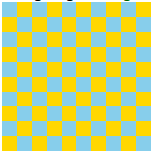

`(sub1 n)`的功能是把n-1，这个做法用到了递归，我感觉算超标很多了（递归问的chatGPT）

```
;create two constants
(define COLOR1 "skyblue")
(define COLOR2 "gold")
(define ELEWIDTH 10)
(define NUMBER 5)
;define cube‘s element
(define (ele ELEWIDTH color)
  (rectangle  ELEWIDTH  ELEWIDTH "solid" color))

; 定义为cube
(define cube
  (above (beside(ele ELEWIDTH COLOR1)(ele ELEWIDTH COLOR2))
       (beside(ele ELEWIDTH COLOR2)(ele ELEWIDTH COLOR1))
       ))

; 横着来一排有n个cube
(define (repeat-image img n)
  (if (>= 0 n)
    empty-image
    (beside img (repeat-image img (sub1 n)))
    ))
; 来n个一排
(define (repeat-row img n)
  (if (>= 0 n)
    empty-image
    (above img (repeat-row img (sub1 n)))
    ))
; 棋盘格
(define all-cubes (repeat-row (repeat-image cube NUMBER) NUMBER))

all-cubes
```

### 3 ⭐

```

#|
PROBLEM:

Based on the two constants provided, write three expressions to determine whether: 

1) IMAGE1 is taller than IMAGE2
2) IMAGE1 is narrower than IMAGE2
3) IMAGE1 has both the same width AND height as IMAGE2
|#
(define IMAGE1 (rectangle 10 15 "solid" "red"))
(define IMAGE2 (rectangle 15 10 "solid" "red"))

```

```
(> (image-height IMAGE1) (image-height IMAGE2))
(< (image-width IMAGE1) (image-width IMAGE2))
(=  
 (image-width IMAGE1) (image-height IMAGE2)
 )
```

### 4 ⭐

```
#|
Given the following function definition:
(define (foo n)
  (* n n))
Write out the step-by-step evaluation of the expression: 
(foo (+ 3 4))
Be sure to show every intermediate evaluation step.
|#
```

```
(foo (+ 3 4))
(foo 7)
(* 7 7)
49
```

### 5 ⭐

```
Write a function that consumes two numbers and produces the larger of the two.
```

```
(define (bigger x y)
(if(> x y)
   x
   y))

(bigger 9 6)
```

虽然这个挺简单的，但由于格式问题，老会写成`bigger(x, y)` 

### 6 ⭐

```
#|
Given the following function definition:

(define (foo s)
  (if (string=? (substring s 0 1) "a")
      (string-append s "a")
      s))

Write out the step-by-step evaluation of the expression: 

(foo (substring "abcde" 0 3))

Be sure to show every intermediate evaluation step.
|#
```

```
1 (foo (substring "abcde" 0 3))
2 (foo "abc")
3  (if (string=? (substring "abc" 0 1) "a")
      (string-append "abc" "a")
      "abc"))
4 if (string=? "a" "a")
5 if #true
6 (string-append "abc" "a")
7 "abca"
```

# 1b: How to Design Functions

这一节的内容讲比较细，上面1a讲了编程如果只有一种语言，那就是函数；这一节的核心围绕函数设计的方法，等于教你西红柿炒鸡蛋，讲讲底层逻辑，设计规范。然后希望你以后所有的素菜+肉的炒锅类都会做。

## Full Speed HtDF Recipe

这个讲太快了。核心：

> The HtDF recipe consists of the following steps:
>
> 1. Signature, purpose and stub.
> 2. Define examples, wrap each in check-expect.
> 3. Template and inventory.
> 4. Code the function body.
> 5. Test and debug until correct

## Slow Motion HtDF Recipe

这个部分是把上面一个部分的内容详细的讲一遍。

> Design a function that consumes a number and produces twice that number. 
> Call your function double. Follow the HtDF recipe and leave behind commented 
> out versions of the stub and template.

简单说，例子是实现一个两倍返回数字的函数。即：n → 2n

### step 1 

Signature

这一步的目的是，明确函数的输入数据类型，和输出数据类型, 以及展示了：进一个出一个。

```
;;Number -> Number
```

> 目前常用的primitive Type：Number, Integer, Natural, String, Image, Boolean

Purpose 

这一步是一句话介绍清楚函数的作用。

```
;;Number -> Number
;;produce 2 times the given number
```

Stub

最后会删除，但是在step1 中最好写一下，这个函数虽然简单，但是实际生产中的函数，写这一步等于磨刀不费砍柴功：

用0 是因为返回的数据类型是0. 不在这一步完成，是因为，stub主要是在test中尝试说明测试的example有没有运行（并不用确保运行成功）

```
;;Number -> Number
;;produce 2 times the given number
(define (double n) 0) ; stub
```

> Stub is a function definition that:
>
> - has correct function name
> - has correct number of parameters
> - produces dummy result of correct type

### step 2

example

```
;;Number -> Number
;;produce 2 times the given number
(check-expect (double 3) 6)
(check-expect (double 5.2) 10.4)
(define (double n) 0) ; this is the stub
```

> Example/Tests
>
> Examples help us understand what function must do. 
>
> Multiple examples to illustrate behavior.
>
> Warpping in check-expect means they will also serve as unit tests for the completed function.

如果此时，运行文件：

> Ran 2 tests.
> 0 tests passed.
>
> Check failures:
>         Actual value 0 differs from 6, the expected value.
>         Actual value 0 differs from 10.4, the expected value.

stub的作用这个时候才得到展示, `run but failed ` . **every step of the recipe helps with all steps after it!**

### step 3 

Inventory - template & constants

```
;;Number -> Number
;;produce 2 times the given number
(check-expect (double 3) 6)
(check-expect (double 5.2) 10.4)
;(define (double n) 0) ; 只用一个; 说明最后记得删

(define (double n)
		(...n))
```

模板等于老中的大纲，`(...n)` 意思是：

>  针对名叫double的函数传进来的参数n，将do something with n。

### step 4

code body

```
;;Number -> Number
;;produce 2 times the given number
(check-expect (double 3) 6)
(check-expect (double 5.2) 10.4)
;(define (double n) 0) ; 只用一个; 说明最后记得删

;(define (double n)		;这个template最后也是要删掉的。
;		(...n))

(define (double n)
		(* 2 n))
```

> 这一步的关键是，想要完成body的书写，需要倒回去考虑看看 example的数据怎么预期的。

### step 5

现在点击运行会得到成功的提示

> Both tests passed!

至于没有成功，那就继续debug，直到成功。

## A Simple Practice Example

这部分好像全是问题练习，然后意思是，每一个问题都建立在前一个问题的基础之上。

### 1. HtDF Problem

> **Problem:** Design a function that pluralizes a given word. (Pluralize means to convert the word to its plural form.) For simplicity you may assume that just adding s is enough to pluralize a word.

```
;;String -> String
;;produce plural form of the given word
(check-expect (plural "pig") "pigs")
(check-expect (plural "cat") "cats")

(define (plural word)
		(string-append word "s"))
```

### 2. Example - yell!

> **Problem:** 
>
> **DESIGN** a function called yell that consumes strings like "hello" 
> and adds "!" to produce strings like "hello!".
>
> Remember, when we say **DESIGN**, we mean follow the recipe.
>
> Leave behind commented out versions of the stub and template.

```
;; String -> String
;; add ! to the end of a string.
(check-expect (yell "bye") "bye!")

;(define (yell str) "!")
;(define (yell str)
;  (...str))
(define (yell str)
  (string-append str "!"))
```

## When Tests are Incorrect

在slow motion中最后提到，test不一定总是正确，毕竟function才是编程的难点嘛。

> 1. writing signatures and purpose statements
>    书写签名和目的声明
> 2. how many tests a function should have
>    一个函数应该有多少个测试
> 3. what to do when tests fail
>    测试失败时该怎么办
> 4. what to do when your understanding of the purpose changes part way through the design
>    当您对目的的理解在设计过程中发生变化时该怎么办

### Example - area

这个例子主要强调test  的编写错误的情况。


```
;;Number -> Number
;; produce a square's area from the given length side of square
(check-expect (area 5) 5)
(check-expect (area 6) 36)
;(define (area len)0)

;(define (area len)
 ; (...len))

(define (area len)
 (* len len))
```

> Ran 2 tests.
> 1 of the 2 tests failed.
>
> Check failures:
>         Actual value 25 differs from 5, the expected value.

如果example test错误，也许是因为：

- the function definition is wrong
- the test is wrong
- they are both wrong（**check the test before fixing the funciton definition.**）

```\
;;Number -> Number
;; produce a square's area from the given length side of square
(check-expect (area 5) 25)
(check-expect (area 6) 36)
;(define (area len)0)

;(define (area len)
 ; (...len))

(define (area len)
 (* len len))
```

## Varying Recipe Order

这个例子主要是强调HtDF recipe 有些时候会改变顺序

> 1. There is some flexibility in following the steps of the process. 遵循该过程的步骤有一定的灵活性。
> 2. It's a structured process, but it's not a locked-in waterfall process. 这是一个结构化的流程，但不是一个锁定的瀑布流程。

### Example - image-area

```
;; Image -> Number
;; produce image's area (w * h)
(check-expect (image-area (rectangle 2 3 "solid" "black")) (* 2 3) )

;(define (image-area img) 0)

;(define (image-area img)
;(...img))
(define (image-area img)
(* (image-width img) (image-height img)))
```

- `image-width`和`image-height`属于在开头没加引入库说明。

```
(require 2htdp/image)
```

- 像素没有小数点，所以结果怎么乘都是整数且是正的，所类型应该是Natural

```
;; Image -> Natural
```

1. 倒回去改发现signature类型没写对是很正常的。
2. 忘记加库/模块 也是常见的。

## Poorly Formed Problems

> 1. Design is the process of going from a poorly formed problem to a well structured solution。**设计是**从一个结构不良的问题出发，到一个结构良好的解决方案的**过程**
> 2. So making the problem more specific is part of the design process. 因此，使问题更加具体是设计过程的一部分。

### Example - tall

这个例子重点讨论了测试集数量。

>**PROBLEM:**
>
>DESIGN a function that consumes an image and determines whether the 
>image is tall.
>
>Remember, when we say DESIGN, we mean follow the recipe.
>
>Leave behind commented out versions of the stub and template.

how many tests does this function need? 这个功能需要多少次测试？

```

(require 2htdp/image)
;; Image -> Boolean
;; produce #true is the img is tall (w < h)

(check-expect (istall (rectangle 2 4 "solid" "gray")) #true)
(check-expect (istall (rectangle 4 2 "solid" "gray")) #false)
(check-expect (istall (rectangle 2 2 "solid" "gray")) #false)

;(define (istall img) #true)

;(define (istall img)
;  (...img)
  )
(define (istall img)
  (if (< (image-width img) (image-height img))
      #true
      #false
      )
  )
```

感觉测试集得至少3个, 因为测试必须走完所有的代码分支+ 边界情况，在这个案例里边界是宽高相同

> You realize partway through the design process that there's a **boundary condition**, or sometimes we call it a **corner case**
>
> 您在设计过程中途意识到,存在边界条件，或者有时我们称之为极端情况
>
> There's this concept called **code coverage** for a test, or **test coverage**, which says given all my tests, how much of the code is actually being evaluated? 有一个称为测试代码覆盖率的概念，或测试覆盖率，它表示根据我的所有测试，有多少代码实际上正在评估吗？

## Practice Problems

题目不多，也就3道。

### 1 ⭐

```
#|
PROBLEM:
DESIGN function that consumes a string and determines whether its length is
less than 5.  Follow the HtDF recipe and leave behind commented out versions 
of the stub and template.
|#
```

```
;; String -> Boolean
;; produce true if the string-length of a string less than 5
(check-expect (less5 "hello") #false)
(check-expect (less5 "hello!") #false)
(check-expect (less5 "halo") #true)
;(define (less5 str) #true); stub

;(define (less5 str) (...str)) ;templete

(define (less5 str)
  (if (< (string-length str) 5)
      #true
      #false
      )
  )
```

### 2 ⭐

```
PROBLEM:
Use the How to Design Functions (HtDF) recipe to design a function that consumes an image, 
and appears to put a box around it. Note that you can do this by creating an "outline" 
rectangle that is bigger than the image, and then using overlay to put it on top of the image. 
For example:
(boxify (ellipse 60 30 "solid" "red")) should produce .
Remember, when we say DESIGN, we mean follow the recipe.
Leave behind commented out versions of the stub and template.
```

```
(require 2htdp/image)
;; Image -> Image
;; produce a boxify with the given img
(check-expect (boxify (rectangle 20 30 "solid" "yellow")) (overlay (rectangle 20 30 "outline" "black") (rectangle 20 30 "solid" "yellow")))
(check-expect (boxify (ellipse 60 30 "solid" "red")) (overlay (rectangle 60 30 "outline" "black") (ellipse 60 30 "solid" "red")))
(check-expect (boxify (right-triangle 40 40 "solid" "tan")) (overlay (rectangle 40 40 "outline" "black") (right-triangle 40 40 "solid" "tan")))
(check-expect (boxify (right-triangle 30 30 "solid" "lightbrown")) (overlay (rectangle 30 30 "outline" "black") (right-triangle 30 30 "solid" "lightbrown")))

;(define (boxify img) (circle 5 "solid" "gold"))

;(define (boxify img) (...img))

(define (boxify img)
  (overlay (rectangle (image-width img) (image-height img) "outline" "black") img )
  )
```

官方的解答，2个像素的box没讲哇

```
;; Image -> Image
;; Puts a box around given image. Box is 2 pixels wider and taller than given image.
;; NOTE: A solution that follows the recipe but makes the box the same width and height 
;;       is also good. It just doesn't look quite as nice. 
(check-expect (boxify (circle 10 "solid" "red")) 
              (overlay (rectangle 22 22 "outline" "black")
                       (circle 10 "solid" "red")))
(check-expect (boxify (star 40 "solid" "gray")) 
              (overlay (rectangle 67 64 "outline" "black")
                       (star 40 "solid" "gray")))

;(define (boxify i) (circle 2 "solid" "green"))

#;
(define (boxify i)
  (... i))

(define (boxify i)
  (overlay (rectangle (+ (image-width  i) 2)
                      (+ (image-height i) 2)
                      "outline"
                      "black")
           i))
```


### 3 ⭐

```
PROBLEM:

There may be more than one problem with this function design. Uncomment 
the function design below, and make the minimal changes required to 
resolve the error that occurs when you run it:

;; Number -> Number
;; doubles n
(check-expect (double 0) 0)
(check-expect (double 4) 8)
(check-expect (double 3.3) (* 2 3.3))
(check-expect (double -1) -2)


#;
(define (double n) 0) ; stub

(define (double n)
  (* (2 n)))
```

```
;; Number -> Number
;; doubles n
(check-expect (double 0) 0)
(check-expect (double 4) 8)
(check-expect (double 3.3) (* 2 3.3))
(check-expect (double -1) -2)


;(define (double n) 0) ; stub

(define (double n)
  (* 2 n))
```

# 2: How to Design Data

这周的内容我尝试更为精简和概要，因为这样速度更快，效率也更高一些。

## cond Expressions

针对下面代码：

```
(require 2htdp/image)

;; cond-starter.rkt

(define I1 (rectangle 10 20 "solid" "red"))
(define I2 (rectangle 20 20 "solid" "red"))
(define I3 (rectangle 20 10 "solid" "red"))

;; Image -> String
;; produce shape of image, one of "tall", "square" or "wide"
(check-expect (aspect-ratio I1) "tall")
(check-expect (aspect-ratio I2) "square")
(check-expect (aspect-ratio I3) "wide")

;(define (aspect-ratio img) "")  ;stub

;(define (aspect-ratio img)      ;template
;  (... img))

(define (aspect-ratio img)  
  (if (> (image-height img) (image-width img))
      "tall"
      (if (= (image-height img) (image-width img))
          "square"
          "wide")))
```

从if 的嵌套使用，来凸显编程语言进程中会出现的情况，当发现原本的用法，并没有很好的支撑现在的数据情况，在这个例子中，tall square wide 是相对一个层级判断的数据。就要开发出新的语法特性。

`cond` 很像python中的`match`，c/c++/javascript 中的`switch case`

```
Problem:

Given the following definition:   

(define (absval n)
  (cond [(> n 0) n]
        [(< n 0) (* -1 n)]
        [else 0]))

Hand step the execution of:
(absval -3)
```

解答：

```
;; Number -> Number
;; produce the absval of a given number, Positive, negative and zero
(check-expect (absval 3) 3)
(check-expect (absval 0) 0)
(check-expect (absval -3) 3)
(check-expect (absval -0.5) 0.5)

; (define (absval n) 0);stub
; (define (absval n)
; (...n))
(define (absval n)
  (cond [(> n 0) n]
        [(< n 0) (* -1 n)]
        [else 0]))

```

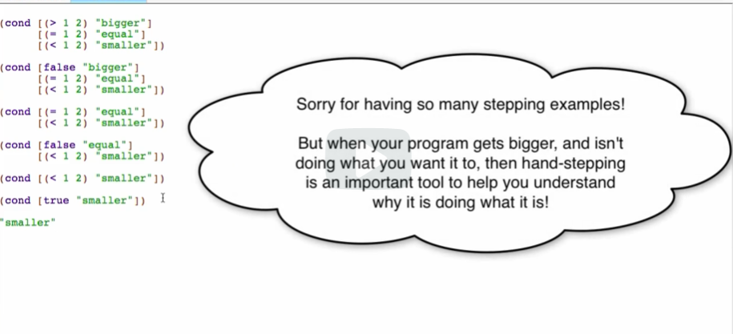

`cond` 的stepper理解有助于知道是否采取了合适的函数来实现功能，这个很像一个个的排队，不符合就踢出去，但是一旦遇到合适的，会立即停止返回对应的value 。

```
(cond [(> 1 0) "yes"]
      [(> -1 0) "no"]
      [(= 1 0) "no"])
      
(cond [#true "yes"]
      [(> -1 0) "no"]
      [(= 1 0) "no"])
"yes"
```


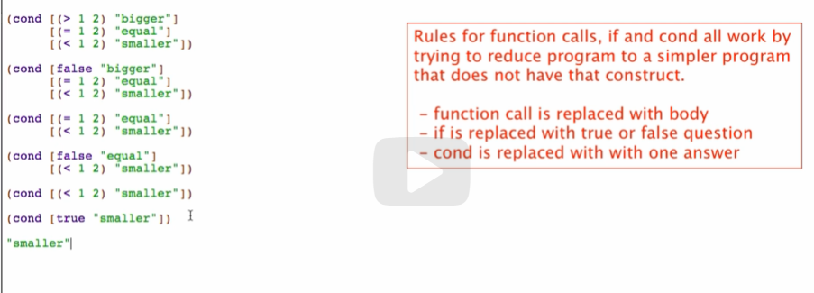

## Data Definitions

通过红绿灯的示范，说明数据和信息表达之间的关系，以及作为函数的编写来说，怎么定义，怎么关联，怎么表示，是非常重要的。通过红绿灯变换中下一个color这个函数，从ver 1 - 4 的迭代，就反映了从一开始粗糙的想法到看起来非常规范，历经的变化。

```
ver 1:


(define (next-color c)
  (cond [(= c 0) 2]
        [(= c 1) 0]
        [(= c 2) 1]))
```

ver1 属于一看就不规范，因为没有按着之前的HTDF 格式来写。

```
ver 2:

;; Natural -> Natural
;; produce next color of traffic light
(check-expect (next-color 0) 2)
(check-expect (next-color 1) 0)
(check-expect (next-color 2) 1)

;(define (next-color c) 0)  ;stub

;(define (next-color c)     ;template
;  (... c))

(define (next-color c)
  (cond [(= c 0) 2]
        [(= c 1) 0]
        [(= c 2) 1]))

```

ver 2 解决了这个问题，但是还是有新的问题，比如0，1，2什么意思？

```
ver 3:
;; Data definitions:

;; TLColor is one of:
;;  - 0
;;  - 1
;;  - 2
;; interp. 0 means red, 1 yellow, 2 green               
#;
(define (fn-for-tlcolor c)
  (cond [(= c 0) (...)]
        [(= c 1) (...)]
        [(= c 2) (...)]))
;; Functions
;; TLColor -> TLColor
;; produce next color of traffic light
(check-expect (next-color 0) 2)
(check-expect (next-color 1) 0)
(check-expect (next-color 2) 1)

;(define (next-color c) 0)  ;stub

; Template from TLColor

(define (next-color c)
  (cond [(= c 0) 2]
        [(= c 1) 0]
        [(= c 2) 1]))
```

ver3 试图解决这个问题，对 0 1 2 补充了 data definition。并且在function中 输入和输出的data type 也根据data definition进行了替换。现在唯一的问题是，0，1，2估计都得在DD的区域对着看是啥意思对不。

```
ver 4:
;; A small part of a traffic simulation.

;; Data definitions:

;; TLColor is one of:
;;  - "red"
;;  - "yellow"
;;  - "green"
;; interp. "red" means red, "yellow" yellow, "green" green
#;
(define (fn-for-tlcolor c)
  (cond [(string=? c "red") (...)]
        [(string=? c "yellow") (...)]
        [(string=? c "green") (...)]))
        
;; Functions
;; TLColor -> TLColor
;; produce next color of traffic light
(check-expect (next-color "red") "green")
(check-expect (next-color "yellow") "red")
(check-expect (next-color "green") "yellow")

;(define (next-color c) "red")  ;stub

; Template from TLColor

(define (next-color c)
  (cond [(string=? c "red")    "green"]
        [(string=? c "yellow") "red"]
        [(string=? c "green")  "yellow"]))
```

ver4 进行了这部分的改变，将0，1，2替换为文本，这样更降低了理解的麻烦程度。


## Atomic Non-Distinct

想讲了下原则，HTDD recipe：

> The first step of the recipe is to identify the inherent structure of the information. 配方的第一步是识别信息的固有结构。
>
> Once that is done, a data definition consists of four or five elements: 完成后，数据定义由四个或五个元素组成：
>
> 1. A possible **structure definition** (not until compound data) 可能的结构定义（直到复合数据）
> 2. A **type comment** that defines a new type name and describes how to form data of that type. 定义新类型名称并描述如何形成该类型数据的类型注释。
> 3. An **interpretation** that describes the correspondence between information and data. 描述信息和数据之间对应关系的解释。
> 4. One or more **examples** of the data. 一个或多个数据示例。
> 5. A **template** for a 1 argument function operating on data of this type. 对该类型的数据进行操作的 1 个参数函数的模板。

最重要的一点是：信息结构决定了会采用什么数据类型，进而决定了模板的结构并帮助确定example test要咋写。

## HtDF With Non-Primitive Data

这节课采用了一个例子来讲解 Non-Primitive ，那可能需要先理解啥是Primitive。

Non--Primitive data: data defined by a data definition

primitive data：没data definition的情况下写function. 

其实大概可以理解成，函数的入口在设计的时候，要多考虑data type，简单函数直觉就知道啥type，但是实际生产中可能一层一层的封装和指向，因此写清楚入口data type咋来的就显得比较重要了。

```
;; Data definitions:


;; CityName is String
;; interp. the name of a city
(define CN1 "Boston")
(define CN2 "Vancouver")
#;
(define (fn-for-city-name cn)
  (... cn))

;; Template rules used:              For the first part of the course
;;   atomic non-distinct: String     we want you to list the template
;;                                   rules used after each template.
;;

;; Functions:

;;CityName -> Boolean
;; produce true if the given city is Godmade

(check-expect (best? "Boston") false)
(check-expect (best? "Godmade") true)

;(define (best? cn) false);stub
; took template from CityName
#;
;7 steps
(define (best? cn)
  (if (string=? cn "Godmade")
      true
      false)
  )
; 5 steps
(define (best? cn)
  (string=? cn "Godmade")
      )
```

| When the form of the information to be represented...        | Use a data definition of this kind                           |
| ------------------------------------------------------------ | ------------------------------------------------------------ |
| is atomic                                                    | [Simple Atomic Data](https://courses.edx.org/courses/course-v1:UBCx+HtC1x+2T2017/77860a93562d40bda45e452ea064998b/#Atomic) |
| is numbers within a certain range                            | [Interval]()                                                 |
| consists of a fixed number of distinct items                 | [Enumeration]()                                              |
| is comprised of 2 or more subclasses, at least one of which is not a distinct item | [Itemization]()                                              |
| consists of two or more items that naturally belong together | [Compound data]()                                            |
| is naturally composed of different parts                     | [References to other defined type]()                         |
| is of arbitrary (unknown) size                               | [self-referential or mutually referential]()                 |

## HtDF X Structure of Data Orthogonality

这节课算导论，主要是强调：

数据类型可以很多种很多样，但是最后都要应用在HtDF中，也就是说，HtDF是最核心的部分，Funciton写好了可以很低成本的迁移应用到各种数据类型中。

> chatGPT: 
>
> “Orthogonal” 在数学和计算机科学中，通常指的是两个对象或概念彼此独立且不相互影响。用在程序设计和开发中，指的是两个方法、流程或技术可以分别独立应用，不会彼此干扰或重叠。

## Interval

`[]` 是左闭右开，取不到32，所以我用了33，但是课程上老师还是采用的32.

```
; 
; PROBLEM:
; 
; Imagine that you are designing a program to manage ticket sales for a
; theatre. (Also imagine that the theatre is perfectly rectangular in shape!) 
; 
; Design a data definition to represent a seat number in a row, where each 
; row has 32 seats. (Just the seat number, not the row number.)
;  

;;Data definitions:
;;SetNum is Natural[1,33]
;; interp. seat number in a row, 1 - 32.
(define SN1 1) ;aisle
(define SN2 12);middle
(define SN3 32);aisle
#;
(define (fn-4-seat-num sn)
  (...sn))

;; temple rules used;
;; - atomic non-distinct: Natural[1,33]

;; funcitons:
```

## Enumeration

带着走了一遍HtDD的文档怎么用的，比如为啥用cond？ code 的条件为啥是判断string的值？多少都有些套路，不过可能因为例子太简单了，有种杀鸡用牛刀的感觉。

 ```
 ; 
 ; PROBLEM:
 ; 
 ; As part of designing a system to keep track of student grades, you
 ; are asked to design a data definition to represent the letter grade 
 ; in a course, which is one of A, B or C.
 ;   
 
 ;;letterGrade is one of:
 ;; - "A"
 ;; - "B"
 ;; - "C"
 ;; interp, the letter grade in a course
 ;;<examples are redundant for enumerations>
 
 (define (fon-for-letter-grade lg)
   (cond [(string=? lg "A") (...lg)]
         [(string=? lg "B") (...lg)]
         [(string=? lg "C") (...lg)]
         )
   )
 
 ;; template rules used:
 ;; - one of : 3 cases
 ;; - atomic distinct value:"A"
 ;; - atomic distinct value:"B"
 ;; - atomic distinct value:"C"
 ```

## Itemization

据说是这周最复杂的例子，一看确实，不过这种划分方式还是有点奇妙，之前很多印象都是纯数字，因为倒计时，数字大于某个区间就是没开始，小于区间就是完了，哪这么细分三个阶段来用不同的data type 玩哟。

step1：这部分主要写了Data definition

```
; 
; PROBLEM:
; 
; Consider designing the system for controlling a New Year's Eve
; display. Design a data definition to represent the current state 
; of the countdown, which falls into one of three categories: 
; 
;  - not yet started
;  - from 10 to 1 seconds before midnight
;  - complete (Happy New Year!)
; 

;; countdown is one of:
;; -  false
;; -natural[1,10]
;; - "complete"

;;interp.

;; false means countdown has not yet started
;; Natural[1,10] : countdown is running and how many seconds
;; "complete": countdown is oer
(define cd1 false)
(define cd2 10); just started running
(define cd3 1) ; almost over
(define cd4 "complete")
```

step2: 开始补充data definition 的最后一部分：函数模板

```
(define (fn-for-countdown c)
  (cond [(false? c) (...)]
        [(and (number? c) (<= 1 c) (<= c 10)) (...c)]
        [else (...) ])
  )

;; template rules used;
;; one of 3 cases
;; atomic distinct :false
;; atomic non-distinct : Natural[1,10]
;; atomic distinct :"complete"
```

这里有需要强调的，主要cond 的最后一项：`else`

> in this course we allow you to assume that a function is called with arguments that match its signature. In other programming languages this will be enforced automatically.
>
> > In this course, if you have written a well formed type comment like countdown, and you later say that a function consumes a countdown, then you can count on the function being called with a legal countdown.
> > So what that means is when this template runs in some specific function, if C isn't false, and C isn't a number between one and 10, then C is guaranteed to be the string complete. You don't have to actually test here whether C is the string complete.
> > What we're saying is that having taken the trouble to do type comment, and having taken the trouble to specify the signature of a function, you can count on that being respected.
> >
> > 在本课程中，如果你写了一个格式良好的类型注释，比如倒计时，你后来说一个函数消耗了一个倒计时，那么你可以指望被调用的函数有一个合法的倒计时。
> > 因此，这意味着当此模板在某个特定函数中运行时，如果 C 不是假的，并且 C 不是 1 到 10 之间的数字，那幺 C 可以保证是字符串完成的。你不必在这里实际测试C是否是完整的字符串。
> > 我们要说的是，在不厌其烦地进行类型注释，并且不厌其烦地指定函数的签名之后，您可以指望这一点得到尊重。
> >
> > The reason that's a reasonable thing to do in this course is the other programming languages that you will use is a part of the programming language implementation call the compiler, which will actually enforce that rule to make sure that it's always true.
> > So it's a reasonable rule for you to start counting on here.
> >
> > 在本课程中，这样做的原因是，您将使用的其他编程语言是编程语言实现的一部分，称为编译器，编译器实际上将执行该规则以确保它始终为真。
> > 因此，从这里开始依赖这是一个合理的规则。
>
> it is actually just a part of the compiler called the type checker, And it doesn't have to be part of the compiler.
> And there are several other caveats. But the key point is that many languages enforce rules about function arguments matching the funcion signature.

step3: 最后部分强调 ` guard`

```
Rules:
1. if a given subclass is the last subclass of its type, we can reduce the test to just the guard. ie(number? c)
2. if alll remianing subclasses are of the same type, then we can eliminate all of the guards.
```

guard可以理解成类型判断，边界，前置条件，就是说也不一定啥时候都要guard，看情况来。毕竟省一步程序就快一步。

## HtDF with Interval

开始用区间数据演示设计函数了,例子比较简单，但是and or 这两个关键字语法已经讲了算是。

```
; 
; PROBLEM:
; 
; Using the SeatNum data definition below design a function
; that produces true if the given seat number is on the aisle. 
; 


;; Data definitions:

;; SeatNum is Natural[1, 32]
;; Interp. Seat numbers in a row, 1 and 32 are aisle seats
(define SN1  1) ;aisle
(define SN2 12) ;middle
(define SN3 32) ;aisle
#;
(define (fn-for-seat-num sn)
  (... sn)) 

;; Template rules used:
;;  atomic non-distinct: Natural[1, 32]


;; Functions:
;;setNum -> Boolean
;; prduce true if the given number in the aisle
(check-expect (aisle? 33) false)
(check-expect (aisle? 1) true)
(check-expect (aisle? 32) true)
(check-expect (aisle? 16) false)
(check-expect (aisle? 0) false)

;(define (aisle? sn) false);stub
;< use templete from setNum>
(define (aisle? sn)
 (or (= sn 1)
     (= sn 32))
  )

```

## HtDF with Enumeration

用这个例子，主要就是说明，枚举的测试example不用多写，因为你写funciton的时候，基本枚举过了（很难说枚举类型还需不需要写用例）

哎，这周内容也太乏味了......

```
; 
; PROBLEM:
; 
; Using the LetterGrade data definition below design a function that
; consumes a letter grade and produces the next highest letter grade. 
; Call your function bump-up.
; 


;; Data definitions:

;; LetterGrade is one of: 
;;  - "A"
;;  - "B"
;;  - "C"
;; interp. the letter grade in a course
;; <examples are redundant for enumerations>
#;
(define (fn-for-letter-grade lg)
  (cond [(string=? lg "A") (...)]
        [(string=? lg "B") (...)]
        [(string=? lg "C") (...)]))

;; Template rules used:
;;  one-of: 3 cases
;;  atomic distinct: "A"
;;  atomic distinct: "B"
;;  atomic distinct: "C"


;; Functions:
;; LetterGrade -> LetterGrade
;; produce next highest letter grade (no change for A)
(check-expect (bump-up "A") "A")
(check-expect (bump-up "B") "A")
(check-expect (bump-up "C") "B")
;(define (bump-up lg) "A");stub
; <use template from LetterGrade>
(define (bump-up lg)
  (cond [(string=? lg "A") "A"]
        [(string=? lg "B")  "A"]
        [(string=? lg "C") "B"]))
```

## HtDF with Itemization

把之前有个倒计时的问题拿来详细做，`(number->string 5)` 这类自带语法属于根本不介绍了......（毕竟这个课不是主要讲语法的）

```

;; countdown-to-display-starter.rkt

; 
; PROBLEM:
; 
; You are asked to contribute to the design for a very simple New Year's
; Eve countdown display. You already have the data definition given below. 
; You need to design a function that consumes Countdown and produces an
; image showing the current status of the countdown. 
; 

(require 2htdp/image)
;; Data definitions:

;; Countdown is one of:
;;  - false
;;  - Natural[1, 10]
;;  - "complete"
;; interp.
;;    false           means countdown has not yet started
;;    Natural[1, 10]  means countdown is running and how many seconds left
;;    "complete"      means countdown is over
(define CD1 false)
(define CD2 10)          ;just started running
(define CD3  1)          ;almost over
(define CD4 "complete")
#;
(define (fn-for-countdown c)
  (cond [(false? c) (...)]
        [(and (number? c) (<= 1 c) (<= c 10)) (... c)]
        [else (...)]))

;; Template rules used:
;;  - one of: 3 cases
;;  - atomic distinct: false
;;  - atomic non-distinct: Natural[1, 10]
;;  - atomic distinct: "complete"

;; Functions:
;; CountDown -> Image
;; produce nice image of current state of countdown
(check-expect (countdown->image false) (square 20 "outline" "black"))
(check-expect (countdown->image 5) (text (number->string 5) 24 "black"))
(check-expect (countdown->image "complete") (text "happy new year!" 24 "red"))

;(define (countdown->image c) (square 20 "outline" "black"));stub

; <templete from Countdown>
(define (countdown->image c)
  (cond [(false? c) (square 20 "outline" "black")]
        [(and (number? c) (<= 1 c) (<= c 10)) (text (number->string c) 24 "black")]
        [else (text "happy new year!" 24 "red")]))
```

主要容易犯的错：

- 没有引入库 `(require 2htdp/image)`
- `countdown->image` 这种命名方式是BSL的规范，每个语言都有偏好的规范。
- dr.racket 也有全文替换，但是不会替换掉注释的内容，也就是说，得手动修改。

## Structure of Information Flows Through

本周总结开始了.....

1. week2 主要讲了红色部分
2. week1 主要讲了蓝色部分
3. week3 要搞定 how to design world，也就是绿色部分。

primitive mix non-primitive是常态，交叉一下就得出复杂的世界。

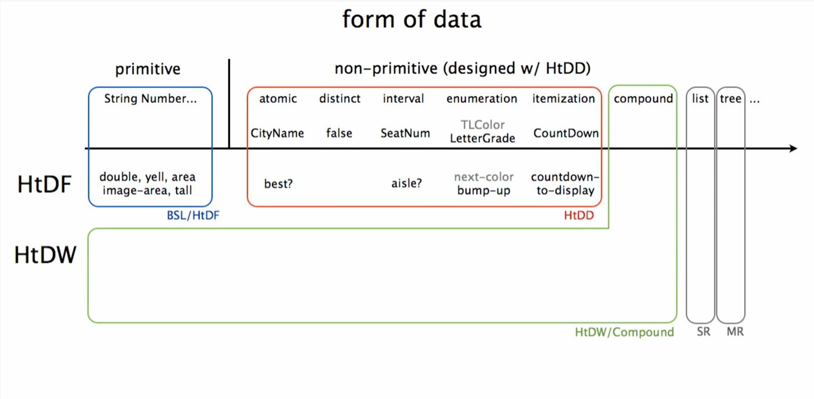

回顾了本周的各种例子，代码结构上呈现出非常有结构的样子，而且从数据设计到功能设计，到测试，都是独立但互相交叉影响。structure还是非常重要。

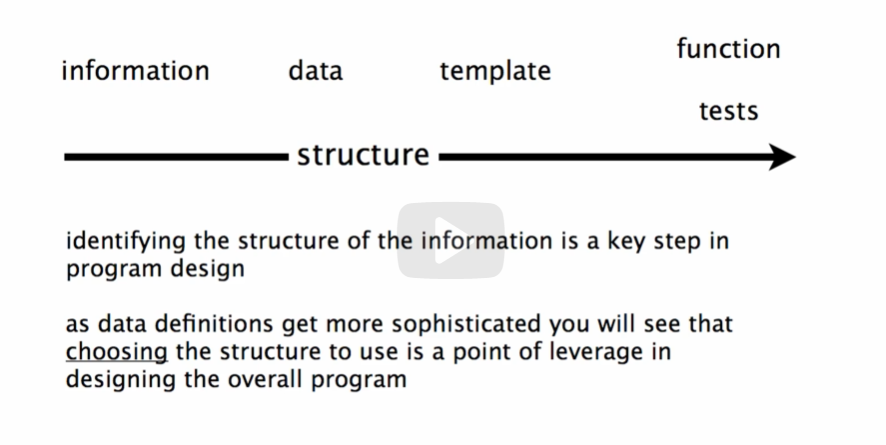

强调了，数据结构驱动模板在大多数时候编程都管用，好好用事半功倍。

week3 将更多考虑控制结构来主导的function设计，但即便这样，数据形式还是很重要。因为信息决定数据，数据决定函数形式。

## Practice Problems

### 1 ⭐

```
;; demolish-starter.rkt

;; =================
;; Data definitions:

; 
; PROBLEM A:
; 
; You are assigned to develop a system that will classify 
; buildings in downtown Vancouver based on how old they are. 
; According to city guidelines, there are three different classification levels:
; new, old, and heritage.
; 
; Design a data definition to represent these classification levels. 
; Call it BuildingStatus.
; 


;; =================
;; Functions:

; 
; PROBLEM B:
; 
; The city wants to demolish all buildings classified as "old". 
; You are hired to design a function called demolish? 
; that determines whether a building should be torn down or not.
; 

```

```
;; =================
;; Data definitions:
;;BuildingStatus is one of:
;; - "new"
;; - "old"
;; - "heritage"
;; interp.
(define BS1 "new")
(define BS2 "old")
(define BS3 "heritage")


#;
(define (fn-for-building-status bs)
    (if(string=? bs "old")
   (...)
  (...))
  )

;; Template rules used:
;;  - atomic non-distinct: "new","old","heritage"

;; =================
;; Functions:
;; BuildingStatus -> Boolean
(check-expect (demolish "new") "not torn down")
(check-expect (demolish "old") "torn down")
(check-expect (demolish "heritage")  "not torn down")
;(define (demolish bs)  "new");stub
;< templete from BuildingStatus>

(define (demolish bs)
  (if(string=? bs "old")
   "torn down"
  "not torn down")
  )

```

### 2 ⭐⭐

```
PROBLEM A:

You are designing a program to track a rocket's journey as it descends 
100 kilometers to Earth. You are only interested in the descent from 
100 kilometers to touchdown. Once the rocket has landed it is done.

Design a data definition to represent the rocket's remaining descent. 
Call it RocketDescent.
PROBLEM B:

Design a function that will output the rocket's remaining descent distance 
in a short string that can be broadcast on Twitter. 
When the descent is over, the message should be "The rocket has landed!".
Call your function rocket-descent-to-msg.
```

```
;; Data definitions:

;; RocketDescent is one of:
;;  - false
;;  - Number[0, 100]
;;  - "The rocket has landed!"
;; interp.
;;    false                         means rocket's 100km journey didn't start.
;;   Number[0, 100]                 means How many meters did the rocket fall
;;    "The rocket has landed!"      means the rocket has landed
(define RD1 false)
(define RD2 99)          ;almost over
(define RD3  0.1)          ;just started falling 0.1 km
(define RD4 "The rocket has landed!")
#;
(define (fn-for-RocketDescent d)
  (cond [(false? d) (...)]
        [(and (number? d) (> d 0) (< d 100)) (... d)]
        [else (...)]))

;; Template rules used:
;;  - one of: 3 cases
;;  - atomic distinct: false
;;  - atomic non-distinct:  Number[0, 100] 
;;  - atomic distinct: "The rocket has landed!"

;; =================
;; Functions:
;;  RocketDescent -> String
(check-expect (rocket-descent-to-msg false) "ready")
(check-expect (rocket-descent-to-msg 100) "The rocket has landed!")
(check-expect (rocket-descent-to-msg 5) "The rocket is still 95.0km away from landing")
(check-expect (rocket-descent-to-msg 78.2) "The rocket is still 21.8km away from landing")
(check-expect (rocket-descent-to-msg 99.599) "The rocket is still 0.401km away from landing")


;(define (rocket-descent-to-msg d) false);stub

; < templete from RocketDescent>

(define (rocket-descent-to-msg d)
  (cond [(false? d) "ready"]
        [(and (number? d) (> d 0) (< d 100))
         (string-append "The rocket is still " (number->string (exact->inexact (- 100 d) )) "km away from landing")]
        [else "The rocket has landed!"])
  )
```

还是有点麻烦，主要是展示问题，`number->string`得到的可能是分数，但是一般来说，用户习惯看小数，所以还需要用`exact->inexact` 转成浮点数。

这个和标准答案出入还是有点大，主要是意思理解反了，不过听众角度，掉了多少km不重要，距离落地还有多少km比较重要。

```
(define RD1 100)
(define RD2 40)
(define RD3 0.5)
(define RD4 false)

#;
(define (fn-for-rocket-descent rd)
  (cond [(and (number? rd)
              (<   0 rd)
              (<= rd 100))
         (... rd)]
         [else  (...)])) 

;; Template Rules Used:
;;  - one of: 2 cases
;;  - atomic non-distinct: Number[100, 0) 
;;  - atomic distinct: false

;; RocketDescent -> String
;; outputs a Twitter update on rocket's descent distance
(check-expect (rocket-descent-to-msg  100) "Altitude is 100 kms.")
(check-expect (rocket-descent-to-msg  40) "Altitude is 40 kms.")
(check-expect (rocket-descent-to-msg  .5) "Altitude is 1/2 kms.")
(check-expect (rocket-descent-to-msg  false) "The rocket has landed!")   

;(define (rocket-descent-to-msg rd) "")  ;stub

; <template from RocketDescent>

(define (rocket-descent-to-msg rd)
  (cond [(and (number? rd)
              (<   0 rd)
              (<= rd 100))
         (string-append "Altitude is " (number->string rd) " kms.")]
        [else 
         "The rocket has landed!"])) 
```

## Quiz

week2的quiz 给了我们白嫖党

```
;; HtDD Design Quiz

;; Age is Natural
;; interp. the age of a person in years
(define A0 18)
(define A1 25)

#;
(define (fn-for-age a)
  (... a))

;; Template rules used:
;; - atomic non-distinct: Natural

; Problem 1:
; 
; Consider the above data definition for the age of a person.
; 
; Design a function called teenager? that determines whether a person
; of a particular age is a teenager (i.e., between the ages of 13 and 19).


; Problem 2:
; 
; Design a data definition called MonthAge to represent a person's age
; in months.


; Problem 3:
; 
; Design a function called months-old that takes a person's age in years 
; and yields that person's age in months.
; 

; Problem 4:
; 
; Consider a video game where you need to represent the health of your
; character. The only thing that matters about their health is:
; 
;   - if they are dead (which is shockingly poor health)
;   - if they are alive then they can have 0 or more extra lives
; 
; Design a data definition called Health to represent the health of your
; character.
; 
; Design a function called increase-health that allows you to increase the
; lives of a character.  The function should only increase the lives
; of the character if the character is not dead, otherwise the character
; remains dead.

```

```
; Problem 1:
;; Age -> Boolean
;; produce true if the given age is between of 13 and 19
(check-expect (teenager? 15) true)
(check-expect (teenager? 12) false)
(check-expect (teenager? 20) false)

;(define (teenager? a) true);stub

;<templete from Age>
(define (teenager? a)
   (and (number? a)
     (<= a 19)
     (>= a 13))
  )
```

```
; Problem 2:
;; data definition:
;; MonthAge is Natural
;; interp. the age of a person in months
(define M0 60) ; a person in 60months means 5 years old
(define M1 72) ; a person in 60months means 6 years old
(define M2 78) ; a person in 60months means 6 years old

#;
(define (fn-for-MonthAge m)
  (... m))

;; Template rules used:
;; - atomic non-distinct: Natural
```

```
; Problem 3:
;; Age -> MonthAge
;; produce monthage of the given age
(check-expect (months-old 3) 36)
(check-expect (months-old 12) 144)
(check-expect (months-old 11) 132)

;(define (months-old y) (* y 12));stub

;<templete from  MonthAge>

(define (months-old y)
  (* y 12))
```

```
; Problem 4:
;; data definition:
;;  Health is one of:
;; - false     
;; - Natural
;;interp.
;; - false      means dead
;; - Natural    means alive line is 0 or more
;;  the age of a person in months
(define H1 false)
(define H2 12)
(define H3 0 )

#;
(define (fn-for-Health h)
  (... h))

;; Template rules used:
;; - one of: 3 cases
;; - atomic distinct: false
;; - atomic distinct: Natural

;; =================
;; Functions:
;;  Health -> Health
;; add lives when alived, add livers is unuseful when dead.
(check-expect (increase-health false 14) false)
(check-expect (increase-health 5 14) 19)
;(define (increase-health h ih) false );stub

;< templete from Health>

(define (increase-health h ih)
  (cond [(false? h) false]
        [(number? h) (+ h ih)]))
```

# 3a: How to Design Worlds

这部分老师坦言，要开始写交互程序了，动画啥的。会比之前的内容有趣。

顺便总结了一下之前的学习内容：

> 1. You've learned about different forms of **primitive data** like numbers and strings and images.
> 2. You've learned about **expressions** like **if** and cond,
> 3. how to **define function**s and **constants**, the rules for evaluating BSL code.
> 4. We've also learned **how to design functions recipe**, and **how to design data recipe**, and **how to use the data-driven template rules**.

## Interactive Programs

强调了了虽然有趣了一些，但是也不会太吊，因为计算机图形学要太多复杂的数学知识了。

属于是降低过高的预期了，然后结尾预告会实现一个单行的文本输入功能，类似发短信那个打字框。

## The big-bang Mechanism

重点讲了机制在交互程序中的运行逻辑：changing state，changing display，keyboard and/or mouse affects behavior。

举例的动画，感觉很像[scratch](https://scratch.mit.edu/)

主要涉及介绍了新的expression`place-image`，感觉之前我已经自己用过不少了。

整个一小节全部在以一个程序来讲解在干啥，做了啥，big-bang 每一步咋运行啥，介绍了big-bang这个名字的栓双关：把碎片揉在一起，然后bang 产出一个world。

总的来说，讲课逻辑和之前两周非常像。

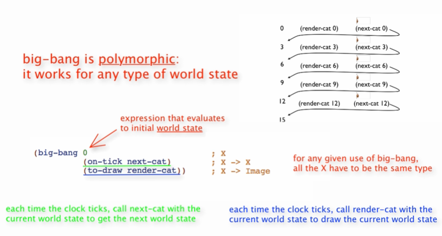

## 1. Domain Analysis

基于recipe的例子来讲，这部分主要是前期分析，磨刀不费砍材工。

Domain Analysis 阶段要点是：

1. sketch
2. identify constant information
3. identify changing information
4. identify big-bang option

给出了一些big-bang 选项关键词表

| If your program needs to:              | Then it needs this option: |
| -------------------------------------- | -------------------------- |
| change as time goes by (nearly all do) | `on-tick`                  |
| display something (nearly all do)      | `to-draw`                  |
| change in response to key presses      | `on-key`                   |
| change in response to mouse activity   | `on-mouse`                 |
| stop automatically                     | `stop-when`                |

```
PROBLEM:

Use the How to Design Worlds recipe to design an interactive
program in which a cat starts at the left edge of the display 
and then walks across the screen to the right. When the cat
reaches the right edge it should just keep going right off 
the screen.

Once your design is complete revise it to add a new feature,
which is that pressing the space key should cause the cat to
go back to the left edge of the screen. When you do this, go
all the way back to your domain analysis and incorporate the
new feature.

To help you get started, here is a picture of a cat, which we
have taken from the 2nd edition of the How to Design Programs 
book on which this course is based.
```

| constant info                                         | changing info                      | big-bang option |
| ----------------------------------------------------- | ---------------------------------- | --------------- |
| width of the screen                                   | the cat's x-coordinate is changing | `on-tick`       |
| height of the screen                                  |                                    | `to-draw`       |
| **the cat's y-coordinate doesn't change.**: center-y  |                                    |                 |
| the(0,0) has been identified in the upper left corner |                                    |                 |
| background image ： MTS （empty scene）               |                                    |                 |
| cat-image                                             |                                    |                 |

做完这上面的分析，下一步就需要将其转换为代码。

## 2. Program through main Function

Build the actual program阶段来临啦：

> 1. Constants (based on 1.2 above)
> 2. Data definitions using **HtDD** (based on 1.3 above)
> 3. Functions using **HtDF**
>    1. main first (based on 1.3, 1.4 and 2.2 above)
>    2. wish list entriesfor big-bang handlers
> 4. Work through wish list until done

**Template for a World Program**

这节课给的模板，已经不是视频介绍了，而是给了url，说明用别人写好的模板/代码 没啥问题，问题是要知道该用就要用，以及用啥。

又一次强调了，模板不是只给初学者用得，反而越是复杂的功能设计用得越多。

```
(require 2htdp/image)
(require 2htdp/universe)

;; My world program  (make this more specific)

;; =================
;; Constants:


;; =================
;; Data definitions:

;; WS is ... (give WS a better name)


;; =================
;; Functions:

;; WS -> WS
;; start the world with ...
;; 
(define (main ws)
  (big-bang ws                   ; WS
            (on-tick   tock)     ; WS -> WS
            (to-draw   render)   ; WS -> Image
            (stop-when ...)      ; WS -> Boolean
            (on-mouse  ...)      ; WS Integer Integer MouseEvent -> WS
            (on-key    ...)))    ; WS KeyEvent -> WS

;; WS -> WS
;; produce the next ...
;; !!!
(define (tock ws) ...)


;; WS -> Image
;; render ... 
;; !!!
(define (render ws) ...)
```

对照着1中的表格，完成了常量的编写。

```
;; =================
;; Constants:
(define WIDTH 600)
(define HEIGHT 400)

(define CTR-Y (/ HEIGHT 2))
(define MTS (empty-scene WIDTH HEIGHT "white") ) ; give a white background.
(define CAT-IMG .)

```

>  Now, let me reinforce the point I made before about using the constants-- always referring to the constants. Notice that this code that I have here lines up really well with the analysis we did.The fact that I can look at the analysis and look at the code and understand where everything in the analysis showed up in the code is a thing called traceability.
>
> 现在，让我强调一下我之前提出的关于使用常量的观点——总是指常量。请注意，我在这里的这段代码与我们所做的分析非常吻合。事实上，我可以查看分析并查看代码并了解分析中的所有内容在代码中显示的位置，这称为可追溯性。
>
> And that is this is an important intuition. The way to think about is there's only two kinds of programs in the world. There's program that the change and programs that nobody uses. Put it another way, any program that anybody uses is always changing. People always want it to do more and better things.
>
> 这是一个重要的直觉。思考的方式是，世界上只有两种程序。有更改的程序和没人用的程序。换句话说，任何人使用的任何程序总是在变化。人们总是希望它做更多更好的事情。

然后对照1中的changing info 做了data definition，能用常量用常量。

```
;; =================
;; Data definitions:

;; CAT-X is a Number
;; interp. x position of the cat in screen coordinates.
(define X1 0);left edge
(define X2 (/ WIDTH 2));MIDDLE
(define X3 WIDTH);right edge
#;
(define (fn-for-cat x)
  (...x))
;; Templete rules used:
;; - atomic non-distinct :Number

```

接着，要开始写框架,一就要对照1中的分析：

```
;; =================
;; Functions:

;; CAT-X -> CAT-X
;; start the world with ...
;; 
(define (main x)
  (big-bang x                   ; CAT-X
            (on-tick  advance-cat )     ; CAT-X -> CAT-X
            (to-draw   render)))   ; CAT-X -> Image
            

;; CAT-X -> CAT-X
;; produce the next cat, by advancing it one pixel to right.
;; !!!
(define (advance-cat x) 0) 


;; CAT-X -> Image
;; render the cat image at appropriate place on MTS
;; !!!
(define (render x) MTS)

```

> A wish-list entry has a signature,purpose,!!! and a stub.
>
> It is a promise to come back and finish this function later.
>
> In bigger programs you can have 10s or 100s of pending wish list entries, so it pays to be disciplined about writing down what you need to do 

`!!!` 强烈的表明，没写完，记得回来干活。

## 3.Working through the Wish List

这一步就是遵循HtDF完善每个小函数。这是这个程序的第一个版本。

```
;; =================
;; Functions:

;; CAT-X -> CAT-X
;; start the world with (main 0)
;;
(define (main x)
  (big-bang x                   ; CAT-X
            (on-tick  advance-cat )     ; CAT-X -> CAT-X
            (to-draw   render)))   ; CAT-X -> Image
            

;; CAT-X -> CAT-X
;; produce the next cat, by advancing it one pixel to right.
(check-expect (advance-cat 3)4)

;(define (advance-cat x) 0) ;stub

;;< templete form the CAT-X>
(define (advance-cat x)
  (+ x 1))

;; CAT-X -> Image
;; render the cat image at appropriate place on MTS
(check-expect (render 4) (place-image CAT-IMG 4 CTR-Y MTS))

(define (render x)
(place-image CAT-IMG x CTR-Y MTS)
  )
```

## 4. Improving a World Program - Add SPEED

增加了常量SPEED，并且强调了可以用到check-expects里，会更清楚也更容易修改。

```
(require 2htdp/image)
(require 2htdp/universe)

;; a cat that walks from left to right across the screen.

;; =================
;; Constants:
(define WIDTH 600)
(define HEIGHT 400)

(define CTR-Y (/ HEIGHT 2))
(define MTS (empty-scene WIDTH HEIGHT "white") ) ; give a white background.
(define CAT-IMG .)
;; add speed 
(define SPEED 10)

;; =================
;; Data definitions:

;; CAT-X is a Number
;; interp. x position of the cat in screen coordinates.
(define X1 0);left edge
(define X2 (/ WIDTH 2));MIDDLE
(define X3 WIDTH);right edge
#;
(define (fn-for-cat x)
  (...x))
;; Templete rules used:
;; - atomic non-distinct :Number


;; =================
;; Functions:

;; CAT-X -> CAT-X
;; start the world with (main 0)
;;
(define (main x)
  (big-bang x                   ; CAT-X
            (on-tick  advance-cat )     ; CAT-X -> CAT-X
            (to-draw   render)))   ; CAT-X -> Image
            

;; CAT-X -> CAT-X
;; produce the next cat, by advancing it SPEED(s) pixel to right.
(check-expect (advance-cat 3)(+ 3 SPEED))

;(define (advance-cat x) 0) ;stub

;;< templete form the CAT-X>
(define (advance-cat x)
  (+ x SPEED))

;; CAT-X -> Image
;; render the cat image at appropriate place on MTS
(check-expect (render 4) (place-image CAT-IMG 4 CTR-Y MTS))

(define (render x)
(place-image CAT-IMG x CTR-Y MTS)
  )

```

> Good designer are able to use a wide variety of models when working on programs.
>
> Some models are simple informal models like this one. Some are complex and quite mathematical. Most are somewhere in between.
>
> 优秀的设计师在编写进程时能够使用各种各样的模型。
>
> 有些模型是简单的非正式模型，就像这个模型一样。有些很复杂，而且相当数学化。大多数介于两者之间。
>
> working hard to make the structure of the program match the structure of the analysis made it really easy to go back and make this change, because the analysis became kind of a model of the program. And we could think about what we needed to do the program first at the model level, first using this analysis picture, and then quickly run through the program catching it up to the new analysis. This ability to work on programs by reasoning about them at a model level is one of the things that really separates program designers for people

## 5. Improving a World Program - Add key handler

只在4的基础上对function部分进行了一些追加。

```
;; =================
;; Functions:

;; CAT-X -> CAT-X
;; start the world with (main 0)
;;
(define (main x)
  (big-bang x                   ; CAT-X
            (on-tick  advance-cat )     ; CAT-X -> CAT-X
            (to-draw   render)   ; CAT-X -> Image
            (on-key handle-key))) ; CAT-X KeyEvent ->  CAT-X

;; CAT-X -> CAT-X
;; produce the next cat, by advancing it SPEED(s) pixel to right.
(check-expect (advance-cat 3)(+ 3 SPEED))

;(define (advance-cat x) 0) ;stub

;;< templete form the CAT-X>
(define (advance-cat x)
  (+ x SPEED))

;; CAT-X -> Image
;; render the cat image at appropriate place on MTS
(check-expect (render 4) (place-image CAT-IMG 4 CTR-Y MTS))

(define (render x)
(place-image CAT-IMG x CTR-Y MTS)
  )

;;  CAT-X KeyEvent ->  CAT-X
;; reset cat to left edge when space key is pressed
(check-expect (handle-key 10 " ") 0)
(check-expect (handle-key 10 "a") 10)
(check-expect (handle-key 0 " ") 0)
;; argu1 is x of cat, argu2 is keybutton 
;(define (handle-key x ke) 0); stub

;; < templete form the HtDF page >
(define (handle-key x ke)
  (cond [(key=? ke " ") 0]
        [else 
         x]))
```

## 6.Improving a World Program ：add new feature

在5的基础上，给了一个追加需求：当鼠标点击页面的时候，cat 去到鼠标的位置。

### 1 通过取余让猫自动回到画布左边边缘。

等于循环了猫的x坐标，在0-600这个区间。

```
;;< templete form the CAT-X>
(define (advance-cat x)
  (modulo (+ x SPEED) WIDTH)
  )
```

### 2 先只移动到鼠标的x上，cat依旧在页面中间

main函数中追加on-mouse事件，编写对应的handle-mouse 函数。当按下鼠标左键`button-down` 返回鼠标的x坐标，否则依旧是猫的坐标x。

```
(define (main x )
  (big-bang x                  ; CAT-X
            (on-tick  advance-cat )     ; CAT-X -> CAT-X
            (to-draw   render)   ; CAT-X -> Image
            (on-key handle-key) ; CAT-X KeyEvent ->  CAT-X
            (on-mouse handle-mouse))) ; CAT-X MouseEvent ->  CAT-X
            
;; CAT-X MouseEvent ->  CAT-X
;; made cat go to the situation of mouse's x and y


(define (handle-mouse x mouse-x mouse-y event)
  (cond [(mouse=? event "button-down") mouse-x]
        [else
         x]))
```

### 3 cat也移动到鼠标的y坐标上。

需要的改动比较大，data definition得改，想要 cat（x,y） 这样的结构。

先了解一下 struct 在BSL里咋用的：

```
;; Data definitions:
;; 1. 定义结构
(define-struct cat (x y))

;; 2. 创建结构的实例
(define c1 (make-cat 3 4))
(define c2 (make-cat 7 1))

;; 3. 访问字段
(cat-x c1) ; 结果是 3
(cat-y c1) ; 结果是 4

;; 4. 修改字段
(define c3 (make-cat (cat-x c1) (+ (cat-y c1) 10))) ; c3 是 (3, 14)

;; 显示结果
c1 ; 显示 (make-cat 3 4)
c2 ; 显示 (make-cat 7 1)
c3 ; 显示 (make-cat 3 14)

```

改写原本的：

```
(require 2htdp/image)
(require 2htdp/universe)

;; a cat that walks from left to right across the screen.

;; =================
;; Constants:
(define WIDTH 600)
(define HEIGHT 400)
(define MTS (empty-scene WIDTH HEIGHT "white") ) ; give a white background.
(define CAT-IMG .)
;; add speed 
(define SPEED 10)

;; cat's init
(define INITIAL-X 0)
(define INITIAL-Y (/ HEIGHT 2))


;; =================

;; Data definitions:
;; CAT is the cat in screen coordinates
(define-struct cat (x y))

(define INITIALCAT (make-cat INITIAL-X INITIAL-Y))
#;
(define (fn-for-cat cat)
  (...))
;; Templete rules used:
;; - atomic distinct :struct(Number,Number)


;; Functions:

;; CAT -> CAT
;; start the world with (main )
;;
(define (main INITIALCAT)
  (big-bang INITIALCAT                   ; CAT
            (on-tick  advance-cat )     ; CAT -> CAT
            (to-draw   render)   ; CAT -> Image
            (on-key handle-key))) ; CAT- KeyEvent ->  CAT

;; CAT -> CAT
;; produce the next cat, by advancing it SPEED(s) pixel to right.


;(define (advance-cat cat) 0) ;stub

;;< templete form the CAT>
(define (advance-cat cat)
  (make-cat (modulo (+ (cat-x cat) SPEED) WIDTH) (cat-y cat))
  )

;; CAT-> Image
;; render the cat image at appropriate place on MTS

(define (render cat)
(place-image CAT-IMG (cat-x cat) (cat-y cat) MTS)
  )

;;  CAT KeyEvent ->  CAT
;; reset cat to left edge when space key is pressed

;; < templete form the HtDF page >
(define (handle-key cat ke)
  (cond [(key=? ke " ") (make-cat 0 (cat-y cat))]
        [else 
         cat]))
```

增加鼠标的：

```
(require 2htdp/image)
(require 2htdp/universe)

;; a cat that walks from left to right across the screen.

;; =================
;; Constants:
(define WIDTH 600)
(define HEIGHT 400)
(define MTS (empty-scene WIDTH HEIGHT "white") ) ; give a white background.
(define CAT-IMG .)
;; add speed 
(define SPEED 10)

;; cat's init
(define INITIAL-X 0)
(define INITIAL-Y (/ HEIGHT 2))


;; =================

;; Data definitions:
;; CAT is the cat in screen coordinates
(define-struct cat (x y))

(define INITIALCAT (make-cat INITIAL-X INITIAL-Y))
#;
(define (fn-for-cat cat)
  (...))
;; Templete rules used:
;; - atomic non-distinct :Number


;; Functions:

;; CAT -> CAT
;; start the world with (main )
;;
(define (main INITIALCAT)
  (big-bang INITIALCAT                   ; CAT
            (on-tick  advance-cat )     ; CAT -> CAT
            (to-draw   render)   ; CAT -> Image
            (on-key handle-key) ; CAT- KeyEvent ->  CAT
            (on-mouse handle-mouse))) ; CAT MouseEvent ->  CAT

;; CAT -> CAT
;; produce the next cat, by advancing it SPEED(s) pixel to right.


;(define (advance-cat cat) 0) ;stub

;;< templete form the CAT>
(define (advance-cat cat)
  (make-cat (modulo (+ (cat-x cat) SPEED) WIDTH) (cat-y cat))
  )

;; CAT-> Image
;; render the cat image at appropriate place on MTS

(define (render cat)
(place-image CAT-IMG (cat-x cat) (cat-y cat) MTS)
  )

;;  CAT KeyEvent ->  CAT
;; reset cat to left edge when space key is pressed

;; < templete form the HtDF page >
(define (handle-key cat ke)
  (cond [(key=? ke " ") (make-cat 0 (cat-y cat))]
        [else 
         cat]))

;; CAT MouseEvent ->  CAT
;; made cat go to the situation of mouse's x and y
(define (handle-mouse cat mouse-x mouse-y event)
  (cond [(mouse=? event "button-down") (make-cat mouse-x  mouse-y)]
        [else
         cat]))
```

## Practice Problems

### 1 ⭐⭐

```
PROBLEM:

Design an animation of a simple countdown. 

Your program should display a simple countdown, that starts at ten, and decreases by one each clock tick until it reaches zero, and stays there.

To make your countdown progress at a reasonable speed, you can use the rate option to on-tick. If you say, for example, (on-tick advance-countdown 1) then big-bang will wait 1 second between calls to advance-countdown.

Remember to follow the HtDW recipe! Be sure to do a proper domain analysis before starting to work on the code file.

Once you are finished the simple version of the program, you can improve it by reseting the countdown to ten when you press the spacebar.
```


| constant info   | changing info                | big-bang option |
| --------------- | ---------------------------- | --------------- |
| STARTNUM 10     | number sub 1 after 1 gaptime | `on-tick`       |
| GAPTIME 1       |                              | `to-draw`       |
| STOPNUM 0       |                              | `stop-when`     |
| screen 200 *100 |                              |                 |

```
(require 2htdp/image)
(require 2htdp/universe)

;; countDown 

;; =================
;; Constants:
(define STARTNUM 10) ;the start number
(define GAPTIME 1) ; the gap time between the number's change
(define STOPNUM 0) ; the end number

(define WIDTH 200)
(define HEIGHT 100)
(define MTS (empty-scene WIDTH HEIGHT "white") ) ; give a white background.
;; =================
;; Data definitions:

;; countdown is a Numer
;; interp. countdown
(define cd1 10) ;countdown started
(define cd2 5) ; middle
(define cd3 0) ; end

#;
(define (fn-for-countdown cd)
  (...cd))

;; Templete rules used:
;; - atomic non-distinct Number


;; =================
;; Functions:

;; countdown -> countdown
;; start the world with (main STARTNUM)
;; 
(define (main cd)
  (big-bang cd                   ; countDown
            (on-tick   coutdown GAPTIME)     ; countDown -> countDown
            (to-draw   render)   ; countDown -> Image
            (stop-when   stopCD) ; CountDown -> boolean.
            (on-key handle-key) ; countDown -> countDown
)) 

;; countDown  -> countDown 
;; produce the next number by sub 1
(check-expect (coutdown 5) (- 5 1))
;(define (coutdown cd) 0 ) ;stub
;;<templete from  countDown>
(define (coutdown cd)
  (- cd 1))

;; countDown  -> Image
;; render the num on screen
(check-expect (render 5) (place-image (text "5" 24 "blue") (/ WIDTH 2) (/ HEIGHT 2) MTS))
;(define (render cd) 0) ;stub
;;<templete from  countDown>
(define (render cd)
(place-image (text (number->string cd) 24 "blue") (/ WIDTH 2) (/ HEIGHT 2) MTS)
  )

;; countDown  -> boolean.
;; if cd num = 0 ,stop countdown process
(check-expect (stopCD 1) false)
(check-expect (stopCD 0) false)
;(define (stopCD cd) 0) ;stub
;;<templete from  countDown>
(define (stopCD cd)
(if (< cd 0)
    true
    false)
  )

;;countDown -> countDown
;; reset number to STARTNUM  when space key is pressed
;(check-expect  (handle-key 1) 10)
;(check-expect  (handle-key 0) 10)
;(define (handle-key cd) STARTNUM); stub

;;<templete from  countDown>
(define (handle-key cd ke)
  (cond [(key=? ke " ") STARTNUM]
        [else 
         cd]))
```

### 2 ⭐⭐

```
PROBLEM:

Design an animation of a traffic light. 

Your program should show a traffic light that is red, then green, then yellow, then red etc. For this program, your changing world state data definition should be an enumeration.

Here is what your program might look like if the initial world state was the red traffic light:

To make your lights change at a reasonable speed, you can use the rate option to on-tick. If you say, for example, (on-tick next-color 1) then big-bang will wait 1 second between calls to next-color.

Remember to follow the HtDW recipe! Be sure to do a proper domain analysis before starting to work on the code file.

Note: If you want to design a slightly simpler version of the program, you can modify it to display a single circle that changes color, ratherthan three stacked circles. 
```

| constant info           | changing info                | big-bang option |
| ----------------------- | ---------------------------- | --------------- |
| COLOR NUM: 3            |                              |                 |
| COLOR :red yellow green | number sub 1 after 1 gaptime | `on-tick`       |
| STYLE: solid outline    | STYLE switch after 1 GAPTIME |                 |
| CIRCLE SIZE: 30         |                              | `to-draw`       |
| TYPE: circle            |                              |                 |
| background: black       |                              |                 |
| GAPTIME: 1              |                              |                 |

实现一个最粗糙版：

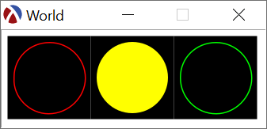

用到了之前的`next-color` 的结构，以及`(boxify i)` 来制作单个灯泡的背景色

```
(require 2htdp/image)
(require 2htdp/universe)

;; Constants:
(define SIZE 30)         ; light's size
(define GAPTIME 1)       ; the gap time between the light's change

;; Data definitions:
(define-struct light-cell (color style))

;; Define light-cell instances
(define red-light (make-light-cell "red" "solid"))
(define yellow-light (make-light-cell "yellow" "solid"))
(define green-light (make-light-cell "green" "solid"))

;; Functions:

;; Draws a box around given image
(define (boxify i)
  (overlay i (rectangle (+ (image-width i) (/ SIZE 3))
                        (+ (image-height i) (/ SIZE 3))
                        "solid"
                        "black")))

;; Draws a light-cell as an image
(define (draw-light light)
  (boxify (circle SIZE (light-cell-style light) (light-cell-color light))))

;; Draws traffic lights based on the current color
(define (draw-lights color)
  (cond
    [(string=? color "red")
     (beside (draw-light red-light) 
             (draw-light (make-light-cell "yellow" "outline")) 
             (draw-light (make-light-cell "green" "outline")))]
    [(string=? color "yellow")
     (beside (draw-light (make-light-cell "red" "outline")) 
             (draw-light yellow-light) 
             (draw-light (make-light-cell "green" "outline")))]
    [(string=? color "green")
     (beside (draw-light (make-light-cell "red" "outline")) 
             (draw-light (make-light-cell "yellow" "outline")) 
             (draw-light green-light))]))

;; Defines the next color in the traffic light sequence
(define (next-color color)
  (cond
    [(string=? color "red") "yellow"]
    [(string=? color "yellow") "green"]
    [(string=? color "green") "red"]))

;; Defines the stop condition, which is always false to keep the animation running
(define (stop-when-handler color)
  false)

;; Starts the animation with the given initial color
(define (start-animation initial-color)
  (big-bang initial-color
            (on-tick next-color GAPTIME)
            (to-draw draw-lights)
            (stop-when stop-when-handler)))

;; Starts the animation with the initial color "red"
(start-animation "red")
```

然后想在这个基础上实现无限的颜色: 这样比较好看。

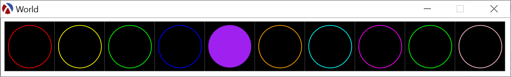

> 考虑能不能把颜色弄成一个list，并且可以取到任意一个index的内容，结论是可行，但是这个函数已经内置过了，也就是：`(list-ref lst n) ` 早被定义过了，用不到我哈哈哈哈。
>
> ```
> chatGPT:
> (define CL (list "red" "yellow" "green")) ; color-lights
> 
> ;; List -> String
> ;; get the x index data of list
> ;; use (list-ref CL 1) will return "yellow"
> (define (list-ref lst n)
>    (if (0? n)
>     (first lst)
>  (list-ref (rest list) (sub1 n))))
> ```
>好奇list是否有find-index，毕竟 访问index对应的数据已经有`(list-ref lst n)`来内置实现了。结果是没有, 但可以自己实现，通过递归。（递归真是计算机的暴力元件了）
> 
> ```
> chatGPT:
> ; 定义一个函数,返回元素在列表中的索引
> (define (index-of lst element)
>   (index-of-helper lst element 0))
> 
> ; 辅助函数,带有当前索引
> (define (index-of-helper lst element current-index)
>   (cond
>     [(empty? lst) -1] ; 如果列表为空,返回 -1 表示未找到
>     [(equal? (first lst) element) current-index] ; 找到元素,返回当前索引
>     [else (index-of-helper (rest lst) element (+ current-index 1))])) ; 递归调用,索引加 1
> 
> ; 测试函数
> (index-of CL "red") ; 应该返回 0
> (index-of CL "yellow") ; 应该返回 1
> (index-of CL "green") ; 应该返回 2
> (index-of CL "blue") ; 应该返回 -1,表示未找到
> ```
> 

chatGPT: 完成了大部分..........（要我干啥

```
(require 2htdp/image)
(require 2htdp/universe)

;; Constants:
(define SIZE 30)         ; light's size
(define GAPTIME 1)       ; the gap time between the light's change

;; Define a list of colors:
(define CL (list "red" "yellow" "green" "blue" "purple" "orange" "cyan" "magenta" "lime" "pink"))

;; Functions:

;; Draws a box around given image
(define (boxify i)
  (overlay i (rectangle (+ (image-width i) (/ SIZE 3))
                        (+ (image-height i) (/ SIZE 3))
                        "solid"
                        "black")))

;; Draws a light with the given color and style
(define (draw-light color style)
  (boxify (circle SIZE style color)))

;; Helper function to draw traffic lights based on the current color
(define (draw-lights-helper colors images current-color)
  (cond
    [(empty? colors) images]
    [(string=? (first colors) current-color)
     (draw-lights-helper (rest colors)
                         (beside images (draw-light (first colors) "solid"))
                         current-color)]
    [else
     (draw-lights-helper (rest colors)
                         (beside images (draw-light (first colors) "outline"))
                         current-color)]))

;; Draws traffic lights based on the current color
(define (draw-lights current-color)
  (draw-lights-helper CL empty-image current-color))

;; Finds the index of an element in a list
(define (index-of lst elem)
  (cond
    [(empty? lst) -1]
    [(equal? (first lst) elem) 0]
    [else (+ 1 (index-of (rest lst) elem))]))

;; Defines the next color in the traffic light sequence
(define (next-color current-color)
  (list-ref CL (modulo (+ 1 (index-of CL current-color)) (length CL))))

;; Defines the stop condition, which is always false to keep the animation running
(define (stop-when-handler color)
  false)

;; Starts the animation with the given initial color
(define (start-animation initial-color)
  (big-bang initial-color
            (on-tick next-color GAPTIME)
            (to-draw draw-lights)
            (stop-when stop-when-handler)))

;; Starts the animation with the initial color "red"
(start-animation "green")

```


# 3b: Compound Data

这部分开始讲复合数据类型，3a中猫的动画，已经尝试用过了struct 来定义x和y坐标两个数据，第一个感受是比较麻烦。展示的时候要用`(cat-x cat) (cat-y cat) `这样的形式，想要针对值重新覆盖，则需要`(make-cat mouse-x  mouse-y)` .

> Q:用最简单的形式，讲解一下BSL语言中， data define 里 struct如何应用。
>
> ChatGPT:
>
> 在 BSL（Beginning Student Language）中，`struct` 是一种用来定义复合数据类型的机制。通过 `define-struct`，我们可以创建包含多个字段的数据结构，然后可以使用这些结构来存储和操作相关的数据。
>
> ### 示例：定义一个表示二维点的结构
>
> 我们将定义一个表示二维平面上点的结构，包含 `x` 和 `y` 两个坐标。
>
> #### 步骤
>
> 1. **定义结构**：使用 `define-struct` 定义结构。
> 2. **创建实例**：使用结构的构造函数创建结构的实例。
> 3. **访问字段**：使用自动生成的访问函数访问结构的字段。
> 4. **修改字段**：使用自动生成的修改函数创建新的结构实例。
>
> ### 示例代码
>
> ```
> ;; 1. 定义结构
> (define-struct point (x y))
> 
> ;; 2. 创建结构的实例
> (define p1 (make-point 3 4))
> (define p2 (make-point 7 1))
> 
> ;; 3. 访问字段
> (point-x p1) ; 结果是 3
> (point-y p1) ; 结果是 4
> 
> ;; 4. 修改字段
> (define p3 (make-point (point-x p1) (+ (point-y p1) 10))) ; p3 是 (3, 14)
> 
> ;; 显示结果
> p1 ; 显示 (make-point 3 4)
> p2 ; 显示 (make-point 7 1)
> p3 ; 显示 (make-point 3 14)
> ```
>
> ### 解释
>
> 1. **定义结构**：
>    - `define-struct` 用来定义一个名为 `point` 的结构，包含两个字段：`x` 和 `y`。
>    - 它会自动生成以下函数：
>      - `make-point`：构造函数，用于创建 `point` 的实例。
>      - `point-x`：访问函数，用于访问 `point` 实例的 `x` 字段。
>      - `point-y`：访问函数，用于访问 `point` 实例的 `y` 字段。
> 2. **创建结构的实例**：
>    - `make-point` 是构造函数，用来创建 `point` 结构的实例。
>    - `p1` 是一个点，`x` 坐标是 3，`y` 坐标是 4。
>    - `p2` 是另一个点，`x` 坐标是 7，`y` 坐标是 1。
> 3. **访问字段**：
>    - `point-x` 函数用来获取点的 `x` 坐标。
>    - `point-y` 函数用来获取点的 `y` 坐标。
> 4. **修改字段**：
>    - 通过构造一个新的 `point` 实例来修改字段的值。
>    - 在这个例子中，`p3` 是一个新的点，其 `x` 坐标与 `p1` 相同，但 `y` 坐标增加了 10。
>
> ### 总结
>
> 通过 `define-struct` 定义的结构使得我们可以方便地创建和操作复合数据类型。这种机制非常适合用于组织和管理相关的数据，从而使代码更加简洁和易于理解。

## define-struct

>A structure definition defines:
>
>constructor: `make-<structure-name>`
>
>selector(s) : `<structure-name>-<field-name>`
>
>predicate: `<structure-name>?`
>
>(define-structure pos(x y)) defines:
>
>constructor:make-pos
>
>selectors:pos-x pos-y
>
>predicate: pos?

```
(define-struct pos (x y))

;; constructor
(define P1 (make-pos 3 5))
(define P2 (make-pos 2 6))

;;selector
(pos-x P1);3
(pos-y P2);6

;;predicate
(pos? P1) ;true
(pos? 12) ;false
(pos? (+ 4 6));false
```

## Compound Data Definitions

```
PROBLEM:
Design a data definition to represent hockey players, including both their first and last names.
```

> remember the fundamental job of a template is to tell you what do you have to work with and what's the basic structure of the function.
>
> 请记住，模板的基本工作是告诉您必须使用什幺以及函数的基本结构是什幺。
>
>  if you write a function that consumes a player as an argument, then what it has to work with is all of the fields of the player, in this case, fn and ln. So basically, the fundamental shape of the function is take the player apart into its constituent field values and do something with them.
>
> 听着，如果你编写一个使用player作为参数的函数，那幺它必须处理的是player的所有字段，在本例中为 fn 和 ln。因此，基本上，函数的基本形状是将player拆解到其组成字段值中，并对它们执行某些操作。

```
(define-struct player (fn ln))
;; player is (make-player String String)
;; interp. (make-player fn ln)is a hockey player with
;;                  first name , fn
;;                  last name , ln

(define P1(make-player "Bobby" "Orr"))
(define P2(make-player "Wayne" "Gretzky"))

(define (fn-for-player p)
   (... (player-fn p)   ;String
        (player-ln p))  ;String
)

;; templete rules used:
;; - compound: 2 fields
```

## Practice Problems - Compound Data

这part的练习来得特别快

```
PROBLEM A:

Design a data definition to represent a movie, including  title, budget, and year released.

To help you to create some examples, find some interesting movie facts below: 
"Titanic" - budget: 200000000 released: 1997
"Avatar" - budget: 237000000 released: 2009
"The Avengers" - budget: 220000000 released: 2012

However, feel free to resarch more on your own!

PROBLEM B:

You have a list of movies you want to watch, but you like to watch your rentals in chronological order. Design a function that consumes two movies and produces the title of the most recently released movie.

Note that the rule for templating a function that consumes two compound data parameters is for the template to include all the selectors for both parameters.

```

```
;; =================
;; Data definitions:

(define-struct movie (title budget year))
;;  movie is (make-movie String Number Number)
;; interp. (make-movie title budget year)is a movie with
;;                  movie title, title
;;                  movie budget , budget
;;                  year released, year

(define M1(make-movie "Titanic" 200000000 1997))
(define M2(make-movie "Avatar" 237000000 2009))
(define M3(make-movie "The Avengers" 220000000 2012))

(define (fn-for-movie m)
   (... (movie-title m)   ;String
        ( movie-budget m) ;Number
        ( movie-year m) ;Number
        )  
)

;; templete rules used:
;; - compound: 3 fields

;; =================
;; Functions:
;; Movie Movie -> String
;; Produce the title of the most recently released movie
(check-expect (recent-movie M1 M2) "Avatar")


(define (recent-movie movie1 movie2)
  (cond
    [(> (movie-year movie1) (movie-year movie2)) (movie-title movie1)]
    [(< (movie-year movie1) (movie-year movie2)) (movie-title movie2)]
    [else (movie-title movie2)]))  ;; If they have the same year, return the title of the second movie

```

哎，做的我兴趣缺缺，虽然格式规范很重要，但是确实很无聊。（

```
PROBLEM A:

Design a data definition to help a teacher organize their next field trip. 
On the trip, lunch must be provided for all students. For each student, track 
their name, their grade (from 1 to 12), and whether or not they have allergies.
PROBLEM B:

To plan for the field trip, if students are in grade 6 or below, the teacher 
is responsible for keeping track of their allergies. If a student has allergies, 
and is in a qualifying grade, their name should be added to a special list. 
Design a function to produce true if a student name should be added to this list.
```

```
(require 2htdp/image)
(require 2htdp/universe)

;; Data definition for a student
(define-struct student (name grade allergies))

;; Examples of students
(define student1 (make-student "Alice" 5 true))
(define student2 (make-student "Bob" 8 false))
(define student3 (make-student "Charlie" 6 true))

;; Student -> Boolean
;; Produces true if the student is in grade 6 or below and has allergies
(define (add-to-allergy-list? student)
  (and (<= (student-grade student) 6)
       (student-allergies student)))

;; Tests
(add-to-allergy-list? student1) ; Expected: true (grade 5 and has allergies)
(add-to-allergy-list? student2) ; Expected: false (grade 8 and no allergies)
(add-to-allergy-list? student3) ; Expected: true (grade 6 and has allergies)

```

## HtDW With Compound Data

这里参考上面的cat运动的部分，引入了一个奶牛，以及`rotate` 让牛掉头移动（越来越有scratch的感觉了呃但没有scratch好上手）

| constant  | changing            | big-bang option |
| --------- | ------------------- | --------------- |
| width     | x coordinate of cow | on-tick         |
| height    | speed of cow        | to-draw         |
| ctr-y     |                     | on-key          |
| mts       |                     |                 |
| cow image |                     |                 |

