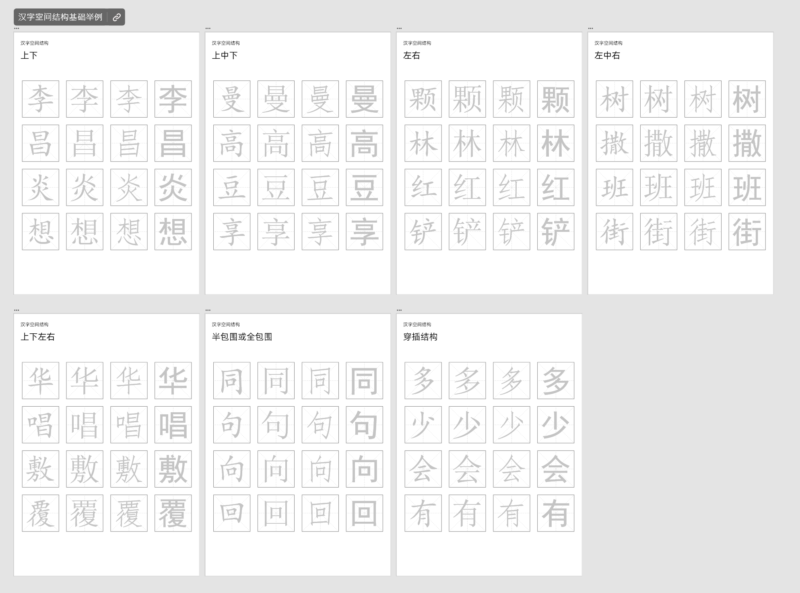

# 背景

[《创字录》](https://book.douban.com/subject/26590016/) 这本书买蛮久了，一直没看，现在感觉需要提升字体的设计水平。

计划是尽量用上自己已经有的思维来解构/扩展书籍，而非单纯的跟练。

# 视频教程

也会搭配一些案例和illustrator的实战来练习，同时提升对illustrator的掌握。

- [【中文字体设计】2021全新字体设计教程](https://www.bilibili.com/video/BV1u34y1R7g6)
- [AI/PS字体设计】字体设计100集全](https://www.bilibili.com/video/BV1CM4m1m74o)

# 文字基础

讲文字从视觉结构上的构成，汉字，拉丁都涉及了。

## 汉字空间结构

这部分讲了几种基本的结构，以及举例的汉字。我将其作为素材制作为A4尺寸的文件打印出来，方便自己描摹轮廓，从而更深的体会不同之处。主要采用了4种在印刷中用得最多的字体：楷体，宋体，仿宋，黑体。

[汉字空间结构基础举例-xd文件-在线查看](https://xd.adobe.com/view/29eb892c-e377-4b2e-8b7a-d131fe829ce4-7cb8/grid?hints=off)

**备注**：

1. 还是个数安排多了，一张A4放1-4个字就够了，不然描勾边的时候真的费眼睛。
2. 这个分类法是从字体设计的角度分的，还可以从汉字规范的角度分：[汉语字典-结构分类](https://www.hgcha.com/zidian/shangxia.html)

主要就是不想学了暂时。

