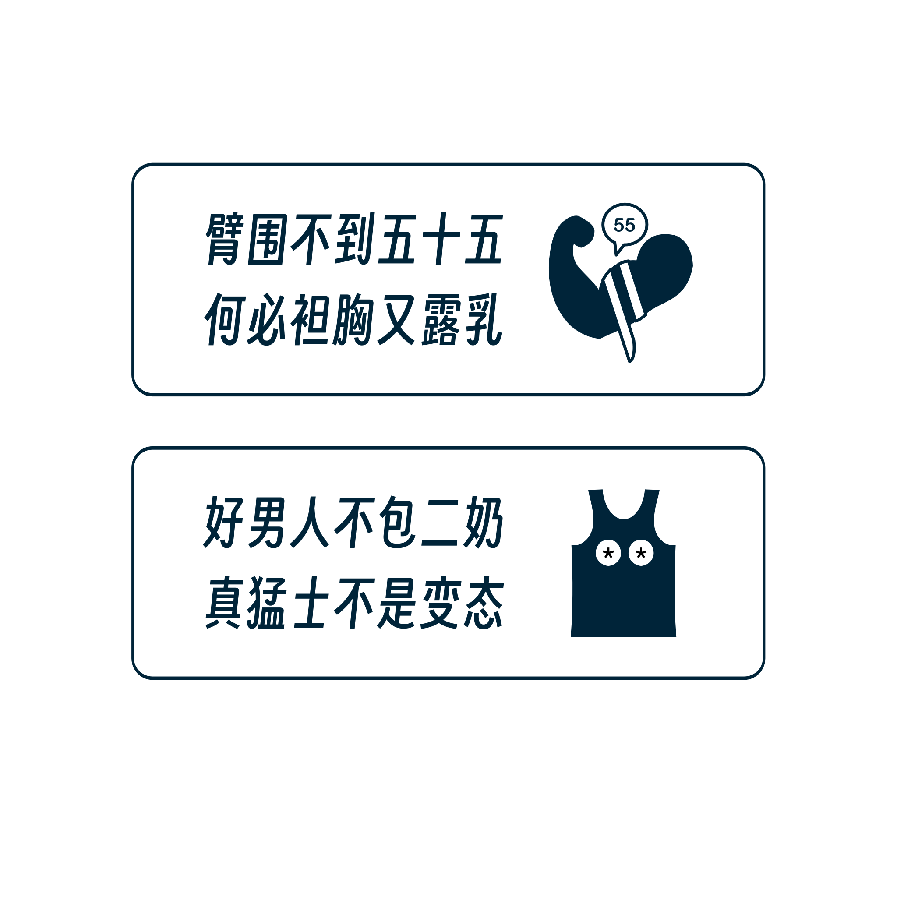

# Background

I often see men bare their upper bodies in the gym, which I find annoying. So, I started this project.

The slogans are playful with some puns and rhymes.

# Process

From the text to the final design, I completed everything by myself, and I'm quite satisfied with it.

## Text

```
臂围不到五十五，何必袒胸又露乳。
```

"If your biceps aren't 55 cm, why flaunt your chest and show your pecs?"

In the gym I go to, several men's biceps measure around 45 cm. Although they are usually polite and well-mannered, to be fair, I set it to 55 cm, which is generally unattainable for most people.

```
好男人不包二奶，真猛士不是变态。
```

"A good man doesn't have a mistress; a true tough guy isn't a flasher."

This was revised several times, and although I'm only moderately satisfied, I really wanted to use the first half of the sentence, so this is the final version.

```
Why flaunt a chest, when arms lack zest?
```

I considered corresponding English versions, but the nuances of the Chinese slogans are hard to capture. Using ChatGPT, it provided the slogan above.

## Graphic Design

- Design software: Affinity Designer
- Text font: [Smiley Sans](https://github.com/atelier-anchor/smiley-sans)
- Material: PVC 

The advantage of having the text first is that you can quickly anchor the images in your mind.


## On-Site Photos


# Download

You might have the same concerns as I do, so feel free to use and modify these. Below is a shareable vector SVG file, adhering to the international [CC BY 4.0](https://creativecommons.org/licenses/by/4.0/) license. Right-click on the image and save it.

  

