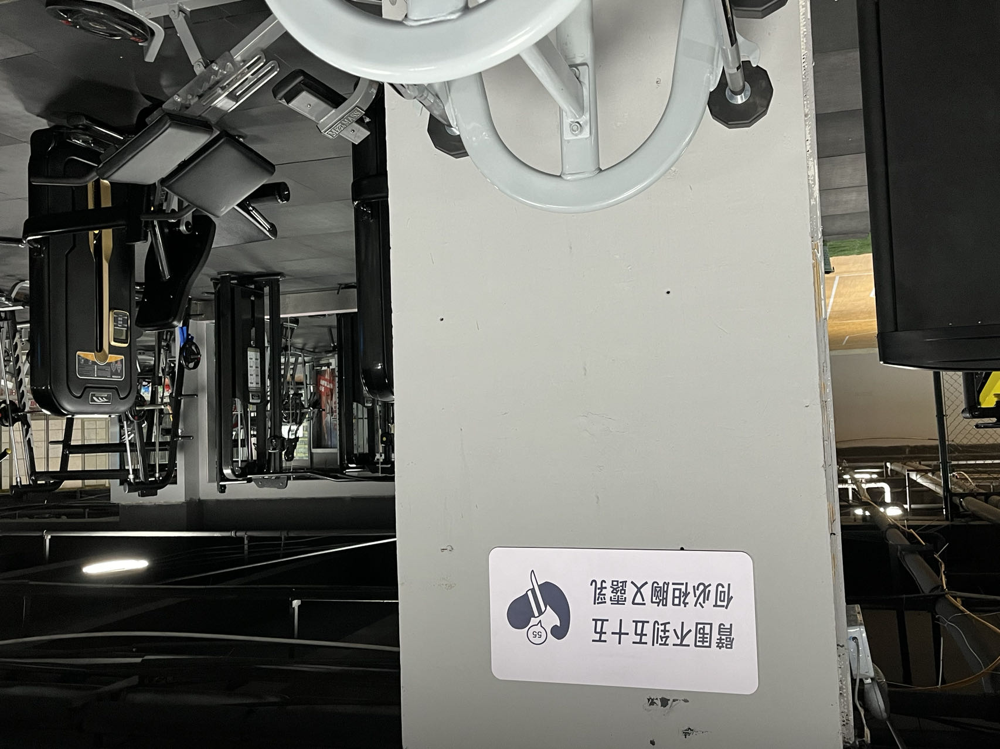
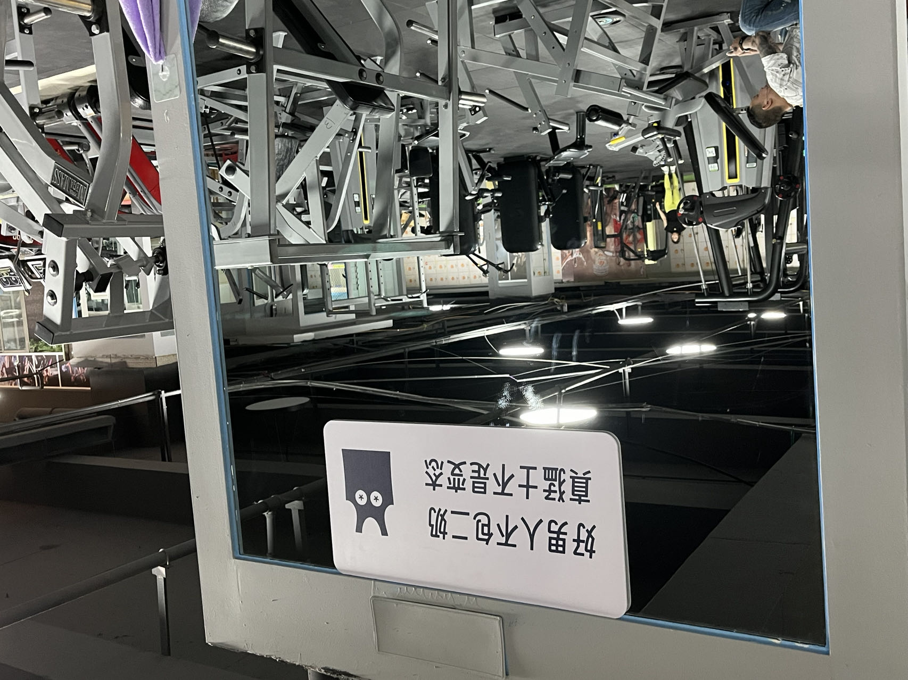

# 背景

经常在健身房看到男性裸露上半身，我很不爽。于是着手开展了这个项目。

它们在语言上比较玩味，有一些双关和押韵的设计。

# 过程

从文字到最后的成品，全是我一个人完成，感觉还是蛮不错的。

## 文本

```
臂围不到五十五，何必袒胸又露乳。
```

因为我在的那家健身房，已经有好几个男性的臂围要到45cm了，虽然他们平时比较文明有礼貌，但一视同仁，我觉得写到55cm，一般人应该达不到吧。

臂围55cm的人赤裸上半身，简直可以说是一道本该付费的风景线了。

```
好男人不包二奶，真猛士不是变态。
```

这个其实改了好几遍，最后只能说勉强满意，但确实很想用上前半句，所以就还是这么定稿了。

```
Why flaunt a chest, when arms lack zest?
```

考虑过对应的英文版本，但确实这样的中文的趣味很难体现出来。使用了chatGPT，它给出了上面这样的标语。

## 平面设计

- 设计软件：affinity designer
- 文本字体：[得意黑](https://github.com/atelier-anchor/smiley-sans) 

文案先行的好处是：在脑海中，可以针对文案很快的锚定图像。


## 实地拍摄





# 下载

也许你也有和我一样的困扰，自由的使用和修改吧，下面的矢量源文件分享，遵循国际[ CC BY 4.0 ](https://creativecommons.org/licenses/by/4.0/) 协议。

[ `.svg` 源文件下载](../../resources/gym-slogans-by-libregd.svg) 