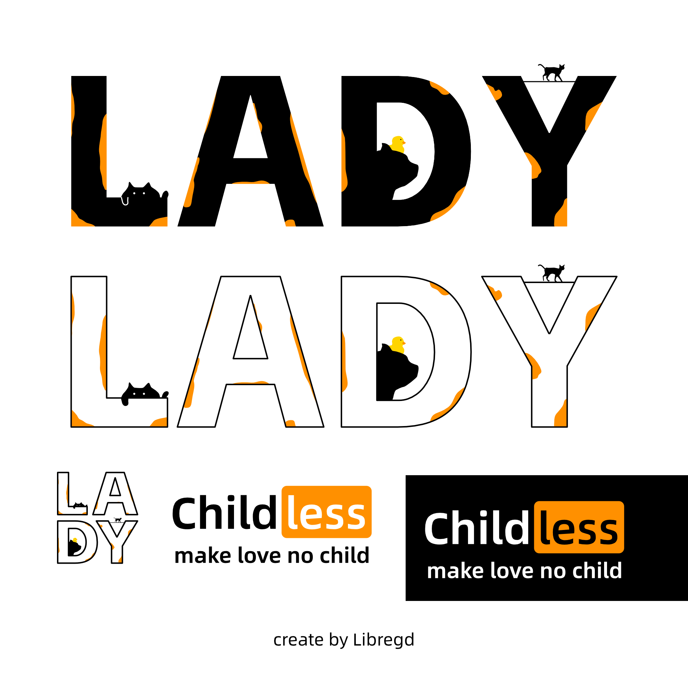
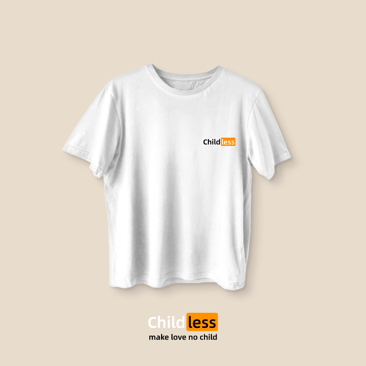
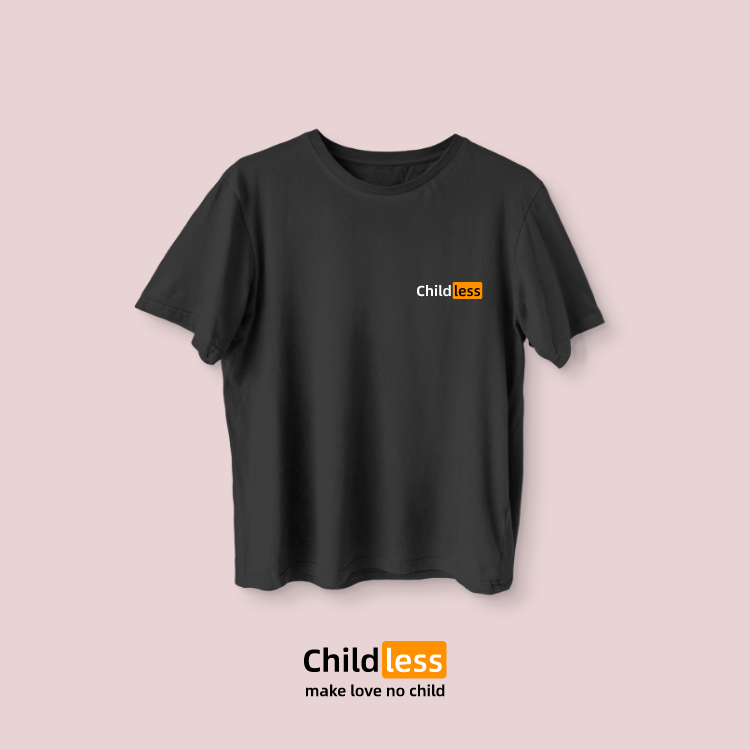
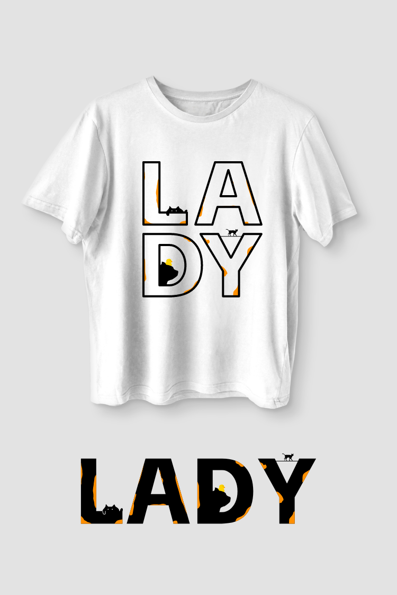

# Background

Many people talking about [#catlady](https://x.com/hashtag/catlady), I realized that wearing clothes can also show some personal opinions, so I set out to design the following.

# Download

You might have the same concerns as I do, so feel free to use and modify these. Below is a shareable vector SVG file, adhering to the international [CC BY 4.0](https://creativecommons.org/licenses/by/4.0/) license. Right-click on the image and save it.

[svg file](https://raw.githubusercontent.com/libregd/libregd.github.io/main/resources/childless-cat-lady-by-libregd.svg)  

# Key Information

some key info

## Graphic Design

- Design software: Affinity Designer
- Text font：[Alibaba-PuHui](https://www.alibabafonts.com/#/font) 

## T-Shirt Show

Thanks：[ T-shirt mockup by Vectonauta on Freepik](https://www.freepik.com/free-psd/black-white-tshirts-transparent-background_78568037.htm#fromView=search&page=1&position=1&uuid=ce204224-db5a-46b3-87cf-893edb8feb13)

