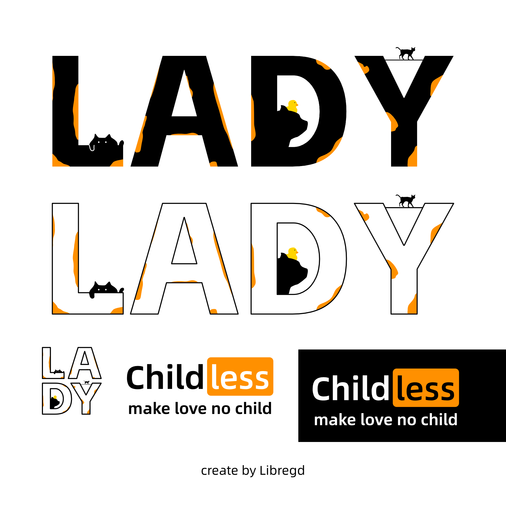
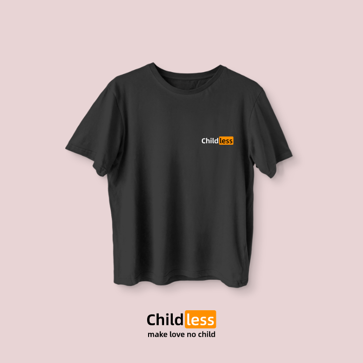
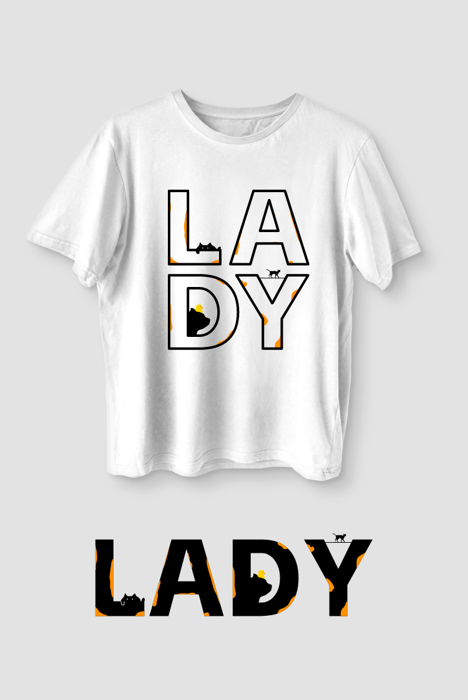

# 背景

看到大家在讨论 `#catlady`，发现穿衣服也可以展示一些个人的观点。于是着手设计了下面内容。

# 下载

自由的使用和修改吧，下面的矢量svg文件分享，遵循国际[ CC BY 4.0 ](https://creativecommons.org/licenses/by/4.0/) 协议。对着图像右键另存为即可。

[svg 文件](https://raw.githubusercontent.com/libregd/libregd.github.io/main/resources/childless-cat-lady-by-libregd.svg)  

# 关键

一些关键信息

## 平面设计

- 设计软件：affinity designer
- 文本字体：[阿里巴巴普惠体](https://www.alibabafonts.com/#/font) 

## 图片展示

感谢：[ T-shirt mockup by Vectonauta on Freepik](https://www.freepik.com/free-psd/black-white-tshirts-transparent-background_78568037.htm#fromView=search&page=1&position=1&uuid=ce204224-db5a-46b3-87cf-893edb8feb13)

