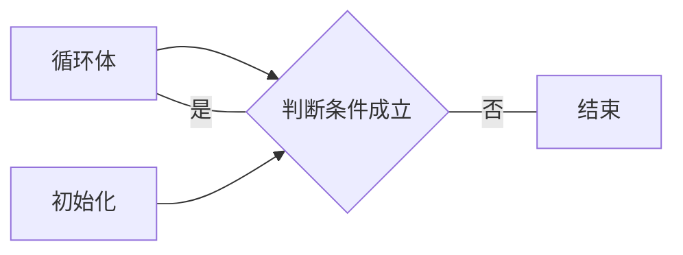
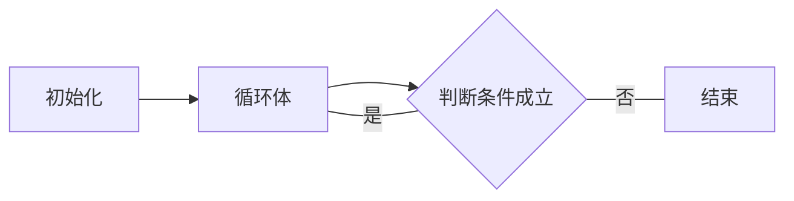
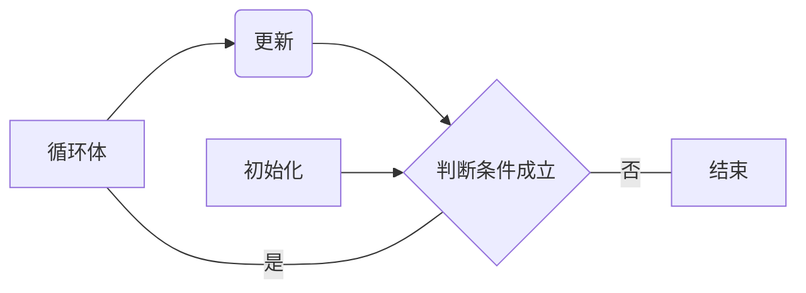

# Program structure

- [ ] Statements and flow control

- [ ] if and else
- [ ] switch
- [ ] loops

## if and else

主要有三种。

### 基本 if 语句

if 语句通过对条件进行求值，若结果为真（非 0），执行语句，否则不执行。如果主体中只有单个语句的话，花括号可以省略。

```c++
if (条件) {
  主体;
}
```

### if...else 语句

if...else 语句和 if 语句类似，else 不需要再写条件。当 if 语句的条件满足时会执行 if 里的语句，if 语句的条件不满足时会执行 else 里的语句。同样，当主体只有一条语句时，可以省略花括号。

```c++
if (条件) {
  主体1;
} else {
  主体2;
}
```

### else if 语句

else if 语句是 if 和 else 的组合，对多个条件进行判断并选择不同的语句分支。在最后一条的 else 语句不需要再写条件。

```C++
if (条件1) {
  主体1;
} else if (条件2) {
  主体2;
} else if (条件3) {
  主体3;
} else {
  主体4;
}
```

**练习**

输入身高和体重，通过BMI的计算公式得出身体所在健康区间。BMI = 体重（kg） / 身高的平方(m) 。

BMI < 18.5 : Underweight;

18.5 ≤ BMI < 24 ：Normal range;

24 ≤ BMI < 27 ：Overweight;

27 ≤BMI :Obesity;

```C++
#include <iostream>
using namespace std;

int main ()
{
	double height,weight,bmi;
	cout<<"please enter your height（m)and weight(kg)："<<"\n";
	cin>> height;
	cin>> weight;
	bmi = weight/(height*height);
	if(bmi<18.5){
		cout<<"你的BMI:"<<bmi<<". Underweight"<<"\n";	
	}
	else if(18.5 <= bmi && bmi < 24.0){
		cout<<"你的BMI:"<<bmi<<". Normal range "<<"\n";	
	}
	else if(24.0 <= bmi && bmi < 27.0){
		cout<<"你的BMI:"<<bmi<<". Overweight "<<"\n";	
	}
	else {
		cout<<"你的BMI:"<<bmi<<". Obesity"<<"\n";	
	}
	
	return 0;
	
}
```

## switch

switch和if else 都是分支结构，相对来说用得少。

```
switch (选择句) {
  case 标签1:
    主体1;
  case 标签2:
    主体2;
  default:
    主体3;
}
```

试试看去掉下面的`break`会发生什么？`defalut` 的部分是可以删除的吗？case的顺序可以调换吗？为什么`case 'B'`的部分用上了`{   }`来包裹？

```c++
#include<iostream>
#include<cstdio>

using namespace std;

int main()
{
	cout<< "朋友，听说你斧头掉下桥了，请问下面哪一把是你掉的？\n";
	cout << "A 金斧头\n"<<"B 银斧头\n""C 木斧头\n";
	cout << "请输入大写字母选择：\n";
	char  choice;
	cin >> choice;
	switch (choice) {
	case 'A' :
		cout <<" 金斧头只有表面是金子，黄金市价￥375/g，本斧头价值10元.\n";
		break;
	case 'B' :{
		double price = 4.5;
		double weight = 3.3;
		cout <<"银斧头只有表面是银子，银市价￥4.5/g，本斧头价值"<<price*weight<<"元。\n";
		break;
	}
		
	case 'C':
		cout <<"小叶紫檀木精心锻造，紫檀木市价￥1500/kg，本斧头价值500元.\n";
		break;
		default:
			cout <<"你说你要什么？我没看懂，看来哪一把都不是你的.\n";
			break;
			
	}
	
}          

```


## loop

不用循环就会累死，比如让你把1-1000的数字依次cout展示出来。loop部分主要讨论了while ，do...while，for，以及break，continue。

### while loop

```
while (判断条件) {
  循环体;
}
```



```c++
#include <iostream>
using namespace std;

int main ()
{
	int n = 10;
	
	while (n>0) {
		cout << n << ", ";
		--n;
	}
	
	cout << "over\n";
}
```

**3x+1猜想**

指对于每一个正整数，如果它是奇数，则对它乘3再加1，如果它是偶数，则对它除以2，如此循环，最终都能够得到1。 

${\displaystyle f(n)={\begin{cases}n/2&{\mbox{if }}n\equiv 0\\3n+1&{\mbox{if }}n\equiv 1\end{cases}}{\pmod {2}}.}$

```c++
#include <iostream>
using namespace std;

int main ()
{
	int x ;
	cin>> x;
	while (x > 1) {
		if (x % 2 == 1) {
			x = 3 * x + 1;
			cout << "x % 2 == 1: new "<<"x: "<<x<<"\n";
		} else {
			x = x / 2;
			cout << "x % 2 != 1: new "<<"x: "<<x<<"\n";
		}
	}
}
```

### The do-while loop

```
do {
  循环体;
} while (判断条件);
```



与 while 语句的区别在于，do...while 语句是先执行循环体再进行判断。

```c++
#include <iostream>
#include <string>
using namespace std;

int main ()
{
	string str;
	do {
		cout << "请输入一个数，它在1-10之间，看看你要猜几次: ";
		getline (cin,str);
		cout << "你输入了: " << str << '\n';
	} while (str != "7");
}
```

### the for loop

```
for (初始化; 判断条件; 更新) {
  循环体;
}
```



根据输入的数字n，计算并返回1~n的和，经典的1+2+3+......100 = 5050。

```c++
#include <iostream>
using namespace std;

int main ()
{
	int sum,end_num;
	sum = 0;
	cout << "计算从1~n的和，如果n=4，则返回 10，输入您的n: ";
	cin>> end_num;
	
	for(int i=1;i<=end_num;i++){
			sum += i;
	}
		
	cout <<"1~"<<end_num<< "的和为： " << sum << '\n';
	return 0;
}
```

连续输入n次内容，每次打印出输出的内容，并表明这是第几次录入的。

```c++
#include<iostream>
#include<cstdio>

using namespace std;

int main()
{
	int n;
	cout<<"请输入数字n，启动n次回声机器人。\n";
	cin >> n;
	for(int i=0;i<=n;i++){
		string echo;
		cin >> echo;
		cout<< echo<<"\n";
		
	}
}        
```

无限次启动回声机器人。

```c++
#include<iostream>
#include<cstdio>

using namespace std;

int main()
{
	cout<<"Infinity echo machine action:\n";
    //method 1
	for(;;){
		string echo;
		cin >> echo;
		cout<< echo<<"\n";	
	}
    // method 2
    while (1) { // 这里的1可以换成别的吗？比如0
		string echo;
		cin >> echo;
		cout<< echo<<"\n";	
	}
}           

```

### Range-based for loop

```
for ( 初始化 : 范围 ) {
	执行语句
}

```

这个的作用是去获取范围内的每个变量，然后对他们进行处理。而这个**范围**要求是具有“序列”特征的，这在未来会学习，而目前我们最了解的还是string，string就是一种序列化，一个个字符拼成的一个类型对吗？

```c++
// range-based for loop
#include <iostream>
#include <string>
using namespace std;

int main ()
{
	//复习，三种变量初始化的办法 
	// uniform ，2011修订标准出现的
	string str {"Hello!"};
	// c-like 历史悠久
//	string str = "Hello!";
	// construct，c++中发展而来
//	string str ("Hello!");
	for (char c : str) //把char 换成int 会打印什么？
	{
		cout << "[" << c << "]";
	}
	cout << '\n';
}
```


### break 与 continue 语句

- break 语句的作用是退出循环。

- continue 语句的作用是跳过循环体的余下部分，回到循环的开头（for 语句的更新，while 语句的判断条件）。

**break**

```c++
#include <iostream>
using namespace std;

int main ()
{
  for (int n=10; n>0; n--)
  {
    cout << n << ", ";
    if (n==3)
    {
      cout << "打断施法！";
      break;
    }
  }
}
```

**continue**

```c++
#include <iostream>
using namespace std;

int main ()
{
	for (int n=10; n>0; n--) {
		if (n==5) 
			continue;
		
		cout << n << ", ";
	}
	cout << "火箭发射\n";
}
```

## 练习

分支和循环是最重要的两大结构，上面内容很简单，相信你们已经OK，来做做题。

### 基础部分

#### 倍数

```
1-100以内:
1. 打印5的倍数和6的倍数。并统计一共有多少个？
2. 即是5的倍数，也是6的倍数，的数。有哪些 ?
3. 不被4，5，6任意一个数整除的数是哪些？有多少个？
```

```c++
// 第 1. 小题
#include<iostream>
using namespace std;

int main() 
{
	int s = 0;
	
	for (int i=1; i<=100; i++)
	{
		if (i % 5 == 0 || i % 6 == 0)
		{
			s++;
			cout<< i <<"\n";
		}
	}
	
	cout <<"上面的加起来，共有："<< s <<" 个。"<< endl;
	
	return 0;
}
```

```c++
// 第2. 小题
#include<iostream>
using namespace std;

int main() 
{
	
	for (int i=1; i<=100; i++)
	{
		if (i % 5 == 0 && i % 6 == 0)
		{

			cout<< i <<"\n";
		}
	}
		
	return 0;
}
```

```c++
//第 3. 小题
#include<iostream>
using namespace std;

int main() 
{
	int s = 0;
	for (int i=1; i<=100; i++)
	{
		if(i%4 != 0 && i%5 != 0 && i%6 != 0){
			cout<<i<<"\n";
			s++;
		}
		
	}
	
	cout <<"不被4，5，6任意一个数整除的数的个数:"<< s << endl;

	return 0;
}
```

#### 打印ascii 编码表

```
ascii 表是最早使用的编码系统。一共有0～127个,运行下面的代码会打印出对应的字符。
    char character = 33; 
    cout<< character<<"\n";
打印出所有的ascii 对应码。
```

```c++
#include<iostream>
using namespace std;

int main()
{
    for (int i=0; i<=127; i++)
     {
         cout << i << ": " << char(i) << endl;
    }  
    cout << endl;
    
    return 0;
}
```

#### 爱因斯坦爬楼梯

```
爱因斯坦出了一道这样的数学题：有一条长阶梯，
若每步跨2阶，则最后剩一阶，若每步跨3 阶，则最后剩2阶，若每步跨5阶，则最后剩4阶，若每步跨6阶则最后剩5阶。
只有每次跨7阶，最后才正好一阶不剩。请问至少有多少阶梯？
```

```C++
#include<iostream>

using namespace std;
// 用while 做？
int main() 
{
	int n = 0;
	while (1)
	{
		n += 7;
		if (n%2==1 && n%3==2 && n%5==4 && n%6==5)
			break;
	}
	
	cout << n << endl;
	
	return 0;
}
// 用for 做？
#include<iostream>
using namespace std;

int main() 
{
	for(int n=0;n>=0;n+=7){
		if(n%2==1 && n%3==2 && n%5==4 && n%6==5 ){
				cout << n << endl;
				break;
		}
	}
	
	return 0;
}
```

#### 模拟报数

```
模拟报数游戏过程。
游戏规则：自动按顺序报数，但是要跳过3的倍数或包含数字3的数。假设某个班级共X人，X需要用户录入。
每个同学都正确，请输出他们报数的过程（即输出数字，用空格/回车隔开）。
```

```c++
#include<iostream>
using namespace std;
// 用while 做？
int main() 
{
	int n = 0, s = 0;
	cout<< "请输入你的班级人数（不超过1w）："<<"\n";
	int students;
	cin>> students;
	cout<<"现在全班开始报数啦："<< "\n";
	while (1)
	{
		
		n++;
		if (n%3==0 || n%10==3 || n/10%10==3 || n/100%10==3 || n/1000%10==3)
			continue;
        
		cout << n << " ";
        
		if (++s == students)
			break;
	}
	
	return 0;
}
// 用for 做？
int main() 
{
	cout<< "请输入你的班级人数（不超过1w）："<<"\n";
	int students;
	cin>> students;
	cout<<"现在全班开始报数啦："<< "\n";
	int times = 1;
	for(int n=1;n>=0;n++){	
		
		if(n%3==0 || n%10==3 || n/10%10==3 || n/100%10==3 || n/1000%10==3 ){
			continue;
		}
		cout<<"第"<<times<<"个报数的人："<< n << "\n";		
		
		if(times++ ==students){
			break;
		}	
		
	}
	
	return 0;
}

```

### 提高部分

#### 打印三角菱形

```
1. 输入n，打印n行直角三角形。例如：
输入：5
输出：
*
**
***
****
*****
```

| 行数 | * 的个数 |
| ---- | -------- |
| 1    | 1        |
| 2    | 2        |
| 3    | 3        |
| 4    | 4        |
| 5    | 5        |
| …    | …        |
| n    | n        |

```C++
// 1小题

#include<iostream>
using namespace std;
int main() {
	int n;
	cin >> n;
	for (int i = 1; i <= n; i++) {
		for (int j = 0; j < i; j++) {
			cout << "*";
		}
		cout << "\n";

	}


	return 0;
}

```


```
2. 输入n，打印行等腰三角形
输入：5
输出：
    *
   ***
  *****
 *******
*********

```

| 行数 | 空格的个数 | * 的个数 |
| ---- | ---------- | -------- |
| 1    | n          | 1        |
| 2    | n-1        | 3        |
| 3    | n-2        | 5        |
| 4    | n-3        | 7        |
| …    | …          | …        |
| n    | 1          | 2n+1     |

```c++
#include<iostream>
using namespace std;

int main()
{
	
	int n;
	cin>>n;
	for (int i=1; i<=n; i++)//打印上三角形
	{
		for (int j=1; j<=n-i; j++)
			cout << " ";
		for (int j=1; j<=2*i-1; j++)
			cout << "*";
		cout << endl;
	} 
	return 0;               
}     

```


```
3. 输入n，打印(2*n-1)行菱形星阵。例如：
输入： 5
输出：
    *
   ***
  *****
 *******
*********
 *******
  *****
   ***
    *
```

```C++
#include<iostream>
using namespace std;

int main() {

	int n;
	cin >> n;
	for (int i = 1; i <= n; i++) { //打印上三角形
		for (int j = 1; j <= n - i; j++)
			cout << " ";
		for (int j = 1; j <= 2 * i - 1; j++)
			cout << "*";
		cout << endl;
	}
	for (int i = n - 1; i >= 1; i--) { //打印下三角形
		for (int j = 1; j <= n - i; j++)
			cout << " ";
		for (int j = 1; j <= 2 * i - 1; j++)
			cout << "*";
		cout << endl;
	}
	return 0;
}

```

#### 打印字母阵列（三角变形）

```
输入n，打印大写字母阵列,比如：
输入：5
输出：
    A
   ABA
  ABCBA
 ABCDCBA
ABCDEDCBA
```

```c++
#include<iostream>
#include<cstdio>

using namespace std;

int main()
{
	int n;
	cin >> n;
	for (int i=1; i<=n; i++)//打印上三角形
	{
		for (int j=0; j<n-i; j++)//输出空格 
			cout << " ";
		for (int j=0; j<i; j++)//顺序输出字母 
			cout << char('A'+j);
		for (int j=i-2; j>=0; j--)//逆序输出字母 
			cout << char('A'+j);
		cout << endl;
	} 
	return 0;               
}   
```

#### 10以内加减法生成器

```
为一年级小朋友设计一个自动生成和批改10以内加减法的程序。
总共生成X道题目，X由用户输入，
每次题随机产生2个[0,9]的整数，并要求它们的和不大于10，差不小于0；否则重新生成它们。
输出提示语：* + * = ，等待学生输入答案。
若答案正确，输出"正确"并记10分；否则输出"错误，正确答案为*"，不计分。
最后输出总分并结束程序。

补充：对于生成随机的数，参考以下内容：

#include<cstdlib> // 使用rand()的前提
#include<ctime> // 使用时间作为种子
int main() 
{
	srand(time(NULL)); //初始化rand()函数，作用于所有用到rand()的地方。
	cout<< rand()<<"\n";// 打印一个随机数看看。
}
```

```C++
#include<iostream>
#include<cstdlib> // 使用rand()的前提
#include<ctime>
using namespace std;

//用for 做
int main() 
{
	srand(time(NULL)); //以时间函数获取到种子用来初始化rand()
	int score = 0; 
	cout<<"来做10以内的加减法啦，请问你想挑战几道题？：  ";
	int items;
	cin>> items;
	int times = 1;
	for(int i=0;i>=0;i++){
        //每个循环里都重新生成两个数
		int a = rand()%(9-0+1) ; //生成[0,9]范围的数
		int b = rand()%(9-0+1) ;
		int c;
		if(a+b <= 10){ //如果和能成立
			cout<< a <<"+"<<b<<"=";
			cin>> c;
			if(c == a+b){ // 判定输入的是对的，则加分
				score +=10;
			}else{
				cout<<"----- ×"<<"正确答案是："<<a+b<<"\n"; //否则判错，并输出正确答案
			}
			
		}else if(b-a >= 0){
			cout<< b <<"-"<<a<<"=";
			cin>> c;
			if(c == b-a){
				score +=10;
			}else{
				cout<<"----- ×"<<"正确答案是："<<b-a<<"\n";
			}
		}else{
			continue; // 不属于上面两种情况，则接着循环
		}
		// 每个循环都增加题目数量，并判断是否等于一开始用户输入的题目数量：
		if(times++ == items){
			cout<<"\n"<<"score:"<< score<<"\n";
			break; // 是就要跳出循环了。 
		}	
	}
	return 0;
}
```
补充：

> 要取得[a,b)的随机整数，使用(rand() % (b-a))+ a;
> 要取得[a,b]的随机整数，使用(rand() % (b-a+1))+ a;
> 要取得(a,b]的随机整数，使用(rand() % (b-a))+ a + 1;
> 通用公式:a + rand() % n；其中的a是起始值，n是整数的范围。

#### 质因子

```
输入正整数n，输出该整数的所有质因子（因数里面是质数/素数的），例如n=36，则输出2 3。
```

```c++
#include<iostream>
using namespace std;

int main() {
	int n;
	bool isPrime = true;
	cout << "please enter a number n： ";
	cin >> n;
	for (int i = 2; i < n; i++) {
		if (n % i == 0) {
			for (int j = 2; j < i; j++) {
				if (i % j == 0) {
					isPrime = false;
					break;
				}
			}

			if (isPrime) {
				cout << i << endl;
			}

		}
	}

	return 0;
}
```

扩展：把上一道题改为无限可以输入数字来验证的程序：

```c++
while(1){
    
    // 只需要把上面main的部分放入这里。
}
```


