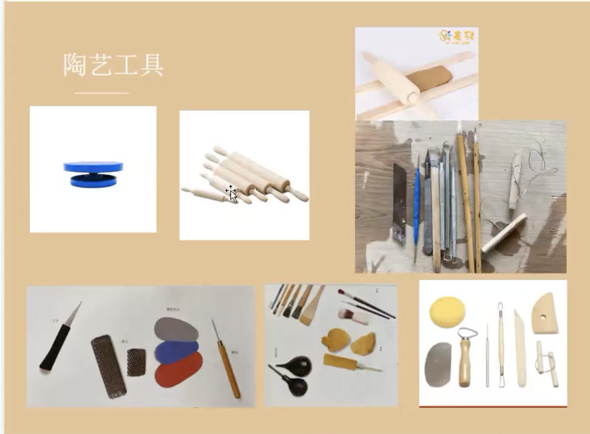
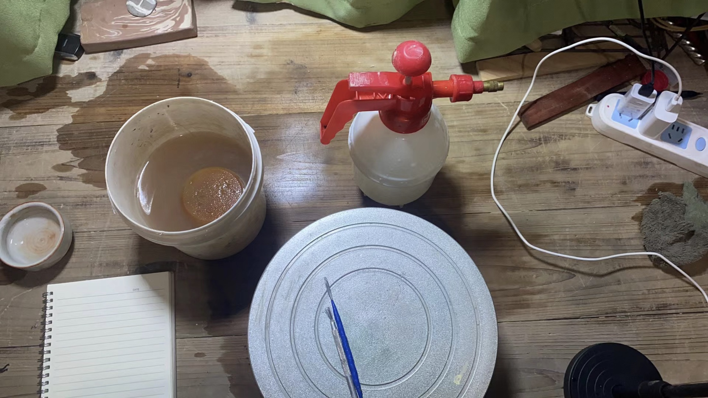

# 背景

小红书的一位up主，[泥巴拌饭](https://www.xiaohongshu.com/user/profile/5dd92b990000000001009ddc), 小红书号：442163054，人称高老师，GLS。

搞的在线公开陶艺基础课，面向小白和新手。由于非常好奇线上要怎么搞，以及这位博主本身是景德镇陶瓷大学的研究生（说明有点东西），我一个小白就去白嫖了。

然后因为我很fresh嘛，所以学到了很多，同学有经验有基础的不少，也分享了很多内容。我觉得得整理一下，蛮实用的。

# pre

Q：有什么书籍推荐吗？

GLS：不怎么看书，但是记得看过的 《日日之器》《250陶瓷创意设计秘籍》《中国陶瓷史》还有就是一些现代陶艺相关的书杂志论文期刊，你有好的书也可以分享出来，大家一块交流学习。

# 第一次课

主要是理论讲解，以及告诉要准备什么工具。

> 日期: 2023-08-12 18:44:46
> [《第一次上课的录制回放》](https://meeting.tencent.com/v2/cloud-record/share?id=723461c1-c407-4bfb-ac92-0d99ac3b9b91&from=3)

## 要点

简要的写一下我觉得比较接近信息的内容。

### 陶泥瓷泥的购买和存储和回收利用

GLS分享了一家：陶三弄。淘宝/小红书都有号。

废泥的回收，我看过一个视频：[【陶艺】如何给瓷盘拉坯并做好后续粘土回收工作](https://www.bilibili.com/video/BV1iN4y137tA/) ,内容和上课内容很接近。

### 工具

最低限度：

一把小工具 ：几块-十几块。

擀泥棒：中号以上

转盘：铁的/铝合金，几十块。

割泥线：几块钱。

海绵：几块钱。

晾坯版/密度板：圆形的，需要备几块。

七本针：用来接部件的，几块钱。就是几根钢丝用来刷接触面方便粘起来。

## 课上/后笔记

>  GLS群里发了很多店铺泥巴烧成的效果图片, 微信群。

Q：这些泥除了颜色不同只有还有什么不一样呢？

A：材质不同 仔细放大看 效果不一样，亮的地方是上釉后的效果 不亮的地方是没上釉的效果。

Q：我也有个问题，材质粗到一定程度，是不是即便经过高温烧制，其实硬度还是比细密的低很多？

A：硬度杠杠的，有些泥高温烧过之后铁的质感

Q：还有个问题哈，这个泥捏好了，平时怎么养护？直到有窑可以烧？

A1：捏好了就放哪呗，我之前捏的泥放了大半个月都没事，烧之前注意补水别裂了应该没事的

A2:接口的前三天可以阴干 可以塑料袋罩一下

A3:我总是捏完了就攒着，去烧窑嫌麻烦。

A4：别磕碰就行平时放久了表面会氧化一层颜色用的时候擦干净就行

Q：提问，上完之后等多久才能烧？要等釉干透吗？

A：一般如果坯是干透啦上完釉就可以烧，如果不放心再晾一会也行。

> GLS推荐的釉料：金色花品牌，釉下彩，无光透明釉（刷釉），丝光透明釉（刷釉），零基础能刷就不错了。

群友也有别的釉料，但都是具体情况具体分析了，不记录。

# 第二次课

> 这个只能去找直播回放小红书，手机端。

## 准备的工具：

## 马克杯的连接

打毛针打毛（七本针）➡️加泥浆衔接➡️也可以戳一个小泥条去再加固衔接处➡️修整衔接处➡️加固完海绵打平➡️完事了，等它再干硬一点取下来修底

## 课后讨论

Q：连接用的泥浆，接的话，是不是同款泥巴温水兑开？泥巴：水= 1:1 ？

A1：你调成浆糊状就可以。

A2：和奶油一样差不多。

A3:我之前的老师推荐做泥浆她的方法是先把泥擀薄干燥后，再捣成粉末再加水混合

A4:你把它们搞成薄片晾干，或者用一些干的碎屑，加水自己就融开啦。

A5:泥浆我有个方法 就是提前把一坨泥 丢水里泡，然后把水倒出去  搅拌 ，很快就好了，用不了多久 1h。

Q：一般什么时候用喷火枪啊？高脚杯的接口能用喷火枪吗 因为送去烧容易断。

A：喷火枪最容易裂，你是想让脚站起来对吧，你就等脚干一点成型啦再接呗，不然软啪啪的。你也接不上。

Q：如果想杯子表面雕刻，做凹面，是8分干还是完全干？

A：都可以，干了不好刻，真要分也就是6？你都可以试试，你先试试6-7，再试一次全干。

Q：好的，木工的那种刻刀应该可行哈？

A1：木工的能用的就拿起来用呗，最好是陶艺工具

A2:我拿木工刻刀刻过素坯，能用。钨钢刀更利一点

# 日常tips 1.0

Q：做作业，结果可能揉泥都很差，2次都没捏出来，我就湿麻布把泥包起来了，想明天搞。这样可以吗？

A：再找个塑料袋包起来。

Q：景德镇有很多公共窑，有一些锐利点评吗？

A：仲窑，看脸烧 = 你放那里，ta不一定给你烧。

B: 顺窑不要去 

Q：晴窑呢？

A：还行。

Q:有没有烧过御心窑的气窑啊?

A:他们家太自助了,啥都自己搞。

Q：一件中温，气窑的话，能想起哪一家？

A：中温一森家很稳定。

Q：我想问，公共窑是不是都不比私窑稳定呀？

A：那倒不是，公共窑烧的快开的快，个人的窑慢慢烧慢慢降温也不容易出问题。

Q：请问一下各位老师们，手捏的杯子用吹风机吹后这样裂了（从杯沿裂向底部中心），是因为吹的吗，还是其他原因呀？

A：是的，上面的太干了，下面的太湿了，然后就裂开

Q：高白泥手捏有点hold不住，怎么办？

A：高白别用，最好别用瓷泥。容易裂

B：瓷你爱出问题，但是也看你是哪个泥，平时买的40一条的还好。

Q：有没有什么烧了之后颜色偏白，但是好捏泥塑的泥呀？感觉好捏泥塑的烧了都是深色。

A：白紫砂泥可塑性强吗？

B：我还没用过白紫砂，但紫砂泥应该可以的。

Q：你们用过匣钵泥 吗，怎么样？

A：匣钵有粗 细 特细。

Q：特细匣钵会漏水吗？

A：会,渗水.

Q:匣钵泥是不是不能做餐具?

A: 也可以,可以上釉.

Q: 烧气窑也会渗吗？

A：高温不漏。（气窑普遍1300以上）

Q: 为啥同一个泥 ，高温就不漏了？

A：还原的原因吧里面可能出现了釉化。

Q：中白怎么样？

A：中白烧出来泛青

Q：各种泥的烧成效果去哪里看啊？

A：陶三弄 淘宝店有图，微信群里有老师拍的线下店铺的示范图。

