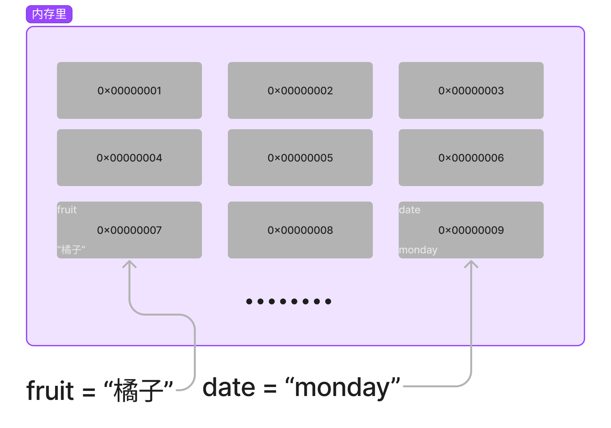
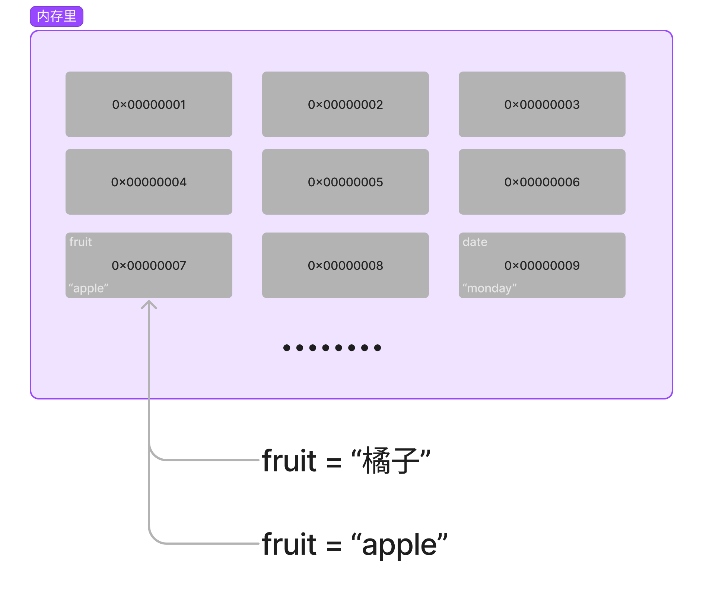
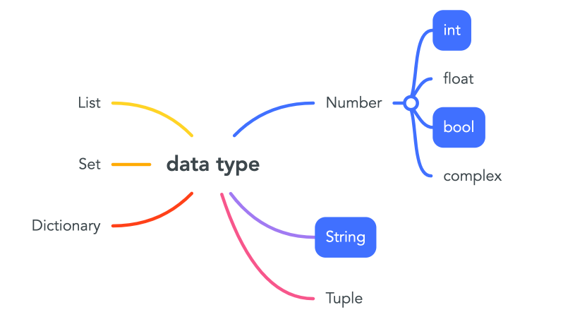
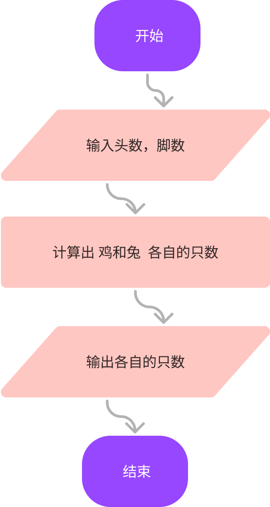

# 目标

- [ ] 掌握变量的概念
- [ ] 掌握变量的驼峰命名法和命名规则
- [ ] 掌握变量类型：int，str，bool，
- [ ] 掌握input的基础用法


# 变量是什么

变量名 = 数据 ，小房子，贴房门名。



```python
fruit = "橘子"
date = "monday"
```

变量的名字如果给一个新的数据，就会后来居上。



```python
fruit = "橘子"
fruit = "apple"
print(fruit)
```

## 变量的命名规则

这个要熟练掌握，不会了就回来翻翻看。

### 三个规范

只要有一条就会报错

- 变量名只能由 字母、数字、下划线 组成。

- 不能以数字开头

  ```
  na9me9 = "juice"
  ```

- 不能用Python内置的关键字

  ```
  def = "juice"
  break = 123
  ```

  *[‘and’, ‘as’, ‘assert’, ‘break’, ‘class’, ‘continue’, ‘def’, ‘del’, ‘elif’, ‘else’, ‘except’, ‘exec’, ‘finally’, ‘for’, ‘from’, ‘global’, ‘if’, ‘import’, ‘in’, ‘is’, ‘lambda’, ‘not’, ‘or’, ‘pass’, ‘print’, ‘raise’, ‘return’, ‘try’, ‘while’, ‘with’, ‘yield’]*

### 两个建议

- 下划线或者驼峰命名

  ```python
  father_name = "hello"
  brother_age = 19
  fatherName = "hello"
  brotherAge = 19
  ```

- 见名知意

  ```python
  age = 18
  color = "red"
  current_user_name = "橘子老师"
  ```

### 练习

找出下面错误的

```python
name = "juice"
name0 = "orange"
name_1 = "tiktok"
_coach = "youtube"
_ = "google"
1_year = "2003" 
year_1_ = "2004"
_1_year = "2003"
nba-team = "rocket" 
new*name = "juicejam" 
```

## 

# 变量的类型

刚上学时，老师教我们 数字 、拼音、汉字、真假判断 等，然后我们根据学到的内容写作文，老师来检查并打分。

现在学编程，我教大家 int、str、bool 等，然后大家根据这些内容来写代码，写完代码交给Python解释器去运行。



##  整形 int

整形，整数。

整型，其实就是以前数学课上讲的整数（不包含小数），在写代码时用于表示整数相关的东西，例如：年龄、存款、尺寸、手机号等。

一般我们提到的：5、18、22、99、… 等整数 在Python中都称为是整型，且支持 加/减/乘/除/取余/指数 等操作。

```python
print(666)

print(2 + 10)

print(2 * 10)

print(10 / 2)

print(10 % 3)

print(2 ** 4)
```

## 字符串 string

字符串，其实就是我们生活中的文本信息。例如：姓名、地址、自我介绍等。

字符串有一个特点，他必须由引号引起来。

```python
print("我是孙悟空")
print("I'm Chinese")
print('我是"alex')
print("geekstar 少儿编程")

# 加，两个字符串可以通过加号拼接起来。
print( "Juice" + "是喜欢python的coder" )

#乘，让整形和字符串进行相乘，以实现让字符串重复出现N次并拼接起来。
print(3 * "我想吃饺子")


```

## 布尔 bool

布尔类型中共有两个值：True / False

```python
print(1 > 2)
print(False)
print(1 == 3)
print("juice" == "tom")
print(1 == "alex")
print(1 == 1)
print(True)

name = input("请输入你的用户名:")

if name == "juice":
    print("用户登录成功")
else:
    print("用户登录失败")
```

## 练习

1. 计算整型50乘以10再除以5的商并使用print输出。
2. 判断整型8是否大于10的结果并使用print输出。
3. 计算整型30除以2得到的余数并使用print输出。
4. 使用字符串乘法实现，把字符串”我爱学习学习爱我”创建三遍并拼接起来最终使用print输出。

## input() 用法

input 就是 print的反面用法。

## 练习

- 请把自己的中文名字，英文名字，年龄，先输入，然后打印出来。

```python
# method 1
ChineseName = input("请输入你的中文名字：")
EnglishName = input("请输入你的英文名字：")
age = input("请输入你的年纪：")
print(ChineseName, EnglishName,age)
print(f"中文名字：{ChineseName}, 英文名字：{EnglishName},年龄：{age}")

```

- 请输入两个数，然后打印它们的和，差，乘积。

```python
number1 = input("请输入第一个数字")
number2 = input("请输入第二个数字")
print(type(number1))
print(type(number2))
print(f"{number1} + {number2} = {number1 + number2}") # 报错 why？

```

- 鸡兔同笼，鸡🐔和兔🐰 在同一个笼子里，数头的话有35个，数脚的话有94只。问笼子里鸡和兔各多少只？




```python
heads = int(input("请输入头的数量："))
feet = int(input("请输入脚的数量："))

rabbits = feet // 2 - heads
chickens = heads - rabbits

print(f"鸡有{chickens}只， 兔子有{rabbits}只")

# feet // 2 改为 feet / 2 ，结果会有变化吗？
```


- 现在有乌龟🐢和仙鹤一共有头10个，脚共28只，请问乌龟和仙鹤各有多少只？请编程实现。

- 交换a和b的值

```python
a = 3
b = 5
# ------ 在下面的区域交换 ------


# ------ 在上面的区域交换 ------
print(a) # 5
print(b) # 3
```

