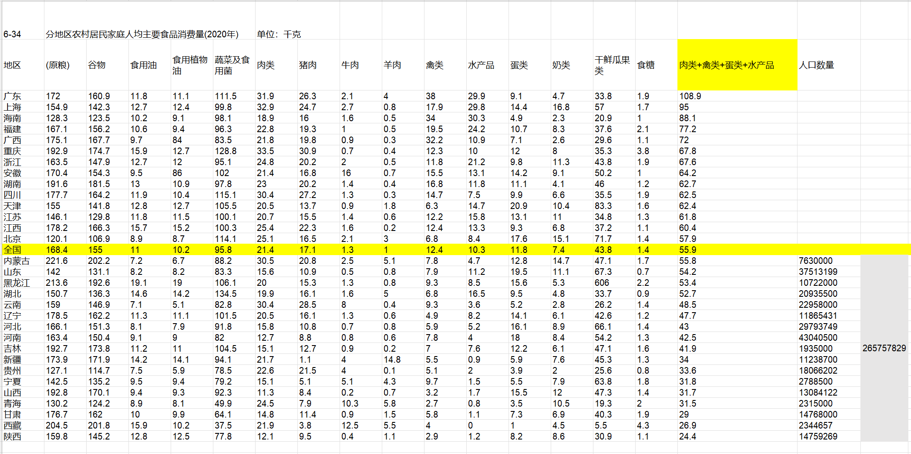

以下是从书中选出来的练习

# 分野

## 现在还需要写作吗？

> 这是一个读图的时代，看视频的时代、注意力碎片化的时代，文字似乎已经失去了读者。有人认为，可视化才是最应该学习的技能（所谓的“视觉素养”）。如此，学写作岂不是成了屠龙之技？对这个问题，你的想法是什么？

我的观点：现在还需要写作。

本人本职工作是UI设计师，通俗的说就是做图，做视频，日常工作大量的内容都在把“想法，文字，需求” 转换为“可视化”的产出。作为一个已经具备可视化技能和相关经验的人来说，我依旧认为写作能力是非常必要的基础技能，并不是诸如马克思主义社科这类真正的“屠龙技”。

首先，大量的工作的内容是涉及 看，理解，沟通文本的。一个有好的写作能力的人，不仅能准确无误简练的传达自己要表达的意思，也能更好地通过文字进一步就最终结果达成有效的沟通。这无论是在学校还是在社会职场都非常紧要的技能。

其次，视频就像文字，也有高低优劣之分，几乎什么样的视频都会有读者，但受到所属范围类别欢迎的视频无一不是精心策划，通常来说这个策划很大一部分是文字内容。比如B站涉猎范围较广的视频博主[衣戈猜想](https://www.bilibili.com/video/BV1WD4y1N7jJ), 在这条视频中，就提到了可视化完全交给妻子完成，但是前期的稿件必须是自己完全写好。

顺便这个列表第一个视频是一位产出了剧情片的导演，导演自然是离不开剧本脚本创作的；第二个视频采访的是专注于“可视化”的搞笑动画博主，博主们也坦言：“没有梗就上网抄一下”，网络梗至今没有完全脱离文本的形式，即便有很多[图片meme](https://knowyourmeme.com/)，也是基于梗的二次创作。

因此，即便是视频时代，创作类视频所体现的内核也离不开文本的支撑。如果非说做视频是必备技能，那么这项必备技能里也一定包含了写作技能。

## 理科生需要学写作吗？

> 术业有专攻，理科生能解出方程，写出代码，算出系数，做出实验不就可以了吗？你怎么看？

我的观点：理科生需要掌握写作。

既然提到理科生，那么说明讨论的范畴落在了学校的这个区间，可能也包括：该理科生参加工作后依旧和在学校做的事情差不多的情况。

理科生不需要文化/娱乐 写作，因为他们的工作确实和这些无关，兴趣爱好另谈。

但理科生需要掌握的是另一个方向的写作：报告性写作，也就是根据数据得出结论，但这个结论大家和你没有心灵感应，特别是越复杂越抽象越具有创造性的专业内容，你不抽丝剥茧，流畅简洁的娓娓道来，大家怎么知道你到底这些时间做了些什么？

毕竟没有监控，就算有监控，你做三年实验，谁又愿意花三年看你每天在做什么？更多的情况是每周就需要写一下这周做了什么，这样别人才能在此基础上进行讨论。

讨厌开会/在SNS上讲废话就去写作吧。

# 风格

## 官话应该模糊还是精确？

>  官话该模煳还是精确？奥威尔在《政治与英语》中，批评英语已经进入腐朽：“作者或是词不达意，或是语焉不详，或是信手写来，根本不在乎其个中含义。语义含混、词不达意是现代英文写作中的两大显着特征。而在政论文写作中，这些特征表现得尤为突出。”
>
> 然而有人指出，官话的“模煳”是有意为之，或者不得已而为之。因为政府面临着非常多样化的利益诉求，需要维持各类微妙的平衡。你的想法是什么？政府文体应当采取什么样的风格？如果你是政府官员，你是要写清澈见底的文字，还是云山雾罩的文字？为什么？

官话自然是应该精确简练的，官方要么给自己人看，要么对外给文化水平相对更低的大众看，总不至于什么法令政策措施号召都写不清楚吧？

官方也分三六九等，编内编外，中心还是偏远。因而水平可能也存在高低的区别，因此选取官媒代表中的TOP代表[央视网](https://tv.cctv.com/)和[五线城市](https://baike.baidu.com/item/%E4%BA%94%E7%BA%BF%E5%9F%8E%E5%B8%82/8620216)中的湖北随州（排名靠前且非西部落后地区）的[官方网站](http://www.suizhou.gov.cn/)来作为讨论和对比的素材。

针对央视网的文章，选取了几篇典型的作为讨论：

| 文章                                                         | 选取理由                                                     | 从风格上点评                                                 |
| ------------------------------------------------------------ | ------------------------------------------------------------ | ------------------------------------------------------------ |
| [文明互鉴 美美与共——习近平主席提出构建人类命运共同体理念十周年](https://tv.cctv.com/2023/03/25/VIDEFU1WzA1keIJJxLoQHaZl230325.shtml?spm=C96370.PPDB2vhvSivD.EVRLyOeY7a6a.1)主要内容讲了几件针对中外文化交流开展的活动，以及办活动的想法缘由。 | 足够抽象的主题，初高中水平都能了解的范畴，看看咋描述的。     | 整体挺好的，文字版是视频版的subtext，因此不算独立成文，既有论据也有论点，还有总结。整体风格偏向学生腔+议论文，达到了向广大群众传播信息宣扬理念的目的，成文也比较短，段落多，句子短，修辞克制。 |
| [如何保障粮食安全？习近平强调“要在增产和减损两端同时发力”](https://news.cctv.com/2023/03/26/ARTI3ZPiudZT5QA8KO8fHGLM230326.shtml?spm=C73544894212.P9moqzeXHoOr.EogkW3VdRtw6.8) 主要内容讲了减少粮食生产和运输销售过程中的消耗，省钱就是赚钱。讲话围绕的文章是:[习近平：加快建设农业强国 推进农业农村现代化](http://www.gov.cn/xinwen/2023-03/15/content_5746861.htm) | 非常实在的吃饭话题，初高中生政治课长期的主题，是讲话记录，更能反映特点和基础。 | 习总讲话还是可以的，简洁有重点，还有举例子列数据来说明问题。就是最后就是想说“这件事要认真仔细的去实施”，非要讲那么长，太爹了。相对来说，下面的“专家分析”，真的就是**车轱辘代表**，哪一个点是人家习总没讲过的。用词“擘画”给我看楞了，不要说写的文章了，说的话更应该多用常见的字词来表达我以为是常识。 |

针对第二篇的数据，我感到非常震惊：

> 我国居民食用油和“红肉”人均消费量，分别超过膳食指南推荐标准的约1倍和2倍。

红肉鉴于已经打了引号，可以狭义的认为就是猪牛羊这类红血肉，不包括鸡鸭鱼虾这类白肉。那么事实真的如此吗？

在[中国居民膳食指南（2022）](https://www.book123.info/detail/9787117314046) 这本权威中，提出了每天的平衡宝塔：“动物性食物 120-200g （每周至少2次水产品，每天一个鸡蛋）”，基于图片和重量可以大胆猜测指代的是生肉，而每天这些生物重量不超过半斤，要知道一个鸡蛋基本就是在50g左右了。

以最低限度的120g来计算，一个人吃的所有动物性食物，一年应该在43.8kg，需要强调这里面包括了：猪牛羊鸡鸭鱼虾蛋。

而在[全国人均肉类消费排行：南方包揽前三，广东人均一年吃肉近65公斤 ](https://www.sohu.com/a/544423035_121052411) 这篇报道中，2021年的数据展示：

> 2020 年广东居民家庭人均肉类（猪、牛、羊）消费量达到了 33.6千克，排行全国第二，仅次于重庆。广东人均禽类消费量31.1千克，高居全国第一，是全国平均水平（12.7千克）的两倍多

针对这段话我去找了源数据[中国统计年鉴2021](http://www.stats.gov.cn/sj/ndsj/2021/indexch.htm)：

不难看出广东人确实吃蛮好的，以图表所列”全国居民（城镇和农村）“ 的范围来看，可以得出以下实际消耗的年kg和膳食指南的年kg对比，因为膳食指南并没有说明红白肉配比问题，因此都算作一起考虑。（下图红白肉配比是红：白 = 4：1的样子）

| 名目                    | 全国城镇平均（6-28） | 全国农村人均（6-34） | 全国居民平均（6-22） | 膳食指南    |
| ----------------------- | -------------------- | -------------------- | -------------------- | ----------- |
| 粮食                    | 120                  | 168.4                | 141.2                | 73-109.5    |
| 食用油                  | 9.9                  | 11                   | 10.4                 | 9.125-10.95 |
| 红肉类+禽类+蛋类+水产品 | 70.5                 | 55.9                 | 64.2                 | 43.8-73     |
| 红肉                    | 27.4                 | 21.4                 | 24.8                 | 35.04-58.4  |

所以回到让我震惊的那句话：

>  我国居民食用油和“红肉”人均消费量，分别超过膳食指南推荐标准的约1倍和2倍

这句话确实是可以说讲错了，如果对信息再考虑上人数占比呢？可以在下图看到，农村人口占中国总人口的1/3的样子，然后2.65亿人动物性食物kg数量是低于全国人均农村水平的，如果另外对比城镇的还是不分农村城镇，他们的这个数字肯定只会高于55.9kg /（年·人）。

官话作为阅读者我肯定倾向于精确，但是事实上对于没有精力去做调查的人来说，一旦精确就可能犯错。所以如果是发布官话的人，不妨把”用最多的文字展示最少的信息“ 作为讲话原则。

回到上图来分析一下广东，即便是农村人口，人均也能吃到108.9kg的动物性食物作为蛋白质的主要来源，那么一天差不多是298g 的生食量。

蛋白质含量：猪肉10-20%，鸡蛋15%，鱼18%，虾16-18%，牛肉15%-20%，鸡肉23%....

就算20%吧，298*0.2 = 59.6g，也就是说，动物摄入最后获得的蛋白质也就是50g的样子。

而对于一个成年人来说，动物性蛋白质一天来说至少保证 1kg体重有1g蛋白质来维持日常的生活状态，如果追求生活品质，需要1.5g；如果热爱健身健美，至少2g。（如果是青春期的未成年人，1.2-1.5都是普遍正常的）

因此名列第一的广东人（城镇和农村相差不多）也仅仅是人均吃到了正常所需的蛋白质。所以这个论据不仅数据有问题，如果想强调的”健康饮食“也需要立足于**营养不良** 上。

## 对“文如其人”的说法怎么看？

>  中国自古以来就说“文如其人”，甚至还有“字如其人”的说法。英语中也有“You are what you write”的说法。然而，这也许是另外一种“以貌取人”，因为相反的例子不胜枚举，例如北宋奸臣蔡京写得一手好字。文字如同一层面纱、一个面具，也会遮盖了真实的人性。对此，你怎么看？为什么？

