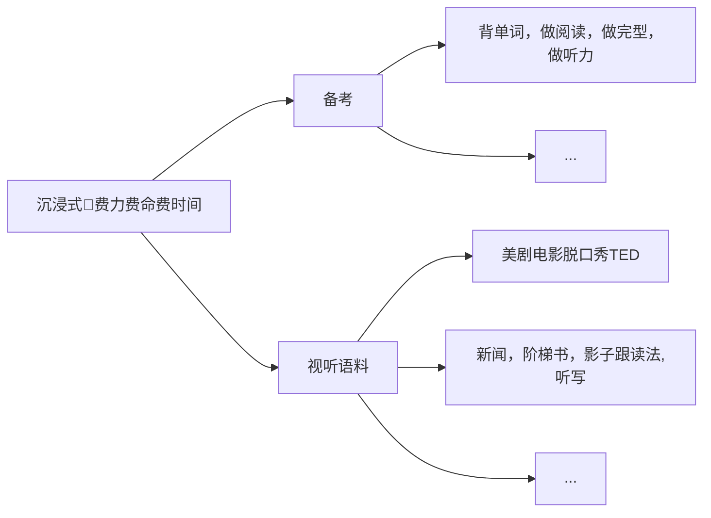
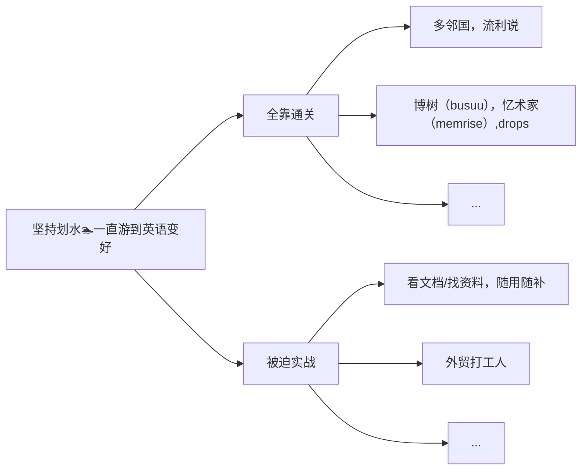
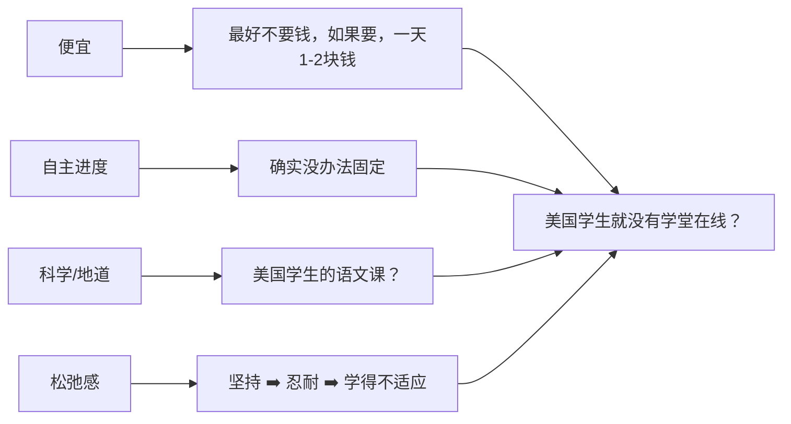
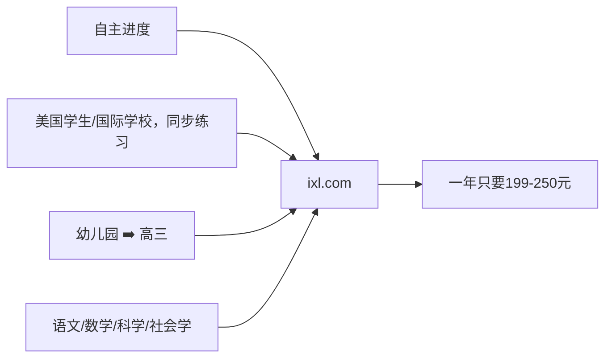

# 更适合穷宝宝体质的英语学习办法

这套办法自己用了小半年，效果不错，分享一下。

## AI都杀疯了，还有必要学英语啊？

当然的，不如说，正是因为AI杀疯了，掌握英语更重要的。

- AI 是程序员写的 ➡️ 程序员要掌握英语 ➡️ 英语还是得学 
- 提问是一门学问 ➡️ 英文比中文得到的信息质量更高
- 如果你需要在中国工作生活，中文是必须的。 ➡️ 同理可得

## 学英语的一些过往经验总结

学英语这个需求一直存在，几乎可以说市面上的方法我都尝试过。

## 学英语的目的是什么？

这个问题非常的关键，直接关系到我的是：

- 能够旅游自助，从准备工作到实际应用。
- 掌握一种语言的逻辑来查找/筛选/处理 信息：沉浸在海量的英文信息里可以仰泳
- 比较流利的表达自己的想法，话题是比较日常和常规的，不涉及特定专业领域的术语。举例：**怎么看董宇辉的薪水相对别的头部主播低？这是合理的吗？**

## 现状：可以公开的情报

下面这个表，给人一种人丑怪镜子🪞的感觉：

| 问题                                      | 答案                                    |
| ----------------------------------------- | --------------------------------------- |
| 是否可以长时间脱产，比如沉浸式备考        | 不行，要打工 ，也不是那种有恒心毅力的人 |
| 是否可以通过 沉浸式视听语料（看美剧）学习 | 不行，全是故事情节和内容，学英语早忘了  |
| 通关的自己感觉适合吗？                    | 不适合，越到后面越只想打卡              |
| 被迫实战呢？                              | 一直被迫，一直糊弄                      |
| 有预算报班嘛，都知道线下效果好            | 没钱，也没有时间去线下班                |
| 线上班呢？又便宜又方便？                  | 可能加班，你的便宜≠我的便宜             |
| 三个月精通英语可能吗？                    | 不要再做这种弯道超车的                  |

## 梳理需求和目标的关系

## 一站式方案

### K12 结构 

3个月学会英语 听起来很扯，永远有人做到，但就是不是我。

但是在美国读了小学初中高中，每次都通过了考试，你说你英语差，这咋可能。

> 学习语言讲究输入量，而根据多语言学家的说法，母语水平至少需要百万级别的阅读量，也就是说，对于天分/效率差一些的/过了语言习得期的，百万级别也不一定就能到达母语水平。

### 多学科 + 便宜

语文 =  language arts  = 老中语文课，必学

社会学 = social studies  = 老中的 思想品德/历史人文/社交礼仪 这些课程，必学

科学 = science = 老中的 自然/地理/天文/物理 ，看个人爱好学

数学 = math = 老中的数学课，我感觉中国人没啥必要

¥1元/天 不到，四个学科学一年，让人震惊。

 ### 自主进度

全程自学，题目多到头大。

时间跨度：9月-12月 ➡️ 4个月➡️ 加班1个月一点没学 ➡️ 3个月 ➡️ grade1 language art + social studies +0.5个science 全部✅！

每天花费时间：平均30mins！

