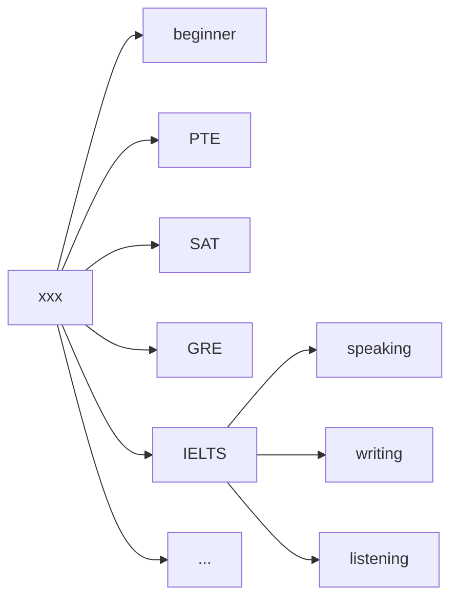
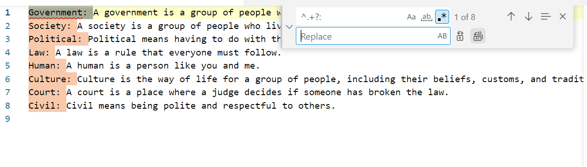
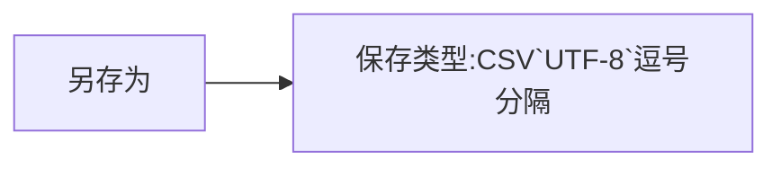
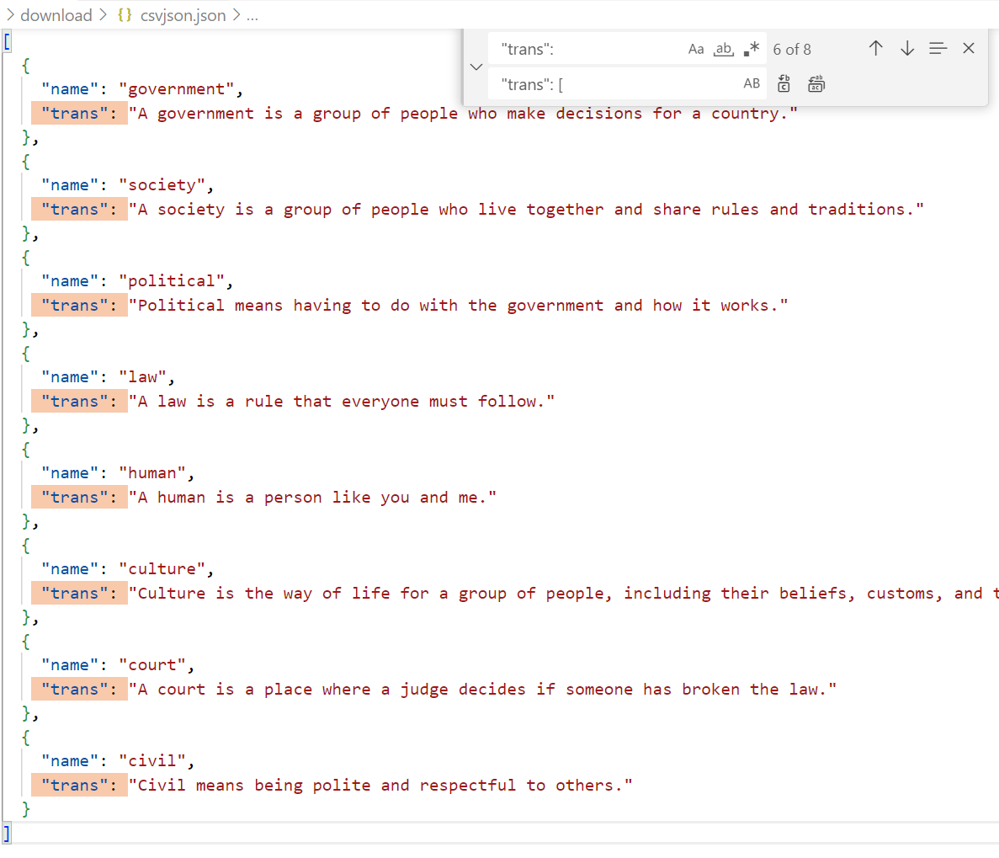
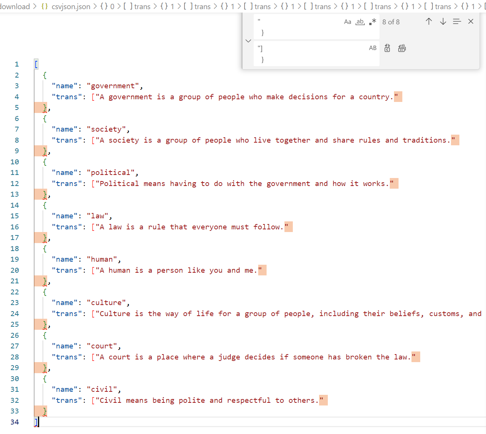

日期：2023年5月22日

# 制作词典要求

虽然[贡献词典](https://github.com/Kaiyiwing/qwerty-learner/blob/master/docs/toBuildDict.md)写了很多，但是并非从0开始，因此本篇文章开始前，希望你有：

- new bing , slack claude , chatGPT 任中有一个就行
- word / vscode 有一个就行
- excel 

# 规划词典

## 1-理清需求

这一步需要有明确的了解，或者明确的，最能够到的目的。

| Q                | A                                                            | 补充                                                         |
| ---------------- | ------------------------------------------------------------ | ------------------------------------------------------------ |
| 谁使用这本词典？ | 我: 基础薄弱，不学语法。                                     |                                                              |
| 我的水平怎么样？ | 比较初级,[(britishcouncil.org)](https://learnenglish.britishcouncil.org/english-levels/understand-your-english-level) 给出的水平是A2 | [8个免费英语测验网站](https://zhuanlan.zhihu.com/p/170631380) |
| 词典的目的？     | 提高基础英语的口语和阅读能力，当成习惯，没有考试需求         |                                                              |

通过这两个问题，可以明确的定位到：

- **英英词典**是主要的形式，因为英语本来就看的不太够。
- 学习语文的时候，新华词典经常用更简单的词汇来定义当前的词汇，因此trans部分的句子，英语词汇应当大部分是A1-A2，也就是**小学生都能看懂的句子**。

每个人的水平和需求不一样，具体根据情况自己判断。

## 2-整理出word list

### 搜索白嫖法

只需要在 必应搜索/ Google 搜索中关键词：word list for XXX，即可获得




| 关键词                                           | 搜索结果                                                     |
| ------------------------------------------------ | ------------------------------------------------------------ |
| word list for American elementary school student | [Vocabulary words for 1st through 12th graders Reading](https://www.greatschools.org/gk/articles/vocabulary-words-for-1st-through-12th-graders/) |
| word list for word roots                         | [Greek and Latin Root Words, Prefixes, & Suffixes List— 300 Vocabulary Word Parts ](https://www.teacherspayteachers.com/Product/Greek-and-Latin-Root-Words-Prefixes-Suffixes-List-300-Vocabulary-Word-Parts-7527422) |

需要自己筛选，但一般搜索引擎第一页就会出现目标 word list，可以发现这种方法比较适合考试，或者偏系统目的的整理，因为别人已经做好了，直接白嫖。

### 自定义选题

这类方法更自由更依赖主观兴趣，或者说，已经没有现成的内容可以白嫖了，需要自己有一定的思路做表。

| 目的                         | 网站                      | 补充                                                 |
| ---------------------------- | ------------------------- | ---------------------------------------------------- |
| 根据某个话题，找到相关的词汇 | https://relatedwords.io/  | 需要注意的是，common排序对于非母语学习者明显更有价值 |
| 根据某个单词，罗列联想词     | https://relatedwords.org/ | 更发散。不仅限于单词，也会有人名或者词组。           |

直接询问new bing：

> Q:雅思学术英语考试中，最经常被使用的200个单词是哪些？
>
> A:根据我的搜索结果，雅思考试中最常用的单词并不是200个，而是570个。这些单词被称为AWL（Academic Word List），即学术词汇表。它是由新西兰惠灵顿维多利亚大学的Averil Coxhead通过分析总计350万字的学术文献，从中找到最为常用的“学术”词汇，将其按570个由“家长词汇”和“成员词汇”构成的词族汇编成表12。这些词汇并不在最常见的200个英文词汇中（也就是GSL词汇），所以很多AWL词尤其针对学术语境12。

然后搜索关键词：`IELTS AWL570 WORD LIST FREE`,得到了以下内容：

- [The Academic Word List - edX](https://www.bing.com/ck/a?!&&p=4e37dffd58f7f3c6JmltdHM9MTY4NDYyNzIwMCZpZ3VpZD0yNjQwNmU4YS05ZWUxLTZlNjEtMzVlNy03YzUzOWY0ZDZmOWUmaW5zaWQ9NTE4MQ&ptn=3&hsh=3&fclid=26406e8a-9ee1-6e61-35e7-7c539f4d6f9e&psq=IELTS+AWL570+WORD+LIST+FREE&u=a1aHR0cHM6Ly9jb3Vyc2VzLmVkeC5vcmcvYXNzZXQtdjE6VVF4K0lFTFRTeCszVDIwMTUrdHlwZUBhc3NldCtibG9jay9BY2FkZW1pY19Xb3JkX0xpc3QucGRm&ntb=1)
- [Academic Word List (AWL) (eapfoundation.com)](https://www.eapfoundation.com/vocab/academic/awllists/)

### 总结

总之方法很多，最终的目的是为了获得一张word list，就像下面这样，可以是用word，excel，记事本，甚至聊天工具对话框来记录，以 关于[justice](https://relatedwords.io/justice)的单词为例子：

```txt
government
society
political
law
human
culture
court
civil
police
rights
legal
justice
judge
freedom
crime
laws
reform
truth
lawyer
criminal
human rights
democracy
courts
liberty
legislation
judges
constitutional
judicial
enforcement
revenge
sentence
ethics
punishment
judiciary
judgment
equity
equality
chief justice
conviction
tribunal
prosecutor
verdict
magistrate
jurist
morality
department of justice
penal
injustice
criminal justice
compassion
jurisprudence
perpetrators
plato
appellate
criminology
fairness
oppressed
jurists
gender equality
juvenile justice
justice department
qadi
righteousness
injustices
racial equality
social contract
impartiality
john stuart mill
judicature
statute law
heinous crimes
adjudicator
prosecutorial
impartially
justiciar
robert nozick
restorative justice
john rawls
litigant
participatory democracy
justness
prison
league
vengeance
karma
avengers
valor
doom
the
titans
social
rwby
closure
moral
teen
aggression
cops
batman
good
```

## 3-根据word list 制作excel

### excel初始态

表格大家都很熟悉了，表头就是name 和trans，仅选一部分单词进行演示：

| name         | trans |
| ------------ | ----- |
| government   |       |
| society      |       |
| political    |       |
| law          |       |
| human        |       |
| culture      |       |
| court        |       |
| civil        |       |
| police       |       |
| rights       |       |
| legal        |       |
| justice      |       |
| judge        |       |
| freedom      |       |
| crime        |       |
| laws         |       |
| reform       |       |
| truth        |       |
| lawyer       |       |
| criminal     |       |
| human rights |       |
| democracy    |       |

### 怎么填充trans

trans这个名字是不能改的，但是里面填充什么你可以自己做主，有人填中文，有人填英语，有人填近义词，有人填词根词缀拼词法，有人填定义，有人填例句。

以填写定义为例子, 与new bing 对话：

问：

> 我将给你一些单词，请你使用**小学生能理解**的**用词简单**，**结构简单**的单词来组成**1-2个句子**，以便给出该单词的**定义**：
>
> government
> society
> political
> law
> human
> culture
> court
> civil

答：

>- Government: A government is a group of people who make decisions for a country.
>- Society: A society is a group of people who live together and share rules and traditions.
>- Political: Political means having to do with the government and how it works.
>- Law: A law is a rule that everyone must follow.
>- Human: A human is a person like you and me.
>- Culture: Culture is the way of life for a group of people, including their beliefs, customs, and traditions.
>- Court: A court is a place where a judge decides if someone has broken the law.
>- Civil: Civil means being polite and respectful to others.

复制粘贴到excel,总之最后这个excel要长这个样子：

| name       | trans                                                        |
| ---------- | ------------------------------------------------------------ |
| government | Government: A government is a  group of people who make decisions for a country. |
| society    | Society: A society is a group of people who live together and  share rules and traditions. |
| political  | Political: Political means having to do with the government  and how it works. |
| law        | Law: A law is a rule that everyone must follow.              |
| human      | Human: A human is a person like you and me.                  |
| culture    | Culture: Culture is the way of life for a group of people,  including their beliefs, customs, and traditions. |
| court      | Court: A court is a place where a judge decides if someone has  broken the law. |
| civil      | Civil: Civil means being polite and respectful to others.    |

### 总结

使用chatGPT，slack claude，一样有效果，而且效果相差不大，所以不必一定要用chatGPT。

- 每次发送的单词最好在50个左右，因为上下文传输都有限制

- 也是这个原因,最好每次发送之前都加上要求, 一般只会记录3-5条来回的消息, 后面如果只发单词不提要求,可能返回的trans会偏离一开始的要求.

- 要求可以使用英语, 效果可能更好.

 > I will give you some words, please use simple words and simple structures that elementary school students can understand to form 1-2 sentences in order to give the definition of the word.

## 4-格式处理

 ### trans内容格式需要修改

以上表为例, 每个trans,都前面有 XXX: 的不必要内容, 我问了new bing :

问:

> 在vscode 中，使用正则让每一行中冒号（:）之前的内容删除，怎么做？

答:

> 在VSCode中，您可以使用正则表达式来删除每一行中冒号（:）之前的内容。首先，打开搜索框（Ctrl+F），然后点击搜索框右侧的“.*”图标以启用正则表达式。接着，在搜索框中输入 `^.+?:` 并按下 `Enter` 键。最后，按下 `Ctrl+Alt+Enter` 键将所有匹配项替换为空即可。

问:

> ^.+?: 是什么意思?

答:

> `^.+?:` 是一个正则表达式，它的意思是匹配每一行开头到第一个冒号（:）之间的所有内容。
>
> - `^` 表示行的开头。
> - `.` 表示任意字符。
> - `+` 表示匹配前面的字符一次或多次。
> - `?` 表示非贪婪模式，即匹配尽可能少的字符。
> - `:` 表示冒号。
>
> 因此，这个正则表达式会匹配每一行开头到第一个冒号（:）之间的所有内容。



上图在`:`后添加了一个` `空格,可以看到了空格也起作用了.

如果没办法很清楚的描述:

问:

> 在vscode中有若干行： 
>
> Government: A government is a group of people who make decisions for a country. 
>
> Society: A society is a group of people who live together and share rules and traditions. 
>
> Political: Political means having to do with the government and how it works. 
>
> 想让他们变成： 
>
> A government is a group of people who make decisions for a country. 
>
> A society is a group of people who live together and share rules and traditions. 
>
> Political means having to do with the government and how it works. 
>
> 用正则批量替换怎么做到？

答:

> 在VSCode中，您可以使用正则表达式来批量替换文本。首先，打开搜索框（Ctrl+F），然后点击搜索框右侧的“.*”图标以启用正则表达式。接着，在搜索框中输入 `^.+?:` 并按下 `Enter` 键。最后，按下 `Ctrl+Alt+Enter` 键将所有匹配项替换为空即可。
>
> 这样，您就可以将每一行中冒号（:）之前的内容删除，从而实现您想要的效果。

总之把去掉多余内容的trans 粘贴覆盖掉excel 里的那一列. 

最后, 如果不想使用vscode, word 里怎么替换也可以问. 

### excel 导出csv,以及 csv to json

- excel 



- [CSV to JSON - CSVJSON](https://csvjson.com/csv2json) 打开这个网站,上传csv, 点击convert:

```json
[
  {
    "name": "government",
    "trans": "A government is a group of people who make decisions for a country."
  },
  {
    "name": "society",
    "trans": "A society is a group of people who live together and share rules and traditions."
  },
  {
    "name": "political",
    "trans": "Political means having to do with the government and how it works."
  },
  {
    "name": "law",
    "trans": "A law is a rule that everyone must follow."
  },
  {
    "name": "human",
    "trans": "A human is a person like you and me."
  },
  {
    "name": "culture",
    "trans": "Culture is the way of life for a group of people, including their beliefs, customs, and traditions."
  },
  {
    "name": "court",
    "trans": "A court is a place where a judge decides if someone has broken the law."
  },
  {
    "name": "civil",
    "trans": "Civil means being polite and respectful to others."
  }
]
```

下载后,得到`csvjson.json`文件.

### 为json中的trans添加 [ ]

如果留意词典的要求的话:

```json
{ "name": "use", "trans": ["n. 运用,用法,使用权,适用 vt. 使用,利用,对待 vi. 吸毒"] },
{ "name": "program", "trans": ["n. 节目(单),程序,计划 vt. 规划,拟定计划,制作节目"] },
{ "name": "line", "trans": ["n. 行,线,航线,场界,皱纹,家族 vt. &vi. 用做衬里,排成一行,顺...排列 vi. 排成一行,顺...排列,划线于"] },
```

你会发现所有的trans 都被包裹在`[  ]`里,因此 上一步得到的json文件依旧格式存在问题.



同样采用替换办法,这次都没有用正则, 找到共同点,复制粘贴进去就行了,在替换上的上面加上要素.



最后得到的内容:

```json
[
  {
    "name": "government",
    "trans": ["A government is a group of people who make decisions for a country."]
  },
  {
    "name": "society",
    "trans": ["A society is a group of people who live together and share rules and traditions."]
  },
  {
    "name": "political",
    "trans": ["Political means having to do with the government and how it works."]
  },
  {
    "name": "law",
    "trans": ["A law is a rule that everyone must follow."]
  },
  {
    "name": "human",
    "trans": ["A human is a person like you and me."]
  },
  {
    "name": "culture",
    "trans": ["Culture is the way of life for a group of people, including their beliefs, customs, and traditions."]
  },
  {
    "name": "court",
    "trans": ["A court is a place where a judge decides if someone has broken the law."]
  },
  {
    "name": "civil",
    "trans": ["Civil means being polite and respectful to others."]
  }
]
```

最后保存, 虽然示范只用了8个单词,但实际中就算是8k个单词,也能1秒解决.就是非常的棒啊vscode.

## 5-补充

最后这个`json`文件丢给qwerty的群主就行了.

### 把qwerty 的词典转化为excel

找到词典:[词典仓库](https://github.com/Kaiyiwing/qwerty-learner/tree/master/public/dicts)

然后可以选择:

1. 下载json文件后: [How to Convert a JSON File to Microsoft Excel (howtogeek.com)](https://www.howtogeek.com/775651/how-to-convert-a-json-file-to-microsoft-excel/)

2. 点开想要的,复制内容. 搜索[json to excel online]()在线转一下,下excel

   > [在线JSON转Excel工具 - UU在线工具 (uutool.cn)](https://uutool.cn/json2excel/)

