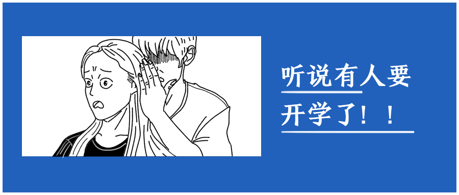
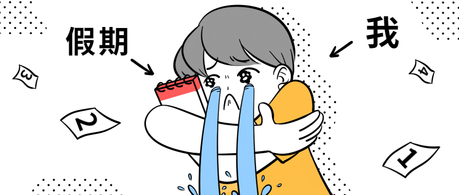

# 基础的html 和html5

- Html 是一种超文本标记语言（Hypertext Markup Language），并不是编程语言。
- html 是一门发展的语言，html5在搜索引擎支持（SEO），移动端适配，更清晰的页面结构上都有一些特性。但是html部分依旧可以使用，这两个不是对立关系，而是加菜的关系。
## html 的历史：

| 阶段        | 事件                                                         |
| ----------- | ------------------------------------------------------------ |
| 1993开始    | Tim Berneris-Lee 开发了html                                  |
| 第一个版本  | HTML1.0.                                                     |
| 1995发布2.0 | HTML 2.0 和html1.0没啥大的区别，就多了一点点新特性           |
| Html3.0问世 | 有很多新能的能力和特性                                       |
| Html4.0     | 1997年发布，1999年成为官方标准，广泛使用在2000年以后，非常强大 |
| html5.0     | 2011年html5依旧是一个草稿，还没成为官方标准，但是很厉害，不少现代浏览器（chrome，firefox等）已经提供了部分的特性支持，让网页制作更加丰富。 |

学东西要点：学新不学旧。

>  [A Brief History of HTML](https://www.washington.edu/accesscomputing/webd2/student/unit1/module3/html_history.html)

## 注释

注释，comment，作用就像古文课文里的注释一样。

```html
<!--这里是注释 --->
<!--  在很多html file里会存在哦-->
<!--  
这样的也叫注释😊
这样的也叫注释😊
-->
```


## 标题标签

一般网站的标题会使用`<h1></h1>` 标签等。具体查看`ex1.html `

## 段落标签

段落，英语是paragraph，因此这个标签是`<p></p>`，具体查看`ex2.html`
## main 标签
在上面的两个html文件中看不到这个标签，这是html5的新特性标签，意在强调包裹（nest）在里面的是页面的主要内容，为搜索引擎去找到页面的主体部分提供便利。具体查看`ex3.html`

对比ex3.docx( 常见的word文档) `ex3.html`有几个小问题：

1. 图片和标题没有居中，不是很美观
2. 文章太宽，眼睛看起来并不舒服
3. 首行没有缩紧，不符合中文规范
4. 整个页面上下左右没有“留白”，看起来很紧迫，没有“呼吸感”

> ⚠️这些问题都等待解决哦。

## img 标签

在`ex3.html`的同一个文件夹下新建一个空文件`ex4.html`, 将`ex3.html`的内容全部复制粘贴给4.在`ex4.html`中可以看到有一张图片，它的部分如下：

```html

```

- src，source，来源的意思，需要指定图片从哪里来的。

```html
<!--
第一点需要注意到的是img 是一个没有 </img> close tag 的single tag，
第二点是需要注意到，src对应的内容是“路径” 
-->
<!--试试看将./pic/pic1.png 提换成 ./pic/pic2.png-->

<!--试试看再换一下-->

<!--试试看再换一下-->

<!--试试看再换一下，注意看什么消失了，有影响吗？ -->

```

- alt，an <u>alternate text</u>  for an image，意为”用来代替图片的文字“，在网络情况糟糕，或者盲人用户浏览网页的时候，尽管ta不能看到这张图片，但是读屏器可以去获取到这个文本，读给ta听。

```html

```

修改成上面这个样子，是不是对没有办法看到这张图的人更友好，更温暖了呢？这样的考虑称之为“无障碍设计”。


## a 标签

新建一个`ex5.html` ，根据`article.txt`提供的文章任选一篇，选择喜欢的图片。

```html
<h1>标题自拟</h1>
<!-- 在文章标题后追加这一行： -->
<a href="http://www.cnfla.com">文章来源</a>
<!-- 如果改成这样会怎么样？ -->
<a href="http://www.cnfla.com" target="_blank">文章来源</a>
```

## footer 标签

一般网站都会有这个tag，用来放置网页相关信息。

```html
<footer>made by @name</footer>
```


